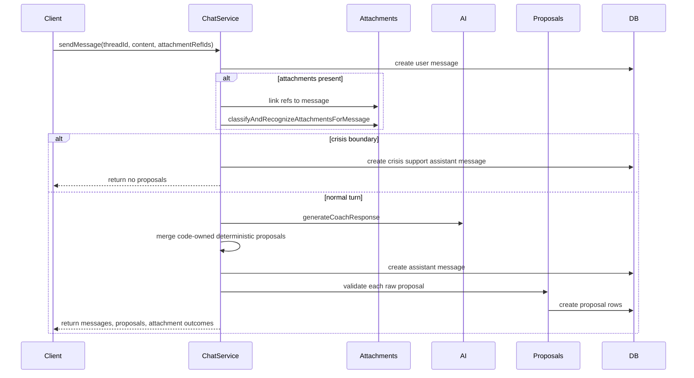
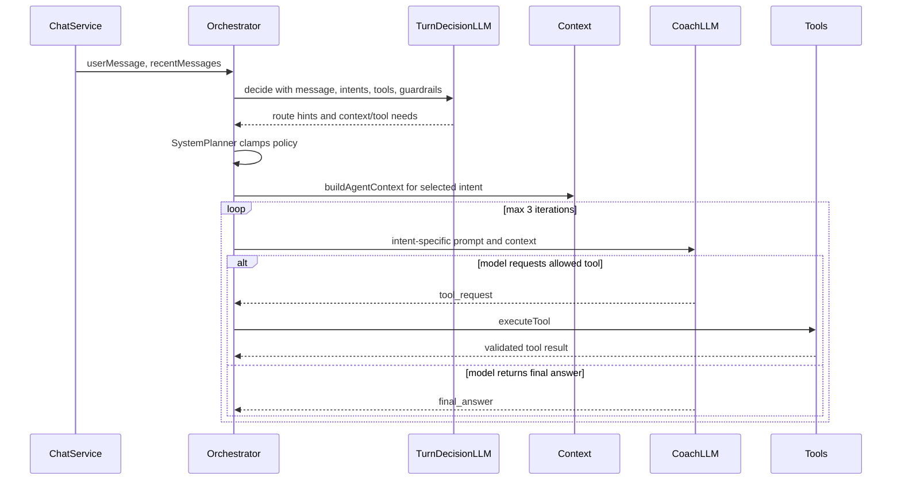
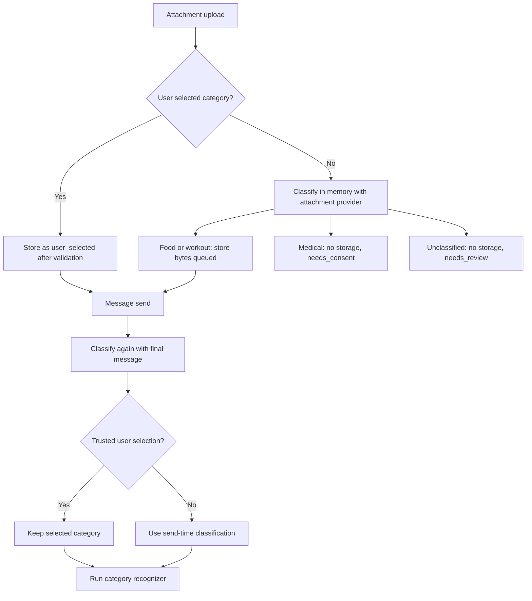

# AI Update Flow

This document describes the chat and AI flow as implemented in the current backend.
The primary code paths are `ChatService.sendMessage`, `ChatAttachmentsService`,
`ChatAttachmentRecognitionService`, and `AgentOrchestratorService`.
Repo-backed behavior policy for routing, prompts, direct paths, and context budgets
is documented in `docs/architecture/ai-behavior-config.md`.

## Core Principle

AI may interpret, explain, summarize, classify, and propose. It must not directly
mutate domain entities.

Any AI proposal that changes a user-facing plan, Today state, nutrition log, profile
state, or other structured state must be stored as a pending proposal and approved by
the user before it is applied. Approval is a product action, not an AI decision.

Structured state is authoritative. Chat messages and attachments are interaction
input; they are not the source of truth by themselves.

## Chat Turn Entry Point

All chat sends go through `ChatService.sendMessage(auth, threadId, input)`.

The service always:

1. Resolves the authenticated user.
2. Loads the target thread and existing messages.
3. Validates attachment refs when `attachmentRefIds` are present.
4. Creates the user chat message, storing `attachmentRefIds` in message metadata.
5. Links attachments to the message and thread.
6. Runs attachment classification and recognition before the coach response when
   attachments are present.
7. Evaluates crisis text and short-circuits before AI when crisis support is needed.
8. Calls `AiService.generateCoachResponse`.
9. Merges AI proposals with remaining code-owned deterministic proposal helpers.
10. Creates the assistant message.
11. Validates and persists each proposal as pending or invalid.
12. Touches the thread title and returns the updated chat turn.

## Text-Only Message Flow

A message with no attachments is AI-first unless it is an explicit system-owned
exception.

Current exceptions:

- Proposal revision turns route deterministically from the original proposal intent.
- Crisis boundary turns do not call the coach LLM.
- Deterministic proposal merge helpers may add narrow product proposals after the
  coach call, but they do not replace the LLM routing step.

Normal text-only flow:

1. `AgentOrchestratorService` builds a TurnDecision request from the full user
   message, recent messages, available capabilities, allowed tools, and safety
   guardrails.
2. `provider.generateTurnDecision` returns route/capability hints, context needs,
   tool needs, direct-command signals, safety flags, and confidence.
3. The orchestrator validates the TurnDecision output with Zod and forbidden
   user-facing field checks. Invalid or low-confidence output stays in the same
   contract and falls back to a safe `general` plan.
4. `SystemPlannerService` clamps the TurnDecision against code-owned policy:
   capability allowlists, context budgets, context slices, executor mode, allowed
   tools, and allowed proposal intents.
5. The planner output builds an `AgentContextPacket` through
   `CoachingContextService`.
6. The selected capability supplies prompt instructions, safety guidance, allowed
   tools, and allowed proposal intents.
7. `ResponseModeExecutorService` runs the bounded agent loop.

## Proposal Revision Flow

Proposal revision turns skip TurnDecision because the system already knows the
proposal being revised.

`AgentOrchestratorService.resolveProposalRevisionRoute` maps the original proposal:

- Workout proposal intents map to `adjust_workout`.
- Nutrition proposal intents map to `adjust_nutrition`.
- Habit proposal intents map to `longevity_overview`.
- Everything else maps to `general`.

The original proposal, superseded proposal id, and user modification feedback are
added to `coachingContext.proposalRevision`. The second-pass coach loop still runs
with intent-specific instructions and proposal validation still applies.

## Crisis Boundary Flow

`ChatService.sendMessage` evaluates `evaluateWellbeingCrisisFromText(messageContent)`
after user message persistence and attachment processing, before the AI coach call.

When crisis support should be shown:

1. Chat creates an assistant message from `formatWellbeingCrisisSupportReply`.
2. Assistant metadata includes `crisisBoundary` and `crisisSupport`.
3. No AI coach response is generated.
4. No proposals are created.

## Attachment Upload Flow

Attachment upload happens before message send through `ChatAttachmentsService.createAttachment`.
The upload endpoint receives `fileContentBase64`, but raw base64 is not persisted in
chat message metadata or transcript.

There are two upload paths:

- trusted user-selected upload
- provisional AI-classified upload

### Trusted User-Selected Upload

A trusted user-selected upload requires `categorySource: "user_selected"`.

When the user explicitly selects a category:

1. The backend validates category MIME and category size limits.
2. Medical document uploads require consent scopes and document metadata before bytes
   are stored.
3. The file is stored.
4. The attachment row is created with `categorySource: "user_selected"` and
   `status: "queued"`.
5. User-selected category is trusted at send time unless medical consent blocks
   processing.

### Provisional AI-Classified Upload

Default composer uploads are not trusted category selections. The client sends
`category: "unclassified"` plus a non-user-selected `categorySource` such as
`default_unclassified` or `mime_inferred`.

For provisional uploads:

1. The backend decodes the file in memory.
2. It validates provisional MIME and provisional size.
3. It rejects consent scopes because consent applies only after a medical category is
   assigned.
4. It calls `ChatAttachmentClassifierService.classify` before storage.
5. The classifier provider receives file bytes when available, safe metadata, the
   optional bounded message, and the allowed attachment categories:
   `food_photo`, `workout_attachment`, `medical_document`.
6. The provider returns a structured classification result.
7. The backend resolves an upload disposition.

Upload disposition:

- `food_photo`: store bytes, create row as `food_photo`, `categorySource: "ai_classified"`, `status: "queued"`.
- `workout_attachment`: store bytes, create row as `workout_attachment`, `categorySource: "ai_classified"`, `status: "queued"`.
- `medical_document` without consent: do not store bytes, create row with `storageKey: null`, `status: "needs_consent"`.
- `unclassified`, `manual_fallback`, or unsupported: do not store bytes, create row as `unclassified`, `status: "needs_review"`.

Important invariant: image MIME alone must not default to food, and PDF MIME alone
must not default to medical. Classification provider output is the source of truth
unless the user explicitly selected a category.

## Attachment Send-Time Flow

When a message contains attachment refs, `ChatService.sendMessage` calls
`ChatAttachmentsService.classifyAndRecognizeAttachmentsForMessage`.

For each attachment:

1. Attachments that are not pending message-first send are returned unchanged.
2. Pending attachments are classified again at send time with the final user message.
3. Stored bytes are passed to the classifier when `storageKey` exists.
4. Send-time classification wins over upload-time AI classification unless the
   category was trusted user-selected or consented medical.
5. `categorySource` is updated with `resolveSendTimeCategorySource`.
6. Manual fallback or unsupported output sets `category: "unclassified"` and
   `status: "needs_review"` without recognition.
7. Medical output without consent purges any stored bytes, clears `storageKey`, and
   sets `status: "needs_consent"`.
8. Food and workout outputs move to `recognizing`, then run the matching recognizer.
9. Recognition output is stored as a typed envelope.

## Attachment Category Flows

### Food Photo

Food photo recognition runs through `FoodPhotoAttachmentRecognizer`.

The recognizer:

1. Builds a typed `food_photo` recognition envelope.
2. Uses `FoodPhotoAnalysisService` to build nutrition estimates.
3. Sets attachment status to `ready` or `low_confidence`.
4. Sets an ephemeral expiry.

The recognition envelope is stored as attachment context and passed into
TurnDecision and the agent loop. It does not create pre-AI proposal candidates.
Any nutrition proposal must come from the unified agent loop and then pass normal
proposal validation.

### Workout Attachment

Workout recognition runs through `WorkoutAttachmentRecognizer`.

There are two main workout outcomes:

- Plan document or plan screenshot: `suggestedIntent: "create_workout_plan"`.
- One-off session or exercise photo: `suggestedIntent: "log_session_context"`.

Workout recognition produces typed context for TurnDecision and the agent loop.
Plan-like attachments and one-off session context can both influence the coach
response, but they no longer create deterministic pre-AI proposal candidates.
Any workout plan, adaptation, or Today checklist proposal must come from the
unified agent loop and then pass the existing proposal validation and apply flow.

### Medical Document

Medical document handling is consent-first.

If a message-first or upload-time classifier identifies a medical document without
consent:

1. The backend does not process the content.
2. Any stored provisional bytes are deleted.
3. `storageKey` is cleared.
4. The attachment becomes `needs_consent`.

After consent is granted:

1. The user must provide consent scopes and document metadata.
2. If content was purged, the client must re-upload file bytes with consent.
3. Image medical documents go to `needs_review`; automated medical image parsing is not used.
4. Supported document files produce context-only medical recognition metadata.
5. Medical recognition is sanitized before returning to the client.
6. Medical chat attachments do not create `health_documents` rows automatically.
   Documents are created only by the explicit documents flow.
7. Medical documents do not create state-changing proposals automatically.

## Attachment Context In The Unified Route

After attachment recognition, `ChatService` passes `attachmentTurn` to
`AiService.generateCoachResponse`.

The attachment turn context contains:

- attachment ref id
- final category
- status
- recognition envelope
- bounded context summaries

Attachments do not use an attachment-family planner bypass. They are context for
the same TurnDecision first-LLM stage used by text-only turns.

## Agent Loop

The agent loop runs through `ResponseModeExecutorService`.

Every final answer must come from `provider.generateAgentLoopStep` as either:

- `tool_request`
- `final_answer`

Loop rules:

1. Maximum iterations: `MAX_AGENT_LOOP_ITERATIONS`.
2. Tool requests are allowed only when the selected catalog intent lists the tool.
3. Tool execution uses `AgentToolRegistryService.executeTool`.
4. Tool results are added to `coachingContext.toolResults`.
5. A disallowed tool request fails safely.
6. Invalid loop output fails safely.
7. Reply safety is validated before returning the answer.
8. Final proposals are coerced, then filtered by `ActionResolverService` using the selected capability allowlist.

Available context tools:

- `getUserContextSlice`
- `getDocumentContext`
- `getWeeklyProgressContext`

## Proposal Merge And Persistence

`ChatService` starts with proposals returned by the AI coach and then applies the
remaining code-owned deterministic proposal helpers.

Merge order:

1. AI coach proposals.
2. Weekly review packing when `isWeeklyReviewChatMessage(input.content)` is true.
3. Deterministic chat proposals from `mergeDeterministicChatProposals`.
4. Recipe recommendation proposal when recipe trigger text is present and no recipe
   proposal already exists.

Before persistence, every raw proposal is validated through:

- `validateProposalSafety`
- `ProposalValidationService.validateRawProposal`
- evidence ownership validation
- provenance ownership validation
- progress-linked provenance requirements
- goal hierarchy validation
- Today checklist source ref validation
- recovery-aware workout validation
- habit proposal context validation
- wellbeing proposal context validation
- nutrition incident image ref ownership validation
- recipe recommendation context validation
- chat attachment proposal ref validation

Each proposal row is created with `validationStatus: "valid"` or `"invalid"` and the
validation errors. Invalid proposals are stored for audit, but they still cannot be
applied successfully.

## Proposal Decision Flow

Proposal decisions are handled by the proposal module, not by the chat LLM.

When the user accepts or rejects a proposal:

1. The API checks ownership and proposal status.
2. Rejection stores the decision and does not mutate structured state.
3. Acceptance revalidates permissions and domain rules.
4. The proposal apply service dispatches by proposal intent.
5. Workout and nutrition plan changes create revisions instead of overwriting plan state.
6. Today checklist proposals write through Today domain services.
7. The proposal row records the decision and applied reference.

## Persistence Rules

- Store raw conversation separately from structured state.
- Store attachment refs separately from structured state.
- Store `categorySource` for attachments so trusted user selections can be separated
  from AI-classified or MIME-inferred categories.
- Do not store raw base64 in chat transcript metadata.
- Do not keep provisional medical bytes without consent.
- Store every proposal that could change structured state.
- Store proposal status: pending, accepted, rejected, superseded, valid, or invalid
  as represented by the proposal records.
- Store enough proposal context to audit why the proposal was shown and who approved it.

## Client Rules

- Chat renders explanations, attachment outcomes, image previews, and proposal cards.
- Attachment controls live inside the chat composer.
- Attachment previews use authenticated attachment content endpoints, not raw base64
  from message metadata.
- Primary tabs are Chat, Today, Longevity, and Profile.
- Today, Longevity, Profile, and secondary Training/Nutrition views read from
  structured state.
- Training and Nutrition are read-only weekly plan views for active workout and
  nutrition plan structure; users request changes through Chat proposals.
- Recipes, Metrics, Documents, Goals, Progress, proposal audit, and developer tools
  are nested or hidden support surfaces, not primary tabs.
- Surfaces update after accepted proposals are validated and applied by backend services.
- Users can mark tasks complete from the relevant tab, but completion writes must still
  go through domain APIs.

## Validation And Safety Checklist

- Validate TurnDecision output with Zod and forbidden field checks.
- Validate agent loop output and reply safety.
- Validate attachment classifier output.
- Validate attachment recognition envelopes.
- Enforce attachment ownership, send eligibility, expiry, retention, consent, and
  provider isolation.
- Validate all proposals before persistence.
- Revalidate proposals before applying.
- Never diagnose, prescribe medication, or claim to treat disease.
- Never mutate structured state directly from chat or attachment recognition.
- Never bypass user approval for plan, Today, nutrition, profile, goal, habit, or
  progress state changes.

## Testing Rules

- Test invalid AI router and agent loop output.
- Test disallowed tool requests.
- Test unsafe replies and unsupported intents.
- Test text-only LLM catalog routing.
- Test attachment upload classification before storage.
- Test that ambiguous images do not default to food.
- Test medical classification purges bytes and requires consent.
- Test send-time classification overriding upload-time AI classification.
- Test user-selected category preserving the selected category.
- Test workout plan documents creating plan proposals.
- Test one-off workout attachments creating Today proposals when the user asks to log
  today's session.
- Test that one-off workout attachments suppress full workout plan proposals.
- Test that accepted workout changes create revisions.
- Test that rejected proposals do not change structured state.
- Test that pending proposals do not change structured state.
