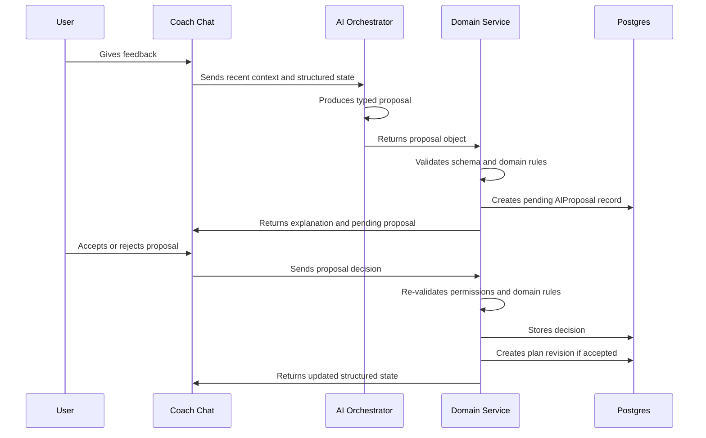

# AI Update Flow

## Principle

AI may interpret, explain, summarize, and propose. It must not directly mutate domain entities.

Any AI proposal that changes a user-facing plan or tab state must be approved by the user before it is applied. Approval is a product action, not an AI decision.

## Flow



## Proposal Shape

```json
{
  "intent": "adjust_workout_intensity",
  "targetDomain": "workout",
  "reason": "User reported high fatigue after two sessions.",
  "changes": {
    "volumeMultiplier": 0.8,
    "affectedDays": ["day_2", "day_4"]
  }
}
```

## Validation Layers

- Zod schema validation for AI output.
- Domain validation inside NestJS services.
- Permission checks against the authenticated user.
- User approval check before applying state-changing proposals.
- Safety checks for prohibited medical diagnosis wording.
- Revision creation instead of in-place plan mutation.

## MVP Tools

- `createWorkoutPlan`
- `adaptPlanBasedOnFeedback`
- `createDailyChecklist`
- `summarizeProgress`
- `createNutritionPlan`

## Persistence Rules

- Store raw conversation separately from structured state.
- Store every proposal that could change a plan.
- Store whether a proposal is pending, accepted, rejected, or superseded.
- Store the created revision id when a proposal is applied.
- Store enough context to audit why the proposal was shown and who approved it.

## Client Rules

- Chat may render explanations and pending proposals.
- Primary tabs are Chat, Today, Longevity, and Profile.
- Today, Longevity, Profile, and secondary Training/Nutrition views read from structured state.
- Training and Nutrition are read-only weekly plan views for active workout and nutrition plan structure; users request changes through Chat proposals.
- Recipes, Metrics, Documents, Goals, Progress, proposal audit, and developer tools are nested or hidden support surfaces, not primary tabs.
- Surfaces update after accepted proposals are validated and applied by backend services.
- Users can mark tasks complete from the relevant tab, but completion writes must still go through domain APIs.

## Testing Rules

- Test invalid AI output.
- Test unsafe or unsupported intents.
- Test that accepted workout changes create a new revision.
- Test that rejected proposals do not change active plan state.
- Test that pending proposals do not change active plan state.
