# Domain Model

## Domains

The model stays focused on structured wellness/coaching state without becoming a
medical-records architecture. Later domains — recipes, device sync, biomarkers /
lab reports, habits, recovery, wellbeing, body composition, progress, and billing —
attach to the same structured-state model instead of turning chat into the source
of truth. Each domain maps to a NestJS module under
[`apps/api/src/modules/*`](../../apps/api/src/modules) and a Drizzle schema file
under [`packages/db/src/schema/*`](../../packages/db/src/schema); the full table
inventory lives in [`database.md`](./database.md).

The core entities below are the ones that carry the product invariants; some
support entities (habits, body composition, progress aggregates, billing/usage)
are summarized in [`database.md`](./database.md) rather than re-described here.

## Core Entities

### User

Represents the account owner and authentication subject.

Fields to plan for:

- `id`
- `email`
- `displayName`
- `timezone`
- `onboardingCompletedAt`
- `createdAt`
- `updatedAt`

### UserProfile

Stores health and coaching context that is stable enough to be structured state.

- age range or birth date policy to be decided before implementation
- height
- baseline weight
- activity level
- training experience
- preferences
- constraints
- longevity direction and tags
- bounded coaching notes visible to the user
- onboarding draft state when needed by the web flow

### Goal

Represents user objectives.

- primary goal: fat loss, muscle gain, maintenance, endurance, general wellness
- target metrics
- timeframe
- hierarchy horizon: direction, quarterly, weekly, or daily
- parent goal id for weekly or daily hierarchy links
- week start for weekly focus goals
- priority
- status

The active hierarchy is constrained: one active quarterly objective per user and up to three active weekly focus goals, each linked to an active quarterly parent. Daily execution actions should usually live in `DailyChecklist` rather than as standalone goal rows.

### ChatThread and ChatMessage

Stores conversation history for continuity, but not as the authoritative state for plans or metrics.

Chat messages can reference `ChatAttachment` records. Attachments are context-only and run
through ownership/retention plumbing before supplying image or document context to the
unified LLM pipeline — see [`llm-pipeline.md`](./llm-pipeline.md) Stage 1 for the full
attachment model (no recognition/classification, no attachment-created proposal/lab path).

### ChatAttachment

Represents an image or document file attached to a chat message.

- user id
- thread id and optional message id
- category, currently created as `unclassified` for runtime image uploads (`document_file`
  for MIME-inferred documents)
- MIME type, file size, and storage key
- passive legacy consent / recognition / category-source fields, readable but not used for
  runtime branching
- retention policy and expiry

Attachments are not authoritative workout, nutrition, or medical state and must not
auto-create `lab_report` / `biomarker_reading` records (see [`llm-pipeline.md`](./llm-pipeline.md)).

### WorkoutPlan

Stable plan identity for a user.

- user id
- status
- active revision id
- createdAt
- updatedAt

### WorkoutPlanRevision

Immutable version of a workout plan (revision number, reason, source, structured payload,
createdAt). Plans are never edited in place — the immutable-revision pattern is documented
once in [`database.md`](./database.md).

Workout plan revisions are rendered through Today workout cards and the secondary read-only Training weekly view. Users should not manually edit active workout plans from the UI; plan changes should flow through approved AI proposals.

### WorkoutSession

Tracks execution of a planned or ad-hoc workout. This is the **performed** side of the
plan-vs-performed split: a session records what actually happened and never mutates a plan
revision.

- planned date
- completion status
- `source`: `planned` (materialized from a plan revision) or `ad_hoc` (a logged one-off
  activity)
- nullable `workoutPlanId` / `workoutPlanRevisionId` (NULL for `ad_hoc` sessions; they
  belong to no plan)
- `activityType` free text for ad-hoc sessions (e.g. "volleyball", "cycling"); NULL for
  planned sessions
- `estimatedCalories` — calorie burn estimate (kcal); for ad-hoc sessions sourced from the
  accepted `log_workout_activity` proposal, for planned sessions from the plan revision
  payload
- exercise results
- fatigue and feedback

Table/index details (the `workout_sessions` unique index and ad-hoc nullability) live in
[`database.md`](./database.md) "Performed vs planned".

Planned sessions may materialize catalog-backed exercises from active plan revisions.
Today execution writes store completion, skipped/adjusted state, bounded actuals,
perceived effort/difficulty, discomfort flags, and notes without mutating workout plan
revisions.

**Ad-hoc sessions** are created by the `log_workout_activity` LOG (revision-free) proposal
intent — they are already-completed activities, appear on Today as **non-required**
checklist items (so they don't penalize adherence), and in weekly aggregates count toward
completed/active days but **not** the planned count or adherence denominator
(`aggregateWorkoutSessions` in
`apps/api/src/modules/progress/progress-aggregate.service.ts`).

### NutritionPlan

Stable nutrition plan identity.

- user id
- status
- active revision id

### NutritionPlanRevision

Immutable nutrition target version.

- calories
- macros
- meal preferences
- restrictions
- hydration target
- reason

Nutrition plan revisions are rendered through Today nutrition cards and the secondary read-only Nutrition weekly view. Users should not manually edit active nutrition plans from the UI; plan changes should flow through approved AI proposals.

### NutritionIncident

Represents a confirmed food log or nutrition incident created through proposal approval.

- user id
- source proposal id
- incident date/time
- item estimates and optional user edits
- calories/macros
- confidence and provenance
- optional image or recipe recommendation refs

Pending, rejected, or low-confidence unedited proposals do not create nutrition incidents. Nutrition incidents do not mutate nutrition plan targets or revisions.

Confirmed incidents are the **performed (eaten)** side of nutrition, kept separate from
plan adherence. They feed two read views:

- **Today.eaten** — per-date aggregated totals `{ calories, proteinGrams, carbsGrams,
  fatGrams, incidentCount }` on `TodayNutritionDetail` (`packages/types/src/index.ts`),
  built by `buildEatenBlock` in `apps/api/src/modules/nutrition/nutrition.service.ts`.
  `null` means no incidents logged for the date (not zero calories).
- **Weekly performed aggregate** — `NutritionPerformedAggregate`
  (`daysWithIncidentsLogged`, `incidentCount`, totals, `averageDailyCalories`), produced by
  `aggregateNutritionIncidentsWeek` (`packages/types/src/progress-cross-domain.ts`) and
  attached as `performed` on `NutritionProgressAggregate`.

### DailyChecklist

Daily execution loop.

- user id
- date
- items
- completion state
- adherence score

DailyChecklist powers the Today surface. It may reference workout sessions, nutrition-today items, wellbeing check-ins, recovery focus items, habit definitions, and goal or weekly-focus source refs, but it should not become the authoritative store for upstream workout or nutrition plan definitions.

### WellbeingCheckIn

Represents a lightweight user-entered mood and stress record for a single date.

- user id
- date
- mood score
- stress score
- optional bounded note
- optional tags
- crisis support flag reasons
- source

Wellbeing notes are excluded from AI prompt context by default. Coaching context receives aggregate mood/stress trends and data sufficiency only.

### RecoveryCheckIn

Represents user-entered recovery state for a single date, separate from device-synced metrics.

- user id
- date
- soreness score
- fatigue score
- optional mood score
- optional perceived stress score

Manual recovery check-ins do not require device consent because they are user-entered app state.

### RecoveryContextSnapshot

Represents the fused qualitative recovery context for a user/date.

- user id
- date
- readiness band: well supported, moderate load, prioritize recovery, or insufficient data
- data sufficiency
- contributing signal summaries and provenance
- focus message
- calculatedAt

The product must not expose a numeric readiness score or clinical recovery score. Recovery context can support coaching explanations and typed workout adaptation proposals, but accepted changes still create plan revisions.

### HealthMetric

Basic user-provided or synced health and fitness metrics.

- metric type: weight, sleep, steps, recovery, mood, soreness, heart rate
- value
- unit
- recordedAt
- source
- consent scope when synced from an integration

Continuous heart rate is a `heart_rate` metric type on `healthMetricSnapshots` (payload — context, avg/max/min bpm, downsampled samples, per-zone minutes — in `normalizedPayload`), **not** a new table; resting HR / HRV / readiness stay as `recovery_input` snapshots. The dedicated read endpoints `GET /health-metrics/sleep`, `GET /health-metrics/pulse`, and `GET /health-metrics/pulse/workouts/:id` (ownership-scoped self-view) back the `/sleep` and `/pulse` web surfaces; `heart_rate` is intentionally excluded from AI context. See [`product-surface-architecture.md`](./product-surface-architecture.md) and the [Sleep & Pulse monitors brief](../product/features/sleep-pulse-monitors.md).

### Recipe

Structured recipe catalog used by nutrition planning and recommendations.

- name
- ingredients
- estimated calories and macros
- meal type
- tags
- dietary restrictions
- preparation metadata
- source, provider, external id
- confidence and provenance for approximate nutrition estimates

### UserRecipeRecommendation

Tracks recipe suggestions shown to the user and whether they were accepted, dismissed, or completed.

- user id
- recipe id
- reason
- related nutrition plan revision id
- status
- shownAt

Accepted or completed recipe recommendations can create `log_nutrition_incident` proposals for explicit user confirmation. They do not directly change nutrition targets.

### DeviceConnection

Represents an explicit user-approved connection to a device or health data provider.

- user id
- provider: HealthKit, Health Connect, wearable vendor
- granted scopes
- status
- connectedAt
- revokedAt

### LabReport

Represents an explicitly user-uploaded laboratory report (PDF/plain text). Lab reports are
sensitive context, not a diagnosis engine. Schema:
`packages/db/src/schema/biomarkers.ts`.

- user id
- title
- storage reference, MIME type, file size
- status: uploaded, processing, extracted, failed
- failure code (typed extraction-failure enum) when failed
- observed date and `unmappedMarkerCount`
- **two-level consent**: `storeParseConsentAt` (required at upload) and the optional,
  revoke-able `coachContextConsentAt` (per-report coach-chat consent)
- extractedAt, uploadedAt, soft-delete `deletedAt`

Extraction runs through a **dedicated out-of-band LLM pipeline** (separate from the chat
fan-out); extracted document text is never persisted or logged. See
[`llm-pipeline.md`](./llm-pipeline.md) "Lab extraction pipeline (out-of-band)".

### BiomarkerReading

A single structured biomarker measurement, either extracted from a lab report or entered
manually.

- user id
- nullable lab report id (NULL for manual readings)
- `biomarkerKey` — a key from the **code-owned catalog** (`packages/types/src/biomarkers.ts`,
  ~50 markers across 8 areas; no DB catalog table, no pg enum)
- `value` (numeric) **or** `valueText`, plus `unit` (stored **as-reported** — there is no
  unit conversion anywhere, a deliberate safety decision)
- optional reference range text
- observed date
- `source`: `extraction` or `manual`
- confidence and `userEdited`
- soft-delete `deletedAt`

A reading reaches the coach (the bounded `biomarkerContext` chat slice or a
`biomarker_reading` proposal evidence ref) **only** when the user deliberately put it there:
manual readings are always eligible; extracted readings require their lab report's
`coachContextConsentAt`. The chat slice carries **no reference ranges** by design.

### AIProposal

Typed pending or applied proposal generated by the AI layer.

- user id
- intent
- target domain
- reason
- proposed changes
- status: pending, accepted, rejected, superseded
- validation status
- optional evidence refs
- user decision metadata
- applied reference (a plan/state revision id, or for LOG intents the created row, e.g.
  `workout_session:<id>` / `nutrition_incident:<id>`)

A proposal payload may carry an optional, **non-authoritative** `displayContract` render
hint (`packages/types/src/display-contract.ts`) so the proposal renders as an editable card;
on accept the backend recomputes/clamps from the stored contract and strips it before any
revision is written (`ProposalsService.decideProposal`).

The end-to-end proposal lifecycle (user → AI typed proposal → user approval → backend
validation → revision) is documented once in [`llm-pipeline.md`](./llm-pipeline.md). Most
accepted workout/nutrition proposals create new **revisions**; the **LOG (revision-free)
intents** — `log_workout_activity` (→ ad-hoc `workout_sessions` row) and
`log_nutrition_incident` (→ `nutrition_incidents` row) — record performed activity and
**never** create a plan revision or mutate plan targets.

## Relationships

```mermaid
erDiagram
  User ||--|| UserProfile : has
  User ||--o{ Goal : sets
  User ||--o{ ChatThread : owns
  ChatThread ||--o{ ChatMessage : contains
  User ||--o{ WorkoutPlan : owns
  WorkoutPlan ||--o{ WorkoutPlanRevision : versions
  WorkoutPlan ||--o{ WorkoutSession : tracks
  User ||--o{ NutritionPlan : owns
  NutritionPlan ||--o{ NutritionPlanRevision : versions
  User ||--o{ DailyChecklist : completes
  User ||--o{ HealthMetric : records
  User ||--o{ DeviceConnection : authorizes
  User ||--o{ UserRecipeRecommendation : receives
  Recipe ||--o{ UserRecipeRecommendation : suggested
  User ||--o{ LabReport : uploads
  LabReport ||--o{ BiomarkerReading : extracts
  User ||--o{ BiomarkerReading : records
  User ||--o{ WellbeingCheckIn : records
  User ||--o{ RecoveryCheckIn : records
  User ||--o{ RecoveryContextSnapshot : has
  User ||--o{ HabitPlan : owns
  HabitPlan ||--o{ HabitPlanRevision : versions
  User ||--o{ HabitCompletion : logs
  User ||--o{ BodyCompositionAnalysis : has
  User ||--o{ WeeklyProgressSummary : accrues
  User ||--|| Subscription : has
  User ||--o{ AIProposal : receives
```

> Habit plans follow the same revision pattern as workout/nutrition plans. Body
> composition analyses (visual photo estimates — never measurements/diagnoses) and
> progress aggregates are read/summary state. Billing (`Subscription`,
> `stripe_webhook_events`, `chat_ai_usage_daily`) gates AI-chat quota. See
> [`database.md`](./database.md).

## Product Surface Mapping

The domain model is intentionally broader than the primary navigation. User-facing placement is:

- Chat reads structured context and renders typed proposals.
- Today reads `DailyChecklist`, current workout execution, nutrition-today data, wellbeing/recovery check-ins, and habit items.
- Longevity reads weekly aggregates, trends, goals, adherence, recovery/wellbeing summaries, and consented metrics.
- Profile reads `User`, `UserProfile`, goal hierarchy, device/data consent, and settings.
- Training reads `WorkoutPlan`, `WorkoutPlanRevision`, and `WorkoutSession` as a secondary read-only weekly plan view.
- Nutrition reads `NutritionPlan`, `NutritionPlanRevision`, adherence, and recipe-supported recommendations as a secondary read-only weekly plan view.
- Biomarkers (`/biomarkers`) reads `LabReport` and `BiomarkerReading` as a secondary route whose wayfinding parent is Nutrition — a dashboard-by-area with range bars, per-marker history, an upload panel, and manual reading entry.

Metrics, recipes, proposal audit data, and developer diagnostics can exist as domain or support models without becoming primary product tabs.

## Modeling Rules

- Do not store critical plan state only in chat messages.
- Prefer explicit revision tables for mutable plans.
- Keep free-form AI output out of core domain tables.
- Use structured JSON only when the schema is owned and validated.
- Keep workout and nutrition plan screens read-only for active plan structure; user-requested changes should create proposals and revisions.
- Keep Today focused on daily execution, not full weekly planning.
- Keep Longevity read-only and trend-oriented; it can link to Chat for proposed changes.
- Treat uploaded lab reports as sensitive, consent-gated coaching context only.
- Treat diagnosis and treatment guidance as out of scope for every product phase.
- Require explicit consent before syncing device data or using biomarker readings as AI context.

## Medical and Lab Data Boundaries

Users may upload laboratory reports (the **Biomarkers** feature) and laboratory studies.
These records are sensitive context, not a diagnosis engine.

Allowed uses with explicit consent:

- structured extraction of catalog-mapped biomarker readings (out-of-band LLM pipeline),
- coaching explanations and typed proposals for workout, nutrition, recovery, and habit changes,
- a bounded, consent-gated `biomarkerContext` chat slice (≤30 items, no reference ranges).

Not allowed:

- diagnosis, treatment plans, medication guidance, or medical certainty,
- silent plan mutation from lab data,
- using chat history as the authoritative store for extracted lab context,
- unit conversion of reported values (stored as-reported; conversion is a deliberate
  non-goal), or "normal/abnormal/deficient" framing (ranges are wellness-neutral "typical").

Extracted biomarker readings and proposal evidence (`biomarker_reading`) are stored as
validated structured state with provenance (`source`, `confidence`, `userEdited`) and
soft-delete auditability.
