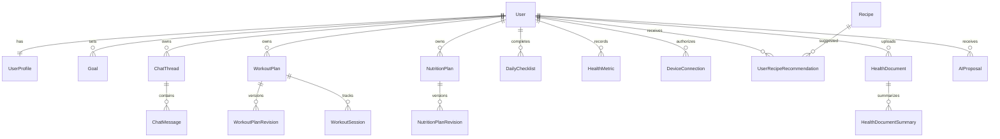

# Domain Model

## Initial Domains

The first model should stay small enough to support MVP 1 without locking the project into a medical-records architecture. Later domains such as recipes, device sync, and health documents should attach to the same structured-state model instead of turning chat into the source of truth.

## Core Entities

### User

Represents the account owner and authentication subject.

Fields to plan for:

- `id`
- `email`
- `displayName`
- `timezone`
- `createdAt`
- `updatedAt`

### UserProfile

Stores health and coaching context that is stable enough to be structured state.

- age range or birth date policy to be decided before implementation
- height
- baseline weight
- activity level
- training experience
- preferences
- constraints

### Goal

Represents user objectives.

- primary goal: fat loss, muscle gain, maintenance, endurance, general wellness
- target metrics
- timeframe
- priority
- status

### ChatThread and ChatMessage

Stores conversation history for continuity, but not as the authoritative state for plans or metrics.

### WorkoutPlan

Stable plan identity for a user.

- user id
- status
- active revision id
- createdAt
- updatedAt

### WorkoutPlanRevision

Immutable version of a workout plan.

- workout plan id
- revision number
- reason
- source: user, coach, ai proposal, admin
- structured plan payload
- createdAt

### WorkoutSession

Tracks execution of a planned or ad hoc workout.

- planned date
- completion status
- exercise results
- fatigue and feedback

### NutritionPlan

Stable nutrition plan identity.

- user id
- status
- active revision id

### NutritionPlanRevision

Immutable nutrition target version.

- calories
- macros
- meal preferences
- restrictions
- hydration target
- reason

### DailyChecklist

Daily execution loop.

- user id
- date
- items
- completion state
- adherence score

### HealthMetric

Basic user-provided or synced health and fitness metrics.

- metric type: weight, sleep, steps, recovery, mood, soreness
- value
- unit
- recordedAt
- source
- consent scope when synced from an integration

### Recipe

Structured recipe catalog used by nutrition planning and recommendations.

- name
- ingredients
- estimated calories and macros
- meal type
- tags
- dietary restrictions
- preparation metadata

### UserRecipeRecommendation

Tracks recipe suggestions shown to the user and whether they were accepted, dismissed, or completed.

- user id
- recipe id
- reason
- related nutrition plan revision id
- status
- shownAt

### DeviceConnection

Represents an explicit user-approved connection to a device or health data provider.

- user id
- provider: HealthKit, Health Connect, wearable vendor
- granted scopes
- status
- connectedAt
- revokedAt

### HealthDocument

Represents a user-uploaded health document. Documents are sensitive context, not a diagnosis engine.

- user id
- document type
- storage reference
- parse status
- consent scope
- uploadedAt

### HealthDocumentSummary

Structured summary extracted from a health document for safe contextual retrieval.

- health document id
- summary payload
- extracted constraints
- generatedAt
- review status

### AIProposal

Typed pending or applied proposal generated by the AI layer.

- user id
- intent
- target domain
- reason
- proposed changes
- status: pending, accepted, rejected, superseded
- validation status
- user decision metadata
- applied revision id

## Relationships

## Modeling Rules

- Do not store critical plan state only in chat messages.
- Prefer explicit revision tables for mutable plans.
- Keep free-form AI output out of core domain tables.
- Use structured JSON only when the schema is owned and validated.
- Treat medical documents as out of scope for MVP 1.
- Treat diagnosis and treatment guidance as out of scope for every product phase.
- Require explicit consent before syncing device data or using health documents as AI context.
