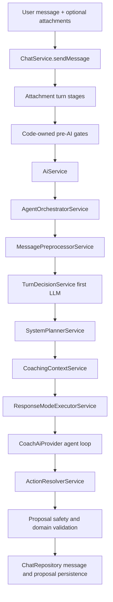

# Unified LLM Pipeline

This document is the canonical map of the current chat/LLM pipeline. The old
intent router, attachment-family route bypass, and attachment proposal side
channel have been removed. Attachments are context for the same pipeline used by
text-only messages.

## End-To-End Flow

## Stage 0: Chat Entry

### `ChatService`

File: `apps/api/src/modules/chat/chat.service.ts`

`ChatService.sendMessage` owns the full chat turn at the API boundary.

Responsibilities:

- Resolve the authenticated user via `UsersService`.
- Load the thread and recent messages through `ChatRepository`.
- Validate attachment refs before send through
  `ChatTurnAttachmentStageService.validateRefsForSend`.
- Persist the user message.
- Run attachment turn stages when `attachmentRefIds` are present.
- Apply hard pre-AI gates: crisis support, proposal explainer no-proposal, and
  direct chat paths.
- Call `AiService.generateCoachResponse` for the unified LLM pipeline.
- Persist the assistant message with parse, safety, agent, and weekly-review
  metadata.
- Run the proposal validation stack and persist reviewable proposals.

`ChatService` does not create proposal cards from attachment recognition. Any
proposal shown to a user must come from the agent loop or a surviving
code-owned deterministic trigger, then pass validation.

### `ChatRepository`

File: `apps/api/src/modules/chat/chat.repository.ts`

Persists chat threads, chat messages, and proposal records. It does not make AI
or domain decisions.

### `chat.mapper`

File: `apps/api/src/modules/chat/chat.mapper.ts`

Maps database rows to API chat DTOs.

## Stage 1: Attachment Context Preparation

Attachments are normal chat turn stages before TurnDecision. They are not a
parallel proposal pipeline.

### `ChatTurnAttachmentStageService`

File: `apps/api/src/modules/chat-attachments/chat-turn-attachment-stage.service.ts`

Runs the configured stage order and returns `AttachmentTurnStageResult`.

Current stages:

- `validate_refs`: checks ownership and send eligibility.
- `link_to_message`: links attachments to the chat message and thread.
- `classify`: classifies pending message-first attachments.
- `apply_upload_disposition`: applies category, retention, consent, and storage
  disposition.
- `recognize`: runs a category recognizer and stores a typed recognition
  envelope.
- `prepare_attachment_context`: builds bounded context summaries for
  TurnDecision and the agent loop.

The removed `prepare_proposal_candidates` stage must not be reintroduced.

### `ChatAttachmentsService`

File: `apps/api/src/modules/chat-attachments/chat-attachments.service.ts`

Owns chat attachment upload, ownership checks, consent grant, storage reads,
storage purge, linking, status transitions, and standalone recognition preview.
It keeps attachments as chat/upload records, not durable health documents.

### `ChatAttachmentClassifierService`

File: `apps/api/src/modules/chat-attachments/chat-attachment-classifier.service.ts`

Classifies attachments using the configured provider and bounded metadata. It
does not create proposals.

Provider selection:

- `OpenAiChatAttachmentClassificationProvider` for OpenAI-backed
  classification.
- `LocalChatAttachmentClassificationProvider` for local/stub classification.
- `ChatAttachmentClassificationProviderFactory` chooses the provider.

### `ChatAttachmentRecognitionService`

File: `apps/api/src/modules/chat-attachments/chat-attachment-recognition.service.ts`

Dispatches recognition by attachment context category:

- `food_photo` uses `FoodPhotoAttachmentRecognizer`.
- `workout_attachment` uses `WorkoutAttachmentRecognizer`.
- `medical_document` uses context-only helpers from
  `medical-document-attachment-recognizer.ts`.

Recognition output is context for TurnDecision and the agent loop. This service
no longer exposes `buildProposalCandidates` or `mergeAttachmentProposals`.

### Category Recognizers

Files:

- `apps/api/src/modules/chat-attachments/food-photo-attachment-recognizer.ts`
- `apps/api/src/modules/chat-attachments/workout-attachment-recognizer.ts`
- `apps/api/src/modules/chat-attachments/medical-document-attachment-recognizer.ts`

Food recognition builds a typed nutrition-analysis envelope. Workout recognition
builds typed workout/session context. Medical recognition is consent-gated and
context-only; it does not create or parse `health_documents` rows.

### Attachment Policy Helpers

File: `apps/api/src/modules/chat-attachments/attachment-behavior-policy.helpers.ts`

Resolves meal context, retention policy, context hints, and category capability
hints from `attachments.json`.

## Stage 2: Code-Owned Pre-AI Gates

These gates intentionally bypass the normal LLM pipeline. They are safety or
deterministic product boundaries, not duplicate AI routers.

### Crisis Boundary

Functions:

- `evaluateWellbeingCrisisFromText`
- `formatWellbeingCrisisSupportReply`

Location: `@health/types`, used by `ChatService`.

When crisis support should be shown, the system creates a deterministic support
reply and no proposals.

### Proposal Explainer

Files:

- `apps/api/src/modules/chat/proposal-explainer.service.ts`
- `apps/api/src/modules/ai/proposal-explainer-matcher.service.ts`

Handles read-only questions about existing proposals. If no proposal is
available, it returns deterministic no-proposal copy without invoking the coach
LLM. Explainer turns with a proposal still remain read-only.

### Direct Chat Paths

Files:

- `apps/api/src/modules/chat/direct-chat-path.service.ts`
- `apps/api/src/modules/chat/direct-chat-path-formatters.ts`
- `apps/api/src/modules/ai/direct-chat-path-matcher.service.ts`

Handles explicit deterministic actions such as reading today's summary or
marking today's workout done. Plan changes remain proposal-only.

## Stage 3: AI Facade And Orchestrator

### `AiService`

File: `apps/api/src/modules/ai/ai.service.ts`

Thin facade over `AgentOrchestratorService`. It preserves the API boundary
between chat code and AI orchestration.

### `AgentOrchestratorService`

File: `apps/api/src/modules/ai/agent-orchestrator.service.ts`

Central orchestrator for the unified LLM pipeline.

Responsibilities:

- Run deterministic message preprocessing.
- Run TurnDecision for eligible turns.
- Ask `SystemPlannerService` for the final deterministic plan.
- Build bounded coaching context through `CoachingContextService`.
- Apply context compression and expansion metadata.
- Attach recognized attachment context, proposal revision context, and proposal
  explainer context to the prompt context.
- Call `ResponseModeExecutorService`.
- Return structured AI output, parse errors, reply safety errors, and agent
  metadata.

TurnDecision is the only first LLM routing stage for eligible turns. Proposal
revision and proposal explainer turns are the explicit non-TurnDecision
exceptions.

## Stage 4: Message Preprocessing

### `MessagePreprocessorService`

File: `apps/api/src/modules/ai/message-preprocessor.service.ts`

Builds deterministic preprocessing output from the raw user message:

- original text
- normalized text
- attachment presence
- basic signals
- direct-path candidate hints

Pure helpers and schemas live in `packages/types`.

### `DirectChatPathMatcherService`

File: `apps/api/src/modules/ai/direct-chat-path-matcher.service.ts`

Compiles direct-path patterns from `ai-behavior.json` and detects deterministic
read/write candidates.

## Stage 5: TurnDecision First LLM

### `TurnDecisionService`

File: `apps/api/src/modules/ai/turn-decision.service.ts`

Builds the first LLM decision request and validates the response.

Inputs:

- preprocessed full user message
- attachment context summaries
- recent messages
- available capabilities from `CapabilityRegistryService`
- available tools from capability metadata
- safety guardrails

Outputs:

- route and capability hints
- context needs
- tool needs
- direct-command signals
- attachment hints
- safety flags
- confidence

Safety behavior:

- validates provider output shape
- rejects forbidden user-facing fields such as direct replies or proposals
- clamps capabilities and tools to allowed values
- falls back to a safe general decision if provider output fails

### TurnDecision Types

Files:

- `packages/types/src/turn-decision.ts`
- `packages/types/src/turn-decision-routing.ts`

Important helpers:

- `shouldRunUnifiedTurnDecision`
- `clampTurnDecisionOutput`
- `isTurnDecisionRouteConfident`
- `pickPrimaryCapabilityFromTurnDecision`
- `buildContextSlicePlanFromTurnDecision`
- `createFallbackTurnDecisionResult`

## Stage 6: SystemPlanner

### `SystemPlannerService`

File: `apps/api/src/modules/ai/system-planner.service.ts`

`SystemPlannerService` is the deterministic control layer after TurnDecision.
The LLM suggests; the planner clamps and finalizes.

Route resolution order:

1. Proposal revision route from the original proposal intent.
2. Confident TurnDecision route.
3. Proposal explainer route.
4. Safe fallback route, usually `general`.

Planner output:

- `IntentRouteResult`
- `CoachIntentDefinitionMetadata`
- capability presentation metadata
- expected response mode
- executor mode
- context budget
- compression requirement
- context slice plan

### `CapabilityRegistryService`

File: `apps/api/src/modules/ai/capability-registry.service.ts`

Loads the capability catalog from code defaults plus optional repo-backed config
overrides. It is the source of truth for capability ids, allowed tools, allowed
proposal intents, prompt instructions, and presentation metadata.

### `CapabilityIntentDefinitionAdapter`

File: `apps/api/src/modules/ai/capability-intent-definition.adapter.ts`

Converts capability config into intent metadata used by the provider prompt and
executor allowlists.

### `ResponseModePolicyService`

File: `apps/api/src/modules/ai/response-mode-policy.service.ts`

Resolves expected response mode from capability policy and route metadata.

### `ContextBudgetPolicyService`

File: `apps/api/src/modules/coaching-context/context-budget-policy.service.ts`

Builds context budget and slice policy. Code floors deny documents and sensitive
health context by default, even if config tries to relax them.

## Stage 7: Coaching Context

### `CoachingContextService`

File: `apps/api/src/modules/coaching-context/coaching-context.service.ts`

Builds `AgentContextPacket` and provider prompt context from structured user
state. It is the gateway between domain state and the coach prompt.

Responsibilities:

- load user snapshot
- assemble requested context slices
- apply safety constraints
- record source refs and missing context notes
- expose context tools used later by the agent loop

### `agent-prompt-context`

File: `apps/api/src/modules/coaching-context/agent-prompt-context.ts`

Maps `AgentContextPacket` into bounded prompt context and strips broad legacy
context keys.

### `ContextCompressionService`

File: `apps/api/src/modules/coaching-context/context-compression.service.ts`

Compresses large context packets when the planner requires compression.

### `ContextExpansionPolicyService`

File: `apps/api/src/modules/coaching-context/context-expansion-policy.service.ts`

Creates expansion-policy metadata for executor modes that may request more
context through tools.

## Stage 8: ResponseModeExecutor

### `ResponseModeExecutorService`

File: `apps/api/src/modules/ai/response-mode-executor.service.ts`

Executes the planned response mode.

Responsibilities:

- resolve executor mode from the plan
- return deterministic gate-miss replies for leaked direct paths
- run the bounded agent loop for LLM modes
- enforce tool-loop policy
- enforce tool allowlists
- validate reply safety
- run `ActionResolverService`
- build execution and safety metadata

Failure behavior:

- parse errors, provider errors, reply safety blocks, and loop exhaustion return
  a safe fallback reply with no proposals.

### Executor Types

File: `packages/types/src/response-mode-executor.ts`

Defines executor modes and loop policies:

- `deterministic_read`
- `deterministic_write`
- `single_llm`
- `context_aware_llm`
- `proposal_flow`
- `context_expansion_loop`

## Stage 9: Coach AI Provider

### `CoachProviderFactory`

File: `apps/api/src/modules/ai/coach-provider.factory.ts`

Selects provider mode from config/env.

### `OpenAiCoachProvider`

File: `apps/api/src/modules/ai/openai-coach-provider.ts`

OpenAI-backed provider implementation.

Unified path methods:

- `generateTurnDecision`
- `generateAgentLoopStep`

Compatibility method:

- `generateMessageUnderstanding` remains for provider compatibility and tests,
  but the orchestrator does not use it as a routing stage.

### Stub Provider

File: `packages/ai/src/stub-provider.ts`

Deterministic provider used for local/test behavior. It implements the same
provider surface without external calls.

### Agent Loop Parsing

File: `packages/ai/src/agent-loop-output.ts`

Parses and coerces provider loop output into either `tool_request` or
`final_answer`.

## Stage 10: Agent Tools

### `AgentToolRegistryService`

File: `apps/api/src/modules/ai/agent-tool-registry.service.ts`

Executes tool requests from the agent loop after executor allowlist checks.

Tools:

- `getUserContextSlice`
- `getDocumentContext`
- `getWeeklyProgressContext`

The executor rejects any tool request that is not allowed by the active
capability.

## Stage 11: Action Resolver

### `ActionResolverService`

File: `apps/api/src/modules/ai/action-resolver.service.ts`

Final LLM answers can include proposals. `ActionResolverService` filters them to
the active capability allowlist before ChatService validation.

It does not mutate domain state and does not persist proposals.

## Stage 12: Proposal Validation And Persistence

### Reply And Proposal Safety

File: `packages/ai/src/safety.ts`

Functions:

- `validateReplySafety`
- `validateProposalSafety`

### `ProposalValidationService`

File: `apps/api/src/modules/proposals/proposal-validation.service.ts`

Validates proposal schema, ownership, provenance, attachment refs, recovery-aware
workout changes, habits, wellbeing check-ins, recipe recommendations, nutrition
incident image refs, and Today checklist references.

### `ChatRepository.createProposal`

File: `apps/api/src/modules/chat/chat.repository.ts`

Persists raw proposals with validation status and validation errors. Nothing is
applied to structured state until the user accepts a valid proposal through the
proposal apply flow.

## Config Sources

### `AiBehaviorConfigService`

File: `apps/api/src/modules/ai/ai-behavior-config.service.ts`

Loads repo-backed behavior config and exposes typed accessors.

Config files:

- `packages/ai-behavior/config/ai-behavior.json`
- `packages/ai-behavior/config/attachments.json`

Loaders:

- `packages/ai-behavior/src/loader.ts`
- `packages/ai-behavior/src/attachment-loader.ts`

Schemas and defaults:

- `packages/types/src/ai-behavior-config.ts`
- `packages/types/src/attachment-behavior-config.ts`

## Safety Boundaries

- Crisis support is code-owned and bypasses the LLM.
- Medical attachment consent is code-owned.
- Medical chat attachment recognition is context-only.
- Context budgets deny document and sensitive health context by default.
- TurnDecision is clamped to known capabilities and tools.
- SystemPlanner owns final route, budget, executor, and allowlists.
- ResponseModeExecutor enforces tool allowlists and reply safety.
- ActionResolver filters proposal intents.
- ChatService validates every proposal before persistence.
- The AI layer never writes directly to domain tables.

## Removed Legacy Paths

The following are no longer active runtime paths:

- `UNIFIED_TURN_DECISION_ENABLED` feature flag.
- `intent-router.ts`.
- `provider.generateIntentRoute`.
- `llm_router` fallback.
- `attachment_family` planner bypass.
- `prepare_proposal_candidates`.
- attachment `proposalCandidates`.
- `preparedProposals`.
- `buildProposalCandidates`.
- `mergeAttachmentProposals`.
- automatic `health_documents` creation from chat attachment recognition.

Some historical enum values and parse compatibility remain only so old stored
metadata can still be read safely.
