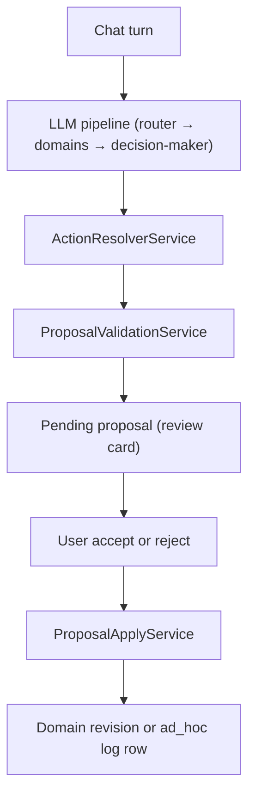
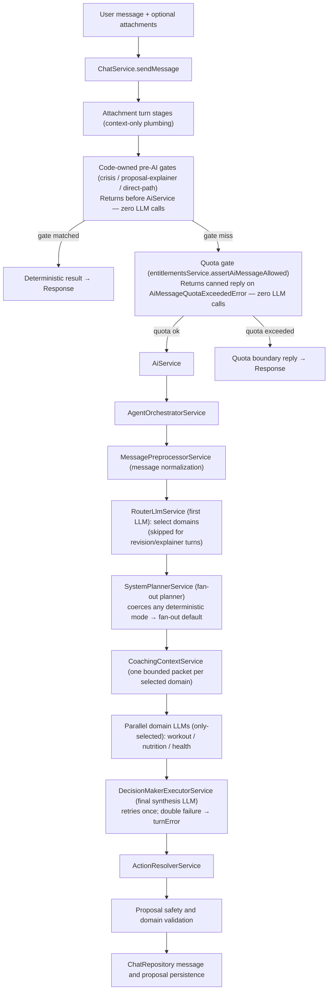
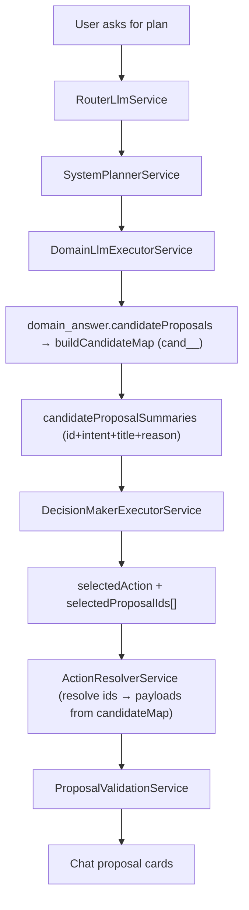

# Unified LLM Pipeline

This document is the **canonical, locked architecture** for the chat/LLM pipeline.
The pipeline is a **multi-domain fan-out + synthesis** design: one routing LLM
selects the relevant domains, the selected domain LLMs run in parallel, and a final
decision-maker LLM synthesizes their output into one reply plus typed proposals.

> **Status — locked architecture, now implemented.** This is the architecture the
> codebase locked and must not deviate from. The phased migration is complete: every
> component described below exists in code. The multi-domain fan-out path
> (RouterLlm → SystemPlanner `DomainFanoutPlan` → parallel `DomainLlmExecutorService`
> → `DecisionMakerExecutorService` → `ActionResolverService`) owns **all** orchestrated
> turn types — proposal-revision, proposal-explainer (with proposal), and low-confidence
> fallback. **Every turn that reaches the orchestrator fans out**: there is no
> orchestrator-level deterministic branch. `SystemPlannerService` coerces any would-be
> deterministic executor mode to the fan-out default (logging `pre_ai_gate.miss`), and the
> router's `directCommand` output is **telemetry-only**.
> `ResponseModeExecutorService`, `resolveProposalOnlyOutput`,
> `buildDeterministicGateMissResult`, the `DETERMINISTIC_PRE_AI_GATE_REPLY` canned reply,
> and the provider methods `generateAgentLoopStep`/`generateCoachResponse` no longer exist.

> **Related:** for a chronological message-journey / decision-tree (one user message,
> every branch point and the condition that selects it), see
> [`chat-message-flow.md`](./chat-message-flow.md).

Attachments are **context** for this same pipeline — there is no separate attachment
recognition/classification pipeline and no attachment proposal side channel. The old
intent router (`intent-router.ts`), `TurnDecisionService`, `MessageUnderstandingService`,
the attachment-family route bypass, and the attachment recognizers/classifiers have all
been removed (see "Removed Legacy Paths").

## Proposal Lifecycle At A Glance

Before the stage-by-stage detail, the high-level rule: the AI layer **never mutates
domain tables directly**. It produces typed proposals; backend services validate,
persist, and apply them only after the user accepts. End to end:



No proposal is applied during generation. A missing proposal card means the final API
response had `proposals: []` for the assistant message (diagnose upstream — see
[Diagnosis & Troubleshooting](#diagnosis--troubleshooting)). Beyond fan-out LLM output,
proposals can also come from deterministic code-owned injectors (wellbeing check-in,
recipe recommendations, weekly-review packing); all sources pass the same
`ProposalValidationService` stack. On accept, workout/nutrition changes create new
revisions — `log_workout_activity` is a LOG intent that creates an `ad_hoc`
`workout_sessions` row, never a plan revision (see Stage 11).

## End-To-End Flow



LLM call budget per eligible turn: **1 router (skipped for revision/explainer) + N
selected domain LLMs (N ≤ 3, run in parallel) + 1 decision-maker (which retries once on
failure, so up to 2 decision calls)**. Crisis, direct-path, and quota-exceeded turns make
**zero LLM calls** — they return in ChatService before AiService is reached. **Every turn
that reaches the orchestrator fans out**: there is no orchestrator-level deterministic
branch. If `resolveResponseModeExecutorMode` ever returns a deterministic executor mode
(e.g. `classifyDirectPathCandidate` matched a candidate the pre-AI gate should already
have handled, or the router emitted a `directCommand`), `SystemPlannerService` coerces it
to the fan-out default via `mapExpectedResponseModeToDefaultExecutorMode` and logs
`pre_ai_gate.miss` (warn). The router's `directCommand` output is **telemetry-only** — it
never short-circuits the LLM path.

## Stage 0: Chat Entry

### `ChatService`

File: `apps/api/src/modules/chat/chat.service.ts`

`ChatService.sendMessage` owns the full chat turn at the API boundary.

Responsibilities:

- Resolve the authenticated user via `UsersService`.
- Load the thread and recent messages through `ChatRepository`.
- Validate attachment refs before send through
  `ChatTurnAttachmentStageService.validateRefsForSend`.
- Persist the user message.
- Run the **attachment plumbing stages** when `attachmentRefIds` are present
  (validate → link → apply upload disposition; no classify/recognize).
- Apply hard pre-AI gates: crisis support, proposal explainer no-proposal, and
  direct chat paths.
- Call `AiService.generateCoachResponse` for the unified LLM pipeline.
- Persist the assistant message with parse, safety, agent, and weekly-review
  metadata.
- Run the proposal validation stack and persist reviewable proposals.
- Accept an **optional `onProgress` (`ProgressReporter`)** and emit coarse stage events
  for the SSE streaming endpoint (see "Streaming (SSE) variant of the chat turn" below).
  The argument is absent on the synchronous endpoint, so streaming is opt-in and never
  changes turn logic.

`ChatService` does not create proposal cards from attachment recognition. Proposals
shown to a user come from one of two sources:

- The decision-maker / domain LLM (fan-out path), filtered through `ActionResolver`.
- A small set of deterministic code-owned injectors running after the LLM response:
  `mergeDeterministicChatProposals` (wellbeing check-in prompt),
  `packChatRecipeRecommendationProposal` (recipe recommendations), and
  `packChatWeeklyReviewProposals` (weekly-review packing).

All proposals — LLM-sourced and code-injected — pass the same
`ProposalValidationService` safety stack before persistence.

When the UI shows assistant text but no proposal card, the API almost always returned
`proposals: []`. Invalid proposals still persist and render as cards with disabled
apply actions, so missing cards should be diagnosed upstream in the router, planner,
domain LLM, decision-maker, action resolver, or reply-safety metadata. See
[Diagnosis & Troubleshooting](#diagnosis--troubleshooting) for the focused
"no proposal card" checklist.

### `ChatRepository`

File: `apps/api/src/modules/chat/chat.repository.ts`

Persists chat threads, chat messages, and proposal records. It does not make AI
or domain decisions.

### `chat.mapper`

File: `apps/api/src/modules/chat/chat.mapper.ts`

Maps database rows to API chat DTOs.

### Streaming (SSE) variant of the chat turn

The same `ChatService.sendMessage` turn can be **streamed** to the client over
Server-Sent Events without changing the pipeline or its safety guarantees. The
synchronous `POST /chat/threads/:threadId/messages` endpoint is unchanged; streaming
is a parallel endpoint that reuses the identical guard, DTO, and turn logic.

Files:

- `apps/api/src/modules/chat/chat.controller.ts` — `POST
  /chat/threads/:threadId/messages/stream` (same `ClerkAuthGuard` + `sendChatMessageSchema`
  body). The body is validated with `parseBody` **before** the SSE stream is opened, so an
  invalid body propagates as a normal HTTP 400 — never a half-opened `200` stream. It opens
  a `ChatTurnStreamWriter`, emits `turn_accepted`, then calls
  `chatService.sendMessage(auth, threadId, input, onProgress)` and emits the `final` (or
  `error`) frame.
- `apps/api/src/modules/chat/chat-turn-stream-writer.ts` — writes SSE frames
  (`event: <kind>\ndata: <json>\n\n`) and sets the SSE headers (incl.
  `X-Accel-Buffering: no` to disable proxy buffering). On client disconnect (`close`
  event) it sets `isClientConnected = false` and **stops writing**, but the underlying
  `sendMessage` promise still runs to completion — the user message and any proposals are
  always persisted regardless of stream state.
- `packages/types/src/chat-turn-stream.ts` — the event contract.
  `chatTurnStreamEventSchema` is a discriminated union on `kind`:
  - `turn_accepted` — `{ threadId, userMessageId? }`, emitted immediately after the body is
    accepted.
  - `stage` — `{ stage, selectedDomains? }` where `stage` is one of `preprocessing` |
    `routing` | `domains_running` | `synthesis` | `validating`; `selectedDomains` (domain
    names only) is present only for `domains_running`.
  - `final` — `{ response: ChatTurnResponse }`, the exact payload the sync endpoint returns.
  - `error` — `{ message }`, a generic safe copy only (no internals/stack/health data).
  - `ProgressReporter = (event: ChatTurnStreamStageEvent) => void` is the narrow callback
    threaded through the pipeline; only `stage` events flow through it (`turn_accepted` and
    `final` are emitted by the controller/ChatService, which hold the response).

**Optional `onProgress` threading.** `ProgressReporter` is an optional last argument on
`ChatService.sendMessage` → `AiService.generateCoachResponse` → `AgentOrchestratorService`.
The sync endpoint passes nothing, so all reporting is a no-op there. Emission points:

- `ChatService` emits `preprocessing` (just before `AiService` is called) and `validating`
  (just before the proposal safety + validation stack) via `emitStageProgress`.
- `AgentOrchestratorService` emits `routing` (before the router LLM), `domains_running`
  (with selected domain names, before the parallel domain LLMs), and `synthesis` (before
  the decision-maker LLM) via `emitProgress`.
- Both helpers **swallow callback errors in try/catch** — a throwing reporter must never
  break or alter the turn.

**Pre-AI gate turns** (crisis, direct-path, quota, no-proposal explainer) return early in
`ChatService` before any stage emission, so over the stream they produce only
`turn_accepted → final` (no `stage` events) — by design.

**Safety design (no token streaming).** There is **no token-level / partial-reply
streaming.** The `final` event is emitted only **after** `validateReplySafety` and the full
`ProposalValidationService` stack have completed — the same safety floor as the sync
endpoint. `stage` events carry **structural information only** (stage names and selected
domain names); they never carry user content, reply text, proposal payloads, or health
data. This is enforced by the `chatTurnStreamEventSchema` shape: only the single `final`
event (and only after validation) ever carries the assistant text and validated proposals.

## Stage 1: Attachment Context (context-only, images + document files)

Attachments are **bounded context** for the same pipeline used by text-only
messages. There is **no recognition or classification machinery** — the multimodal
router and domain LLMs read the image content directly, and document files are
extracted to plain text per-turn. The chat-attachments module keeps only the
ownership/storage/retention perimeter.

Attachments are **images + document files**, context-only. Images are
`image/jpeg`, `image/png`, `image/webp`. Document files are the new `document_file`
category: PDF (`application/pdf`), plain text (`text/plain`), and Markdown
(`text/markdown`, `text/x-markdown`), capped at **5 MB**, retention
`ephemeral_recognition` (DB enum value added in migration
`0036_careless_pandemic.sql`). There is **no upfront classification** (no
food/workout/medical category picker, no `categorySource` "declare before upload"
machinery) and **no upfront consent gate** — an attachment uploads freely and is
sent to the LLM as context, and the multimodal/text LLM reads what it is.

**Category inference (`mime_inferred`).** Document-file uploads are not declared by
the user; the category is inferred deterministically from the MIME type via a fixed
MIME→category map (`isChatAttachmentDocumentMimeType` in `@health/types`), so a PDF
or text/Markdown file resolves to `document_file` without a category picker.

**Lazy per-turn text extraction.** `AttachmentTextExtractionService`
(`apps/api/src/modules/chat-attachments/attachment-text-extraction.service.ts`)
extracts plain text from `document_file` attachments **once per turn**, before the
fan-out, reusing `extractPdfPlainText` from the documents module for PDFs and a
UTF-8 read for text/Markdown. Extraction is capped at
`MAX_ATTACHMENT_TEXT_CONTENT_CHARS` (**12 000 chars**, truncated beyond), wrapped in
a ~5 s timeout, and degrades independently to a status of `ok` / `empty` / `failed`
(it **never throws** and never blocks the turn). The extracted text is **never
persisted to the database and never logged** (only the refId + status are logged) —
this is a code-level safety floor. The original `filename` rides on the bounded
attachment metadata (used as the label in the prompt; see Stage 8).

> **Temporary, intentional safety relaxation (recorded so code↔doc don't drift):**
> image content — including a photo of a medical document — now reaches the LLM
> (OpenAI) **before any consent**. This consciously removes the previous
> "medical content only when `consentState === 'granted'`" code floor, **for now**.
> The pre-upload medical/MIME consent gate and the `needs_consent` upload disposition
> are gone (see "Removed Legacy Paths"). Floors that still hold: the context-budget
> `allowDocuments=false` floor (about DB `health_documents` slices, **not** the
> uploaded attachment) stays, there is **no** auto-persist or parsing of
> `health_documents` from an attachment, and the legacy `recognition`/`categorySource`
> DB columns remain readable but are not used for runtime branching. (`category` is
> still read to resolve a retention policy — `mime_inferred` resolves image uploads to
> `unclassified` and document uploads to `document_file`, both with
> `ephemeral_recognition` retention — and `status` is read for send eligibility; see
> "Removed Legacy Paths".)

### `ChatTurnAttachmentStageService`

File: `apps/api/src/modules/chat-attachments/chat-turn-attachment-stage.service.ts`

Runs the **plumbing stages only**:

- `validate_refs`: checks ownership and send eligibility.
- `link_to_message`: links attachments to the chat message and thread.
- `apply_upload_disposition`: applies a **trivial generic retention disposition** —
  it resolves the configured retention policy for the attachment's MIME-inferred
  category and passes the attachment through unchanged otherwise. Both image
  (`unclassified`) and `document_file` uploads resolve to `ephemeral_recognition`
  retention, so no per-category runtime branching occurs today. There is **no consent
  gate, no medical purge, and no category reclassification** at this stage.

The `classify`, `recognize`, and `prepare_attachment_context` stages, the removed
`prepare_proposal_candidates` stage, and the removed pre-upload classification /
consent gate **must not be reintroduced**.

### `ChatAttachmentsService`

File: `apps/api/src/modules/chat-attachments/chat-attachments.service.ts`

Owns chat attachment upload, ownership checks, storage reads, storage purge,
linking, and status transitions. It keeps attachments as chat/upload records,
**not** durable health documents. The consent column is a passive/null field —
no consent-grant method exists today; consent handling is deferred until the
medical special-save flow lands.

### Attachment Policy Helpers

File: `apps/api/src/modules/chat-attachments/attachment-behavior-policy.helpers.ts`

Resolves retention policy from `attachments.json` (`resolveAttachmentRetentionPolicyFromBehavior`).
The former recognition/meal-context/capability-hint helpers are removed.

### What the pipeline receives

`ChatService` passes the raw attachment refs + minimal metadata (category, MIME,
storage ref, and per-attachment `consentState` from `resolveConsentState`) into
the orchestrator. `consentState` is a passive back-compat field carried on the
`AttachmentTurnContextItem`; it is not used for any runtime gate today and is
**not passed to the router**. The router receives attachment **presence + category
only** — `RouterAttachmentHint` carries `category` and nothing else.
An attachment goes to **all** router-selected domains — there is no per-domain
category-relevance filter. The selected domain LLMs receive the bounded image
content and/or extracted document text as context and produce typed proposals
(nutrition calories, workout adjustments, etc.). No `contextSummaries` / recognition
envelope is produced, and
there is no consent-gated medical-save proposal variant (that is deferred — see
below).

### Document upload (LIVE) vs attachment-driven save (deferred)

`document_file` chat attachments are **context-only**: their text is extracted
per-turn and fed to the domain LLMs, but **no attachment path may create or parse a
`health_document` row** — the chat-attachments path stays context-only and this
boundary is enforced and regression-tested. Durable, parsed document **storage** is a
separate concern.

**Durable PDF/text document upload + parse is implemented** — but as a separate,
explicit **Profile Documents** feature (`apps/api/src/modules/documents/*`,
`apps/web/src/components/documents/*`), **not** part of the chat-attachment pipeline.
The user explicitly uploads a PDF/plain-text file under a five-scope, per-operation
consent model (`upload_storage`, `parse_ocr`, `ai_summarization`,
`semantic_indexing`, `coach_chat_context`) with revoke + delete; raw bytes live on
the storage adapter (local filesystem in dev, encrypted access-controlled store in
prod), extracted text is never persisted or logged, summaries are governed and
non-diagnostic, and access is ownership-scoped.

Still **not** built (deferred), and still a hard boundary:

- The LLM-recognized medical **special save**: a domain recognition signal → a
  consent-gated save **proposal** → on accept, with consent, persist a
  `health_document`. Document persistence is **explicit-upload only**; **no
  attachment path may create or parse a `health_document`** (context-only,
  enforced and regression-tested).

## Stage 2: Code-Owned Pre-AI Gates

These gates intentionally bypass the LLM pipeline. They are safety or
deterministic product boundaries, not duplicate AI routers.

### Crisis Boundary

Functions:

- `evaluateWellbeingCrisisFromText`
- `formatWellbeingCrisisSupportReply`

Location: `@health/types`, used by `ChatService`.

When crisis support should be shown, the system creates a deterministic support
reply and no proposals — before any LLM runs. The gate receives the **raw user
text** and matching is **bilingual**: `containsWellbeingCrisisKeyword` checks the
English `WELLBEING_CRISIS_KEYWORDS` substrings **and** the Russian
`WELLBEING_CRISIS_KEYWORDS_RU` regexps (Cyrillic lookaround word boundaries,
lowercase-normalized input, deliberate safe-side over-triggering — a false positive
is preferred to a missed crisis signal), all in
`packages/types/src/wellbeing-check-ins.ts`. Russian crisis phrases (e.g. "не хочу
жить", "покончить с собой") therefore trip the gate, so crisis coverage is no longer
EN-only.

### Proposal Explainer

Files:

- `apps/api/src/modules/chat/proposal-explainer.service.ts`
- `apps/api/src/modules/ai/proposal-explainer-matcher.service.ts`

Handles read-only questions about existing proposals. If no proposal is
available, it returns deterministic no-proposal copy without invoking any coach
LLM. Explainer turns with a proposal still remain read-only.

### Direct Chat Paths

Files:

- `apps/api/src/modules/chat/direct-chat-path.service.ts`
- `apps/api/src/modules/chat/direct-chat-path-formatters.ts`
- `apps/api/src/modules/ai/direct-chat-path-matcher.service.ts`

Handles explicit deterministic actions. There are **five** direct-path kinds
(`directChatPathKindSchema` in `packages/types/src/direct-chat-path.ts`), detected in
the config order `mark_today_workout_done` → `today_summary_read` →
`nutrition_plan_read` → `weekly_progress_read` → `workout_plan_read`
(`directPaths.detectionOrder` in `ai-behavior.json`,
`DEFAULT_DIRECT_PATH_DETECTION_ORDER` in
`packages/types/src/direct-chat-path-default-patterns.ts`):

- `today_summary_read` — read-only Today summary (formatter
  `formatTodaySummaryReadMessage`).
- `mark_today_workout_done` — the one narrow **write** (marks today's workout done).
- `nutrition_plan_read` — read-only active-nutrition-plan readback (formatter
  `formatNutritionPlanReadMessage` in `direct-chat-path-formatters.ts`, RU/EN match
  patterns + `replyTemplates.nutritionPlan` in `ai-behavior.json`).
- `weekly_progress_read` — read-only readback of the latest weekly progress summary
  snapshot (`ProgressService.getLatestSummarySnapshot` — the same snapshot the
  `weekly_review` context slice reads, never re-aggregated; formatter
  `formatWeeklyProgressReadMessage`, `replyTemplates.weeklyProgress`). Its negative
  patterns deliberately exclude **analytic phrasing** (`analy[sz]e`/`review`/`why`,
  `проанализ`/`анализ`/`разбор`…) and **longer-than-week lookbacks**
  (`month`/`quarter`/`year`/`all-time`, `месяц`/`полгода`/`за год`/`за всё время`…) so
  those turns fall through to the fan-out / Tier-2 review path.
- `workout_plan_read` — read-only active-workout-plan readback, symmetric with
  `nutrition_plan_read` (`WorkoutsService.getCurrentActivePlan`, formatter
  `formatWorkoutPlanReadMessage`, `replyTemplates.workoutPlan`). Its negative patterns
  exclude create/change/adapt phrasing (EN + RU) so plan mutations stay proposal-only
  through the fan-out.

Direct paths resolve only when the message is clearly understood **and there is no
attachment**; otherwise the turn falls through to the router. Four are read-only; only
`mark_today_workout_done` writes. Plan changes remain proposal-only.

### Free-Tier AI Message Quota Gate

File: `apps/api/src/modules/billing/entitlements.service.ts`, called by `ChatService`.

Placed **after** the crisis, proposal-explainer, and direct-path early returns so that
non-LLM turns never consume quota. `entitlementsService.assertAiMessageAllowed` checks
the user's daily AI message count; on `AiMessageQuotaExceededError` it persists a canned
boundary reply and returns before `AiService` is called — zero LLM calls. Pro-tier users
pass through without a quota check.

## Stage 3: AI Facade And Orchestrator

### `AiService`

File: `apps/api/src/modules/ai/ai.service.ts`

Thin facade over `AgentOrchestratorService`. It preserves the API boundary
between chat code and AI orchestration.

### `AgentOrchestratorService`

File: `apps/api/src/modules/ai/agent-orchestrator.service.ts`

Central orchestrator for the unified LLM pipeline.

Responsibilities (`orchestrateCoachTurn`):

- Run deterministic message normalization via `MessagePreprocessorService`.
- Run `RouterLlmService` for eligible turns to select relevant domains (proposal-revision
  and proposal-explainer turns skip the router).
- Ask `SystemPlannerService` for the deterministic `DomainFanoutPlan`.
- **Every orchestrated turn** routes through `runFanOutTurn`: build one bounded
  coaching-context packet per selected domain through `CoachingContextService`, run the
  **selected domain LLMs in parallel** through `DomainLlmExecutorService`, synthesize via
  `DecisionMakerExecutorService`, and resolve through `ActionResolverService`.
  Proposal-revision and proposal-explainer turns skip the router but still execute the
  full fan-out path (router is not a prerequisite for `runFanOutTurn`). There is **no
  orchestrator-level deterministic branch** — `SystemPlannerService` guarantees
  `plan.executorMode` is never deterministic by coercing any deterministic mode to the
  fan-out default (logged `pre_ai_gate.miss`). The genuine zero-LLM path is the pre-AI gate
  in `ChatService` (crisis, direct-path, quota), which returns before `AiService` is called.
- Return structured AI output, parse errors, reply safety errors, the `consentRequired`
  flag, an optional typed `turnError` (`decision_failed` | `reply_blocked`), and agent
  metadata. On a `turnError`, `finalOutput` is an empty reply marker with no proposals;
  ChatService persists the empty assistant message + `turnError` metadata instead of fake
  coach prose.

`RouterLlmService` is the only first-LLM routing stage for eligible turns. Proposal
revision and proposal explainer turns are the explicit non-router exceptions.

### Degradation and observability

For missing proposal cards, inspect the assistant message metadata before assuming a UI
problem:

- `agent.catalogIntentId` / routing metadata show whether the route was `adjust_workout`
  or a fallback such as `general`.
- `parseErrors` includes domain fallback entries such as
  `Fan-out: domains degraded to fallback: [workout]`.
- `parseErrors` includes `Decision-maker degraded: ...` when final synthesis fell back.
- `replySafetyErrors` and `agent.safety.status === "reply_blocked"` mean the
  orchestrator **dropped proposals and emitted an empty reply marker** with
  `turnError: { reason: "reply_blocked" }` — there is no canned safety prose.
- An otherwise clean turn with text but no cards usually means the decision-maker chose
  `plain_reply` or `null`, and `ActionResolverService` correctly returned
  `proposals: []`.

#### Honest degradation: typed `turnError`, no fake coach prose

When the pipeline cannot produce an honest reply, it surfaces a **typed turn error**
instead of canned coach text (the old canned fallback strings are gone):

- **Decision-maker retry.** `DecisionMakerExecutorService.execute` runs once; on any
  failure (provider error, shape guard, or Zod parse failure) it **retries once** with the
  same inputs (logs `decision_maker.retry`). If the retry also fails it logs
  `decision_maker.failed_after_retry` and returns a degraded result carrying
  `turnError: { reason: "decision_failed" }`.
- **`decision_failed`.** The orchestrator skips reply-safety validation (there is no reply
  to validate), sets `finalOutput = { reply: " ", proposals: [] }`, and threads
  `turnError: { reason: "decision_failed" }` to ChatService. `agent.safety.status` is
  `provider_error`.
- **`reply_blocked`.** When `validateReplySafety(resolved.reply)` fails on a synthesized
  reply, the orchestrator drops all proposals, sets the same empty reply marker, and emits
  `turnError: { reason: "reply_blocked" }`. Reply-safety still drops proposals; it no
  longer substitutes a safe canned reply.
- **Contract + persistence.** `chatTurnErrorSchema` (`packages/types/src/chat-turn.ts`,
  `reason: "decision_failed" | "reply_blocked"`) rides on `ChatTurnResponse.turnError` and
  the SSE `final` event, and is stored in assistant-message
  `metadata.turnError` (parsed back via `parseChatMessageTurnError`). The assistant message
  is persisted with empty content. The web renders an **error card with Retry**
  (`apps/web/src/components/chat/chat-turn-error-card.tsx`) instead of coach prose. Crisis,
  quota, direct-path, and proposal-explainer replies are product features and **never** set
  `turnError`.

Per-stage token/latency **usage** is now recorded in the optional fan-out diagnostics
block (`agent.fanOut`, schema in `packages/types/src/agent-context.ts`): the
`AgentProviderUsage` shape (`promptTokens`, `completionTokens`, `totalTokens`,
`latencyMs`, `retries`, and the optional per-stage `model` id) is attached as an
optional `usage` field on `fanOut.router`,
each `fanOut.domains[]` entry (accumulated across that domain's loop iterations), and
`fanOut.decision`. It is absent on fallback paths where no provider call was made. These
are structural numbers only — never prompts, replies, or health content.

## Stage 4: Message Normalization

### `MessagePreprocessorService`

File: `apps/api/src/modules/ai/message-preprocessor.service.ts`

Builds the deterministic **message-context** object from the raw user message:

- original text
- normalized text
- detected language and basic signals (incl. the `review_request` boolean — RU/EN
  retrospective-review phrasing such as `анализ`/`разбор`/`итог`/`review`/`analy[sz]`/
  `retrospect`)
- attachment presence
- direct-path candidate hints
- `requestedLookbackDays: number | null` — deterministically detected lookback period
  (`detectRequestedLookbackDays`): fixed RU/EN phrase rules (`сегодня`→1, `неделю`/`last
  week`→7, `месяц`→30, `квартал`/`quarter`→90, `полгода`/`six months`→180, `год`/`year`→365)
  plus numeric forms (`за 3 месяца`, `last 2 months`, `6 weeks`); the **longest** mentioned
  period wins, and full-history asks (`за всё время`, `all time`, `entire history`) resolve
  to `PROGRESS_HISTORY_FULL_LOOKBACK_DAYS` (= 731, the monthly-ladder grant). These two
  signals drive the deterministic budget-profile selection in Stage 6 — the LLM never
  decides the budget tier.

Pure helpers and schemas live in `packages/types`
(`packages/types/src/message-preprocessor.ts`).

### `DirectChatPathMatcherService`

File: `apps/api/src/modules/ai/direct-chat-path-matcher.service.ts`

Compiles direct-path patterns from `ai-behavior.json` and detects deterministic
read/write candidates.

## Stage 5: RouterLlm — First LLM

### `RouterLlmService` (replaces the removed `TurnDecisionService`)

File: `apps/api/src/modules/ai/router-llm.service.ts`

Builds the first-LLM routing request (`buildRequest`) and validates the response
(`route`). The router receives the message-context plus app context assembled from
the **merged domain YAML config + capability catalog** (`buildAvailableDomains`), and
selects which domain LLMs should run. It calls `provider.generateRouterDecision`.

The router's available-domain list is exactly the **3 `RouterDomain` values**:
`workout`, `nutrition`, and `health`. `medical.yml` has been deleted — the `health`
domain owns all wellness/health-context intents and is not a fourth router-selectable domain.

**Message-length caps (`packages/types/src/message-limits.ts`).** The API accepts a
user message up to `MAX_CHAT_USER_MESSAGE_CHARS` (**20 000 chars**) — enough for a
full pasted workout routine or meal plan — enforced by `sendChatMessageSchema` and
carried at full length through the domain-step, final-decision, and agent-context
schemas, so the **domain LLMs and the decision-maker see the full message**. The
**router does not**: `buildRequest` applies `truncateForRouter` (cap
`ROUTER_TEXT_MAX_CHARS = 4 000`) to the **top-level** router fields (`originalText`,
`normalizedText`) **and** to each recent-message item **and** to the router-scoped
copy of the serialized `preprocessorJson`, so no long paste can bloat the router
prompt or trip its schema parse. The router only needs the head of the message to
choose domains.

Inputs:

- normalized message-context (incl. detected language)
- attachment presence + **category only** (`RouterAttachmentHint.category`);
  `mimeType` and `consentState` are not routing signals and are never passed here
- recent messages
- available domains/capabilities from the merged domain config and
  `CapabilityRegistryService` (workout / nutrition / health only)
- safety guardrails

Output: `RouterDecisionOutput` (`packages/types/src/router-decision.ts`):

- `selectedDomains[]` (max 3) — each with `domain`, `confidence`, and per-domain
  `intentHints[]` / `toolHints[]` / `signalHints[]`
- `directCommand` signal
- `safetyFlags[]`
- `confidence`

Safety behavior (three-step validation pipeline):

1. `validateRouterDecisionOutputShape` — shape guard: rejects forbidden user-facing
   fields such as direct replies or proposals.
2. `routerDecisionOutputSchema.parse` — Zod parse applying schema defaults (e.g.
   empty `selectedDomains` when absent). **Count caps are enforced by slicing
   in-schema, never by rejection**: `selectedDomains` is `.transform`-sliced to
   `MAX_ROUTER_SELECTED_DOMAINS` (3) and each domain's
   `intentHints`/`toolHints`/`signalHints` to `MAX_ROUTER_HINTS_PER_DOMAIN` (5), so a
   router LLM emitting 4 valid domains or 6 valid hints degrades to the cap instead of
   failing the whole parse onto the fallback route. Element validations (known
   domain/tool names, hint length) still reject as before.
3. `clampRouterDecisionOutput` — clamps `selectedDomains` to known `RouterDomain`
   values, `toolHints` to `AgentToolName` values, and `safetyFlags` to
   `AgentSafetyFlag` values; re-applies the same domain/hint count caps.
   `intentHints` pass through unclamped. Capability-catalog narrowing of
   tool/proposal allowlists happens downstream in `SystemPlannerService`, not here.

Falls back to a safe general decision if any step fails.

Multilingual routing is LLM-led. The router receives both original text and normalized
text plus `detectedLanguage`, so Russian requests such as "сгенерируй тренировочный
план" can route to `workout`. Deterministic signal coverage is not equivalent across
languages: some preprocessor signals cover Cyrillic workout terms, while domain YAML
signal examples remain mostly English. Short typo-heavy requests therefore depend more
on router LLM confidence. The **safety floors are bilingual**, though: the crisis gate
(`WELLBEING_CRISIS_KEYWORDS_RU`) and the unsafe-medical reply/proposal screen
(`UNSAFE_MEDICAL_PATTERNS_RU`) both cover Russian, so a weak/low-confidence route on a
Russian turn still falls back safely and is now handled by the decision-template
clarifying-question path (see Stage 6 `lowConfidenceRoute`).

## Stage 6: SystemPlanner — Fan-out Planner

### `SystemPlannerService`

File: `apps/api/src/modules/ai/system-planner.service.ts`

`SystemPlannerService` is the deterministic control layer after the router. The
LLM suggests; the planner clamps and finalizes.

**Primary-route resolution order** (`resolveRoute`):

1. Proposal revision route from the original proposal intent.
2. Confident router selection, feeding `CapabilityPlanResult` fields.
3. Proposal explainer route.
4. Safe fallback route, usually `general`.

**Fan-out construction** (`buildFanoutMetadata` / `buildRouterFanout`) — a separate,
independent step that runs after `resolveRoute`:

- Re-checks router confidence (`isConfidentRouterRoute`): no proposal-revision context,
  router source is `"llm"`, confidence is at or above the threshold, and at least one
  domain was selected.
- When `isConfidentRouterRoute` is true, calls `buildRouterFanout`, which maps each
  router-selected domain to a `DomainFanoutEntry` with independently derived allowlists
  and context budget (capped at `MAX_ROUTER_SELECTED_DOMAINS = 3`).
- When `isConfidentRouterRoute` is false (non-router routes, low-confidence, or all
  domains fail capability mapping), falls back to `buildSingleDomainFanout` using the
  primary capability as the sole domain entry.

Planner output (`DomainFanoutPlan`):

- `selectedDomains[]` — each with `{ domain, capabilityId, allowedTools,
  allowedProposalIntents, contextBudget, executorMode,
  supplementaryContextSlices? }`, clamped to the capability
  catalog (the catalog is the floor; YAML/router can only narrow it).
- decision-maker plan (action-variant catalog + budget)
- per-domain context slice plans and compression requirements
- turn-level lookback metadata: `requestedLookbackDays` (from the preprocessor) and
  `grantedLookbackDays` (the ladder/profile clamp — see `ContextBudgetPolicyService`
  below)

Selected domains are capped at **3** (code constant). The planner never widens
tool/proposal allowlists beyond the catalog.

**Deep-review slice injection (deterministic).** `planTurn` receives the
preprocessor result and threads only `requestedLookbackDays` +
`simpleSignals.review_request` into the budget-profile selection
(`resolvePreprocessorBudgetHints`). When `shouldInjectProgressHistoryReview`
(`context-budget-policy.service.ts`) approves — a review budget profile
(`deep_review` / `deep_history`) **and** a review-ish turn (monthly review, progress
review, or the `review_request` signal) — the planner builds one
`progress_history_review` slice request
(`buildProgressHistoryReviewSliceRequest`: depth `large`, timeRange clamped to the
budget's `maxLookbackDays` as display metadata) and appends it right after the
primary slice on the route's `requiredContextSlices` **and** as
`supplementaryContextSlices` on every fan-out domain entry
(`appendSupplementarySliceRequests`, dedup + `MAX_CONTEXT_SLICES` cap). A purely
multi-domain `deep_review` turn (e.g. "help with training and nutrition") is
deliberately excluded — it is not a retrospective and never triggers the history
aggregation. Default turns never carry the slice.

Router confidence directly affects proposal availability. If the router result is not
from the LLM, has confidence below `RULE_ROUTE_CONFIDENCE_THRESHOLD` (`0.75`), has no
selected domains, or cannot map the selected domain to a capability,
`SystemPlannerService` falls back to the configured fallback capability (currently
`general`). The `general` capability does not allow workout proposal intents, so workout
cards cannot be created from that route even if a later LLM writes workout-like text.

**The fallback is no longer silent: `lowConfidenceRoute`.** When `buildFanoutMetadata`
takes the single-domain fallback specifically because an **LLM-routed** turn was below
the confidence threshold or selected zero domains, it sets
`DomainFanoutMetadata.lowConfidenceRoute = true`. The flag is **never** set for
proposal-revision, proposal-explainer, deterministic/rule-based routes, or capability-map
failures (those stay `false`). The orchestrator threads
`plan.fanout.lowConfidenceRoute` into the `FinalDecisionRequest`
(`packages/types/src/final-decision.ts`), and the decision template renders the
`{{lowConfidenceRouteSuffix}}` placeholder (a `LOW_CONFIDENCE_ROUTE_INSTRUCTION` in
`openai-coach-provider.ts`, injected into the decision template's DYNAMIC suffix so the
cacheable static prefix is unchanged) instructing the decision-maker to ask **one short
clarifying question** in the response language rather than guess the domain. The flag is
also surfaced in `agent.fanOut.decision` diagnostics and the `decision_done` structured
log (boolean only).

### `CapabilityRegistryService`

File: `apps/api/src/modules/ai/capability-registry.service.ts`

Loads the capability catalog from code defaults plus optional repo-backed config
overrides. It is the source of truth for capability ids, allowed tools, allowed
proposal intents, prompt instructions, presentation metadata, and the
**domain → capabilities** mapping. The per-domain YAML config can only narrow these
allowlists, never widen them.

### `CapabilityIntentDefinitionAdapter`

File: `apps/api/src/modules/ai/capability-intent-definition.adapter.ts`

Converts capability config into intent metadata used by domain prompts and
executor allowlists.

### `ResponseModePolicyService`

File: `apps/api/src/modules/ai/response-mode-policy.service.ts`

Resolves expected response mode from capability policy and route metadata.

### `ContextBudgetPolicyService`

File: `apps/api/src/modules/coaching-context/context-budget-policy.service.ts`

Builds context budget and slice policy **per selected domain**. Code floors deny
documents and sensitive health context by default, even if config tries to relax
them, and the floor is re-applied to each per-domain packet.

**Three budget profiles** (`contextBudgetProfileSchema` in
`packages/types/src/context-budget.ts`, overridable via
`contextBudgets.profiles` in `ai-behavior.json`, always re-floored):

| profile | maxSlices | maxRawItems | maxLookbackDays | compression |
| --- | --- | --- | --- | --- |
| `default` | 3 (`MAX_CONTEXT_SLICES`) | 20 | 30 | no |
| `deep_review` | 5 | 50 | 90 | mandatory |
| `deep_history` | 6 | 60 | 731 (`PROGRESS_HISTORY_MONTHLY_MAX_GRANTED_DAYS`) | mandatory |

**Deterministic profile selection** (`resolveBudgetForTurn`) — the LLM never decides
the tier:

1. A review-ish turn (any deep-review trigger, the `isProgressReview` signal, or the
   preprocessor `review_request`) with `requestedLookbackDays >
   deepHistoryMinLookbackDays` (config, default **91** — so 90-day/quarter reviews
   stay `deep_review`) → `deep_history`.
2. Otherwise the existing `deep_review` triggers (monthly-review pattern/intents,
   multi-domain review, progress review + extended lookback) → `deep_review`.
3. Everything else → `default`.

**Granted lookback** (`resolveGrantedLookbackDays`): the **granularity ladder** clamp
(`clampProgressHistoryLookback` in `packages/types/src/progress-history.ts` — ≤14d →
daily buckets (cap 31), ≤182d → weekly (cap 26), longer → monthly (cap 24, granted at
most 731 days)) further capped by the selected profile's `maxLookbackDays`. A long ask
is **clamped, never refused**. When `requestedLookbackDays > grantedLookbackDays`,
`CoachingContextService` appends an honest clamp note rendered from the config-sourced
EN/RU templates (`contextBudgets.degradationNotes.lookbackClamped`, schema
`contextBudgetDegradationNotesSchema`, rendered via `renderLookbackClampNote` /
`buildLookbackClampNote`) — never hardcoded prose.

## Stage 7: Coaching Context

### `CoachingContextService`

File: `apps/api/src/modules/coaching-context/coaching-context.service.ts`

Builds one bounded `AgentContextPacket` and provider prompt context **per selected
domain** from structured user state. It is the gateway between domain state and the
domain prompts.

Responsibilities:

- load user snapshot
- assemble requested context slices for each selected domain (route-derived plan +
  planner-injected `supplementarySliceRequests`, deduped and capped by
  `normalizeContextSlicePlan`)
- apply safety constraints (per-packet budget floor re-applied)
- record source refs and missing context notes (incl. the config-sourced lookback
  clamp note when `requestedLookbackDays > grantedLookbackDays` on a review turn)
- expose read-only context tools used by the domain agent loops

**`progress_history_review` slice (deep reviews).** A new slice purpose
(`contextSlicePurposeSchema` in `packages/types/src/agent-context.ts`) carrying the
numeric-only `ProgressHistoryReviewSummary` on `UserContextSlice.progressHistory`. Its
builder case (`user-context-slice.builder.ts`) adds the summary plus a small
recent-baseline contrast (`activeWorkoutPlan`, `recentWorkoutExecution`, small
`weeklyProgress`) and deliberately includes **no** `wellbeingSummary` /
`recoveryContext` / `documentContext` / `ragResults`.

- **Lazy + once per turn.** The aggregation
  (`ProgressHistoryAggregateService.buildReviewSummary`,
  `apps/api/src/modules/progress/progress-history-aggregate.service.ts` — 6 parallel
  numeric-projection queries over workout sessions, habit completions,
  recovery/wellbeing check-ins, and plan-revision dates) runs **only** when the
  resolved slice plan contains `progress_history_review` — default turns never trigger
  it. On review turns the orchestrator **precomputes the summary once**
  (`precomputeProgressHistorySummary`) and threads it via
  `ProgressHistoryLookbackOptions.precomputedSummary` into every packet build (primary
  + ≤3 domains), so the aggregation never re-runs per packet; the lazy compute path
  remains for callers outside the fan-out turn.
- **The sensitive floor stays untouched — STRUCTURALLY.**
  `progressHistoryReviewSummarySchema` (`packages/types/src/progress-history.ts`) is
  numbers, `z.enum` values, and regex-validated ISO dates **only** — there is no
  unconstrained `z.string()` anywhere in the schema, and the aggregate service never
  selects note/free-text columns. That structural guarantee is why
  `slice.progressHistory` may pass `applyBudgetToBuiltSlice` while `wellbeingSummary`
  and `recoveryContext` remain stripped under the unchanged
  `allowSensitiveHealthContext=false` floor: wellbeing/recovery **trends** reach a deep
  review as numbers, never as private text.
- **Raw-item budgeting:** `progressHistory.buckets` count toward `maxRawItems`;
  truncation keeps buckets first and trims from the **oldest** end (buckets are
  ascending by `bucketStart`, so the most recent periods survive).

### `agent-prompt-context`

File: `apps/api/src/modules/coaching-context/agent-prompt-context.ts`

Maps `AgentContextPacket` into bounded prompt context and strips broad legacy
context keys.

### `ContextCompressionService`

File: `apps/api/src/modules/coaching-context/context-compression.service.ts`

Compresses large context packets when the planner requires compression.

`ContextCompressionService` injects an optional `ContextCompressionProvider` via the
`CONTEXT_COMPRESSION_PROVIDER` DI token (declared in
`context-compression.tokens.ts`). The provider is wired in
`CoachingContextModule` with a `useFactory` that returns an
`OpenAiContextCompressionProvider` only when `AI_COACH_PROVIDER === 'openai'` and
`OPENAI_API_KEY` is present; otherwise it returns `undefined`. The service injects
it `@Optional()` and degrades to `summary: null` in either of two cases (S2):

- No provider is configured (missing key or non-OpenAI provider).
- The provider throws or returns output that fails `contextCompressionSummarySchema`
  (the schema is strict-parsed; any parse failure degrades to `null`).

**S5 safety floors** are re-applied inside `OpenAiContextCompressionProvider.compress`
before any data reaches OpenAI:

- Document source refs (domain `"document"`, `"document_summary"`, `"rag"`) are
  stripped from `packet.sourceRefs` when `budget.allowDocuments` is `false`.
- The `wellbeingSummary` and `recoveryContext` slice fields — treated as sensitive
  health context — are only read when `budget.allowSensitiveHealthContext` is `true`
  (mirroring the `applyBudgetToBuiltSlice` guard). `documentContext` and `ragResults`
  are intentionally never read.
- `slice.progressHistory` (the deep-review numeric aggregates) is read **ungated** —
  it is structurally safe (numbers/enums/ISO dates only by schema construction) and
  already bounded by the per-granularity bucket caps. All slices in a turn share the
  same turn-level summary, so the provider takes the first one found. The
  wellbeing/recovery free-text gates above are unchanged. The compression summary's
  `dataQuality` feeds the deep-review sufficiency block (worst-of; see Stage 9).

`ContextCompressionProvider` is a **distinct interface** from `CoachAiProvider` — it
has a single `compress` method and is never part of the three-method fan-out surface.
See the "Coach AI Provider Surface" section for the `CoachAiProvider` boundary.

### `ContextExpansionPolicyService`

File: `apps/api/src/modules/coaching-context/context-expansion-policy.service.ts`

Creates expansion-policy metadata for domain executor modes that may request
more context through tools.

## Stage 8: Parallel Domain LLMs

### `DomainLlmExecutorService`

File: `apps/api/src/modules/ai/domain-llm-executor.service.ts`

Runs **one** domain LLM bounded loop (`runDomainLoop`). The orchestrator invokes the
selected domain executors concurrently (`Promise.all`, in
`AgentOrchestratorService.runDomainsConcurrently`). The three initial domains are:

- **workout** (`workoutCoach`)
- **nutrition**
- **health** (fed by `health.yml`; `medical.yml` was removed — the health domain owns all wellness/health-context intents)

Per domain executor:

- run a bounded tool loop capped at a fixed 3 iterations (`DOMAIN_MAX_LOOP_ITERATIONS`
  module constant; `domainEntry.executorMode` is carried on the fan-out entry but is not
  yet used to vary the loop policy)
- enforce the per-domain tool allowlist via `AgentToolRegistryService`
- run read-only context tools only
- validate reply safety
- emit a typed `domain_answer`

The `domain_answer.candidateProposals[]` array is advisory. It is not persisted directly
and does not render a card by itself. After a domain answer is accepted, `buildCandidateMap`
assigns each candidate a **deterministic, code-owned id** (`cand_<domain>_<index>`, e.g.
`cand_workout_0`) and returns it on `DomainLlmExecutorResult.candidateMap` — the LLM never
invents these ids. The orchestrator merges every domain's `candidateMap` into one union map
(`buildMergedCandidateMap`) and derives lightweight `CandidateProposalSummary` entries
(`buildCandidateProposalSummaries`: `id + intent + title + reason`) for the decision-maker.
The decision-maker then **selects candidate ids** (it never copies or re-emits payloads);
`ActionResolverService` resolves the selected ids back to canonical payloads from the merged
candidate map and keeps them only when a matching non-`plain_reply` action was also selected
(see Stage 9 / Stage 10).

Failure behavior: a domain that errors, exhausts its loop, or times out degrades
to a **safe empty output** and never blocks the other domains or the turn. The
per-domain timeout (`DOMAIN_LLM_TIMEOUT_MS = 30_000`) is enforced via `Promise.race`
against a rejection-free timer, and is now tied to an `AbortController`: when the
timeout fires it aborts the controller, so any in-flight provider `fetch` (including
its pending retries) receives an `AbortError` and stops immediately rather than running
out the clock. The abort signal is threaded into `provider.generateDomainStep(..., {
signal })`.

**Attachment context per domain (`buildAttachmentContext`).** Before running the
loop, each domain executor enriches the turn's attachment items for that domain:

- **`textContent` + `filename` reach ALL selected domains, including workout.** The
  text is sourced from the orchestrator's pre-extracted per-turn map (extracted once
  by `AttachmentTextExtractionService` before the fan-out — never re-read from
  storage here, never logged). When extraction was `empty`/`failed`, the item still
  carries `filename` as metadata with no `textContent`.
- **`imageDataUri` is unchanged: populated only for image-MIME attachments on the
  multimodal (nutrition / health) domains.** The workout domain never receives image
  bytes; non-image MIMEs never get an `imageDataUri`.

**How the provider injects attachments** (`openai-coach-provider.ts`):

- Extracted document text becomes labeled blocks in the **USER message content
  only** — `ATTACHED FILE "<filename>" (user-provided context, may be truncated):`
  followed by the text (`buildAttachmentTextBlocks`, label falls back to
  `attachmentRefId`). Image attachments with an `imageDataUri` are appended as vision
  content. Attachment text is **never** placed in the system prompt.
- The **system prompt** carries only a bounded metadata **summary** per attachment
  (`hasImage`, `hasText`, optional `filename`) — it omits both `imageDataUri` and
  `textContent` (a code-level safety floor; raw content never enters the system
  prompt).

`domain_workout` and `domain_nutrition` static prefixes each carry one added
instruction line telling the domain LLM how to use an attached document's text.

Each `generateDomainStep` returns `ProviderCallResult` with optional `usage`; the
executor **accumulates** that usage across loop iterations (summing `promptTokens`,
`completionTokens`, `totalTokens`, `latencyMs`, and `retries`) and threads the running
total onto the result — including degraded/fallback results, so usage from completed
iterations before a mid-run degradation is still metered. `usage` is absent only when no
provider call completed (e.g. immediate timeout fallback). The accumulated usage surfaces
as `DomainLlmExecutorResult.usage` and is published into per-domain fan-out diagnostics
(see Stage 3 / `agent-context.ts`).

Output shape (`packages/types/src/domain-llm-step.ts`) — union of
`tool_request` or `domain_answer`, where
`domain_answer = { domain, summary, candidateProposals[], domainSignals[],
workoutCalorieEstimate?, workoutCaloriePerHourRate? }`. Only the **workout** domain may
populate `workoutCalorieEstimate` or `workoutCaloriePerHourRate` — `domainLlmStepOutputSchema`'s
`superRefine` (the discriminated union wrapping `domainAnswerSchema` in
`packages/types/src/domain-llm-step.ts`) rejects both fields for any
other domain; this invariant is enforced at the provider boundary via
`domainLlmStepOutputSchema.parse`. `workoutCaloriePerHourRate` is the
**trusted kcal/hour burn rate** used downstream to recompute editable display-contract
totals; the decision-maker and non-workout domains can never source it.

The workout domain LLM may also emit a `displayContract` on a candidate workout/activity
proposal — a **non-authoritative render hint** (see Stage 10 / `display-contract.ts`) for
an editable card with a duration slider and a `rate_per_hour` derived total. The contract
is render metadata only; it is stripped before any plan revision is written and its total
is recomputed server-side on accept.

### `AgentToolRegistryService`

File: `apps/api/src/modules/ai/agent-tool-registry.service.ts`

Executes tool requests from a domain loop after executor allowlist checks.

Tools (read-only context only, **7**):

- `getUserContextSlice`
- `getWeeklyProgressContext`
- `searchExerciseCatalog` — exercise catalog lookup; wired to workout-domain capabilities only
- `searchRecipeCatalog` — recipe catalog lookup; wired to nutrition-domain capabilities only
- `getActivePlanDetail` — current active plan summary; wired to workout, nutrition, and review_progress
- `getRecentAdherence` — 7-day workout/habit adherence counts; wired to workout, nutrition, and review_progress
- `getProgressHistory` — adaptive-lookback numeric progress aggregates for deep
  reviews (`{ periodDays }`, clamped server-side: min
  `MIN_PROGRESS_HISTORY_PERIOD_DAYS = 7`, granularity-ladder cap inside
  `ProgressHistoryAggregateService`). Returns a `ProgressHistoryReviewSummary`
  (numeric-only by schema construction); allowlisted **only** on `review_progress`
  and `longevity_overview` (`packages/types/src/intent-catalog.ts`).

`getDocumentContext` has been removed: document context in chat is intentionally unavailable under the `allowDocuments=false` context-budget floor. The consent-scoped design is deferred (see "Removed Legacy Paths").

A tool request not allowed by the active domain capability is rejected.

**Tool allowlist caps are 6** (`capabilityConfigSchema.allowedTools` and
`domainLlmStepRequestSchema.allowedTools` both `.max(6)`): `review_progress` carries
6 tools since `getProgressHistory` was added, and the previous cap of 5 would have
made every review_progress domain step degrade on schema parse. The per-domain YAML
`tools` cap equals the full catalog size (`agentToolNameSchema.options.length`) since
YAML narrows the catalog. The OpenAI wire schema's tool-name enum is **derived from
the authoritative Zod enum** (`openai-wire-schemas.ts` spreads
`agentToolNameSchema.options`), so the wire contract can never drift from the live
tool set.

## Stage 9: Decision-Maker LLM

### `DecisionMakerExecutorService`

File: `apps/api/src/modules/ai/decision-maker-executor.service.ts`

Receives the selected domains' outputs plus the **action-variant catalog**
(built by `ActionVariantCatalogService`,
`apps/api/src/modules/ai/action-variant-catalog.service.ts`) and produces the final
decision in a single LLM call (`execute` → `provider.generateFinalDecision`). It
always resolves, degrading to a safe fallback on any provider error.

Request (`finalDecisionRequestSchema`, `packages/types/src/final-decision.ts`):
`{ userMessage, domainOutputs[] (≤3), candidateProposalSummaries[] (≤15),
actionVariantCatalog, safetyFlags[], safetyConstraints[], responseLanguage?,
recentMessages[], lowConfidenceRoute, deepReview? }`.
`candidateProposalSummaries[]` are the `id + intent + title + reason` descriptors built by
the orchestrator (Stage 8); the decision-maker selects from these ids and never sees the
full candidate payloads. `recentMessages[]` is capped at **6 messages / 4000 chars each**
(assembled in `AgentOrchestratorService.runFanOutTurn`). `responseLanguage` is input-only —
all four fan-out templates require the reply in `{{responseLanguage}}`.

Output (`finalDecisionOutputSchema`, **selection-only**):
`{ reply, selectedAction, selectedProposalIds[] (≤5), consentRequired }`.

This is a **selection-by-id** contract — the decision-maker picks `selectedProposalIds`
from `candidateProposalSummaries` and **never writes proposal payload objects**. The legacy
`proposals[]` payload channel was **deleted in slice 2** and `"proposals"` is now a
**forbidden key** in `FINAL_DECISION_FORBIDDEN_KEYS` (`validateFinalDecisionOutputShape`
rejects any output containing it). `ActionResolverService` resolves the selected ids back to
canonical payloads from the merged candidate map (Stage 10). This structurally prevents the
decision-maker from fabricating a workout calorie estimate, the trusted
`workoutCaloriePerHourRate`, or any other domain-owned payload field — those may only come
from the workout domain LLM.

`selectedAction` is part of the proposal contract, not only presentation metadata. For
a proposal to survive, `selectedAction` must be a non-`plain_reply` action id from the
catalog, and the matching candidate id(s) must appear in `selectedProposalIds`. If the
decision-maker chooses `null` or `plain_reply`, the action resolver returns a text-only
response even when the reply describes a full plan.

Decision-maker degradation is observable through orchestrator `parseErrors` entries that
start with `Decision-maker degraded:`. The fallback final decision
(`createFallbackFinalDecision`) always has `selectedAction: null`,
`selectedProposalIds: []`, and `consentRequired: false`.

### Deep-review sufficiency framing (`deepReview` + `{{deepReviewSuffix}}`)

On deep-review turns, an optional typed `deepReview` block
(`deepReviewPromptContextSchema` in `packages/types/src/progress-history.ts` —
`{ requestedPeriodDays, grantedPeriodDays, dataQuality }`, numbers + enum only) rides
on **both** the `DomainLlmStepRequest` of every selected domain and the
`FinalDecisionRequest`:

- **Built only when** the plan selected a review budget profile (`deep_review` /
  `deep_history`) **and** the primary context packet carries the
  `progress_history_review` slice (`buildDeepReviewPromptContext` in
  `agent-orchestrator.service.ts`). Undefined on every non-review turn.
- `dataQuality` is the **worst-of** reduction (`deriveDeepReviewDataQuality` /
  `resolveWorstDataSufficiency`) over the review summary's four per-domain
  `dataSufficiency` values **plus** the compression summary's `dataQuality` when
  compression produced one (`insufficient > partial > sufficient`).
- The provider injects a `{{deepReviewSuffix}}` placeholder — the same
  request-field → dynamic-suffix channel as `lowConfidenceRoute` →
  `{{lowConfidenceRouteSuffix}}` — present in **all four** fan-out templates (three
  domain templates + decision template), rendered as the empty string on normal turns
  so the static prefixes stay byte-stable. `buildDeepReviewSuffix`
  (`openai-coach-provider.ts`) composes the stage instruction
  (`DEEP_REVIEW_DECISION_INSTRUCTION` for the decision template,
  `DEEP_REVIEW_DOMAIN_INSTRUCTION` for domain templates: separate OBSERVED from
  UNCERTAIN, cite concrete bucket dates/numbers, name the analyzed range, never
  diagnostic wording), an analyzed-range sentence (naming the clamp honestly when
  `requestedPeriodDays > grantedPeriodDays`), and — when `dataQuality` is not
  `sufficient` — exactly **one** narrowing follow-up (shorter period or single
  domain, never both, never more than one question).
- A static **EN metric legend** (`PROGRESS_HISTORY_METRIC_LEGEND_PROMPT_BLOCK`, built
  from `PROGRESS_HISTORY_METRIC_LEGEND.en` in `progress-history.ts`) sits in the
  **static prefix** of the three domain templates and the decision template — one
  line per `progressHistory` bucket metric, code-owned text, placeholder-free and
  byte-stable, so the prompt-cache prefix/suffix split is preserved (the LLM still
  answers in `{{responseLanguage}}`).
- Diagnostics surface a **boolean-only** `deepReview: true` marker on
  `agent.fanOut.decision` and the `decision_done` log — never period numbers or
  health data.

### `ActionVariantCatalogService`

File: `apps/api/src/modules/ai/action-variant-catalog.service.ts`

Builds the bounded action catalog passed to the decision-maker:

- `plain_reply` is always present and currently appears first.
- Each selected domain contributes the union of its clamped
  `allowedProposalIntents`, capped at `MAX_CATALOG_ENTRIES`.
- The catalog is not authoritative by itself; `ActionResolverService` re-filters the
  decision-maker output to the same selected-domain allowlist.

This means a confident workout route must be present before workout proposal variants
such as `create_workout_plan` and `adapt_workout_plan` can appear in the decision-maker
catalog.

## Stage 10: Action Resolver

### `ActionResolverService`

File: `apps/api/src/modules/ai/action-resolver.service.ts`

Resolves the decision-maker's `selectedProposalIds` into canonical payloads from the
merged candidate map (`buildMergedCandidateMap`, keyed `cand_<domain>_<index>`), then
filters those resolved proposals to the **union allowlist** of the selected domains'
`allowedProposalIntents`. The decision-maker no longer supplies payloads — it selects ids,
and `resolveFinalDecisionOutput` looks each id up in `candidateMap`. **Unknown or duplicate
ids degrade safely**: each is recorded as a diagnostic string in `result.parseErrors` and
skipped (never thrown, never blocking the turn), and their count is surfaced as
`result.idResolutionDropCount` (equal to `parseErrors.length`). The orchestrator appends
these diagnostics to the turn's `parseErrors` with a `Resolver: ` prefix and logs
`idResolutionDropCount` on the `resolution_done` structured log; `droppedByAllowlist` now
counts **only** proposals that resolved successfully but were then dropped by the union
allowlist (the two drop categories are no longer conflated).

The proposal intents that may pass through the allowlist are:

- workout-plan intents (`create_workout_plan`, `adapt_workout_plan`,
  `adapt_workout_plan_from_progress`)
- `log_workout_activity` — a LOG (revision-free) intent that records a one-off
  performed activity and, on accept, creates an `ad_hoc` `workout_sessions` row
  rather than a plan revision (see Stage 11 / the domain-model doc)
- nutrition intents (incl. `log_nutrition_incident`)
- `capture_wellbeing_checkin`
- `plain_reply`

Branching inside `resolveFinalDecisionOutput` is structural, not per-kind:
`plain_reply` is handled separately (no scrub/stamp needed), and the
`scrubAndStampWorkoutCalorieEstimate` step applies uniformly to every workout-plan
and `log_workout_activity` proposal regardless of which specific workout intent it is.
Non-workout proposals pass through without calorie scrubbing.

It does **not** mutate domain state and does **not** persist proposals.

`plain_reply` and `null` selected actions are structural no-op actions: they deliberately
produce no proposals and set `consentRequired` to `false`. This is the most important
debugging distinction for "text answer, no card" turns: a well-written workout plan in
`reply` is not enough unless the decision-maker also selected a proposal action and
returned proposals under an allowed intent.

**Trusted calorie-rate stamping (`scrubAndStampWorkoutCalorieEstimate`).** For every
workout-plan and `log_workout_activity` proposal, ActionResolver **always scrubs** the
calorie fields from the **resolved candidate payload** and re-stamps only from values passed
by the orchestrator (`AgentOrchestratorService`, sourced exclusively from the workout
`domain_answer`). Since slice 2 removed the decision-maker `proposals[]` channel, the
decision-maker can no longer inject calorie data at all; the scrub step now stands as
**defense-in-depth** against any future code path that re-introduces a payload channel:

- `workoutCalorieEstimate` → `estimatedSessionCalorieBurn` (plan) /
  `estimatedCalories` (log activity), with provenance `workout_llm`.
- `workoutCaloriePerHourRate` → the **trusted** `caloriePerHourRate` (plan) /
  `ratePerHour` (log activity), used later to recompute editable-card totals.

Branching mirrors the payload shape: flat (`create_workout_plan` / `adapt_workout_plan`),
nested `.plan` (`adapt_workout_plan_from_progress`), and the top-level
`log_workout_activity` payload. If neither trusted value is available, the
`log_workout_activity` calorie fields are left unset — its `.refine()` then rejects the
proposal downstream (fail-closed). The `displayContract` itself is carried through as a
non-authoritative render hint; the decision-maker can never fabricate the trusted rate.

## Suggested Quick Actions

After an **LLM-backed (fan-out) turn**, `ChatService` attaches config-driven
`suggestedQuickActions` chips to the turn response. They are derived **deterministically**
from the fan-out's selected domains by the pure helper
`deriveQuickActionsForTurn` (`packages/types/src/suggested-quick-actions.ts`):

- `today_summary_read` and `weekly_progress_read` are always eligible.
- `mark_today_workout_done` and `workout_plan_read` are added when `workout` is among
  the selected domains.
- `nutrition_plan_read` is added when `nutrition` is among the selected domains.

(Up to **5** chips; the configured `suggestedQuickActions.actions[]` defines one entry
per direct-path kind.)

The chip labels and localized `messageText` (`{ en, ru }`) come from the
`suggestedQuickActions.actions[]` block in
`packages/ai-behavior/config/ai-behavior.json` (loaded via
`AiBehaviorConfigService.getSuggestedQuickActions`). Each chip's `id` is a
`DirectChatPathKind`, so tapping a chip **sends the localized `messageText`** as a new user
message — which then matches the corresponding deterministic direct path (see Stage 2).

Quick actions are **not** attached on `turnError` turns (honest degradation — no coach text
to follow up) or on pre-AI gate turns (crisis, quota, direct-path, explainer-no-proposal,
which return before the orchestrator). The contract field is `ChatTurnResponse.suggestedQuickActions`
(`packages/types/src/chat-turn.ts`); the web renders chips in
`apps/web/src/components/chat/chat-quick-action-chips.tsx`.

## Per-Turn Telemetry (`ai.turn_summary`)

After each fan-out turn completes, `AgentOrchestratorService.runFanOutTurn` emits one structured
log entry with event `"ai.turn_summary"` (`AgentTurnTelemetry`,
`packages/types/src/agent-context.ts`). The payload contains only counts, enums, and durations —
**no user message text, no reply text, no health data** (safety floor enforced by the Zod schema).
The schema is runtime-validated (`agentTurnTelemetrySchema.safeParse`) before logging; a
mismatch emits a warn and falls back to raw object logging without failing the turn.

Fields: `totalLatencyMs`, `routerLatencyMs`, `contextLatencyMs`, `decisionLatencyMs`,
`domainLatencies[]`, `selectedDomains[]`, `routerConfidence`, `routerSource`,
`toolsRequestedPerDomain[]`, `degradedDomains[]`, `finalActionType`, `proposalCount`,
`validationFailureClasses[]`.

## Stage 11: Proposal Validation And Persistence

### Reply And Proposal Safety

File: `packages/ai/src/safety.ts`

Functions:

- `validateReplySafety`
- `validateProposalSafety`

`containsUnsafeMedicalLanguage` (the shared check behind both) is **bilingual**: it
tests the English `UNSAFE_MEDICAL_PATTERNS` and, on the lowercased text, the Russian
`UNSAFE_MEDICAL_PATTERNS_RU`. The RU patterns hold the same **prescriptive-medical
altitude** as the EN set — they block diagnosis (`диагноз` with a `не `-disclaimer
negative-lookbehind guard, `диагностиру…`), prescribing a drug (`назначаю` only with
a pharmaceutical word co-occurring within ~60 chars), `рецепт на` + a drug noun,
pharmaceutical dosing (`дозировка препарата`, `принимайте по … таблетк`), treatment of
disease (`лечени… заболеван`), and `психотерапи…`/`психотерапевт` — while deliberately
**not** firing on wellness/nutrition phrasing (e.g. "дозировка белка", "лучшая
терапия", "не диагноз"). Russian coach replies and proposals are no longer EN-only for
unsafe-medical screening.

### `ProposalValidationService`

File: `apps/api/src/modules/proposals/proposal-validation.service.ts`

Validates proposal schema, ownership, provenance, attachment refs, recovery-aware
workout changes (incl. calorie-estimate bounds), habits, wellbeing check-ins,
recipe recommendations, nutrition incident image refs, and Today checklist
references.

### `ChatRepository.createProposal`

File: `apps/api/src/modules/chat/chat.repository.ts`

Persists raw proposals with validation status and validation errors. Nothing is
applied to structured state until the user accepts a valid proposal through the
proposal apply flow. Accepted workout/nutrition changes create new revisions; the
`log_workout_activity` LOG intent instead creates an `ad_hoc` `workout_sessions` row and
**never** a revision (`ProposalApplyService` → `WorkoutsService.applyLogWorkoutActivityProposal`).

### Accept-time display-contract recompute seam

File: `apps/api/src/modules/proposals/proposals.service.ts`
(`ProposalsService.decideProposal`)

When a proposal carrying a `displayContract` is accepted, the calorie total is a
**safety-critical recompute**, never the client's submitted total:

- The **stored** proposal supplies the `displayContract` STRUCTURE and the trusted
  `caloriePerHourRate` / `ratePerHour` — the client can substitute neither a different
  contract nor a higher rate.
- Only the client-submitted **editable** field values are applied
  (`extractClientEditableFieldValues`), each clamped to the stored field's own `min`/`max`
  (`clampFieldValue`). The rate input field is always overwritten with the trusted stored
  rate.
- The primary-total derived value is recomputed via `computeDerivedValues`, `Math.round`-ed,
  and clamped to `[0, 20000]`; `calorieEstimateProvenance` is forced to `workout_llm`.
- Branching matches the payload shape:
  `recomputeWorkoutProposalCaloriesFromDisplayContract` for flat
  (`create_workout_plan` / `adapt_workout_plan`) and nested
  (`adapt_workout_plan_from_progress` `.plan`) workout proposals, and
  `recomputeLogWorkoutActivityCaloriesFromDisplayContract` for `log_workout_activity`.

The `displayContract` and trusted rate are dropped (`stripWorkoutPlanProposalExtras`)
before a plan revision is written; they never persist on revisions.

## Coach AI Provider Surface

### `CoachProviderFactory`

File: `apps/api/src/modules/ai/coach-provider.factory.ts`

Selects provider mode from config/env and resolves **per-stage models**. The factory
reads `OPENAI_MODEL` (default `gpt-4o-mini`) as the baseline and three optional
overrides from `apps/api/src/env.ts` — `OPENAI_MODEL_ROUTER`, `OPENAI_MODEL_DOMAIN`,
`OPENAI_MODEL_DECISION` — passing them to `createOpenAiCoachProvider`, which resolves
each stage as `override ?? OPENAI_MODEL`. This lets the cheap router/domain stages run
on a smaller model while the decision-maker uses a stronger one (cost tiering). When no
override is set, all three stages fall back to `OPENAI_MODEL`.

### `OpenAiCoachProvider`

File: `apps/api/src/modules/ai/openai-coach-provider.ts`

OpenAI-backed provider implementation. The `CoachAiProvider` surface
(`packages/ai/src/coach-ai-provider.ts` defines the interface). The three fan-out
methods drive the live multi-domain path:

- `generateRouterDecision` — the first-LLM domain selection (uses `stageModels.router`)
- `generateDomainStep` — one domain loop step (`domain: 'workout' | 'nutrition' |
  'health'`); resolves image attachments to multimodal content when present (uses
  `stageModels.domain`)
- `generateFinalDecision` — the decision-maker synthesis (uses `stageModels.decision`)

The provider holds a resolved `stageModels` map (`{ router, domain, decision }`) built
by the factory from the per-stage env overrides; each fan-out method passes its stage's
model into the OpenAI request and **stamps that model id into `usage.model`** (see
`AgentProviderUsage`/`ProviderUsage` below), so diagnostics record which model served
each stage.

The `CoachAiProvider` surface is exactly these three fan-out methods — there are no
other provider methods. Proposal-revision, proposal-explainer, and low-confidence
turns all route through `runFanOutTurn` in `AgentOrchestratorService`; the router
is simply skipped for revision/explainer turns, but the same
`generateRouterDecision` / `generateDomainStep` / `generateFinalDecision` surface
drives every LLM turn.

**Return shape and transport reliability.** Each of the three methods now returns a
`ProviderCallResult<T> = { output, usage? }` (`packages/ai/src/coach-ai-provider.ts`)
and accepts an optional `{ signal?: AbortSignal }` second argument. `usage` is a
`ProviderUsage` (`promptTokens`, `completionTokens`, `totalTokens`, `latencyMs`,
`retries`, plus the optional `model` id stamped per call) — numbers/ids only, never
prompt/health content. The three-method surface
itself is unchanged; only the wrapped return type and the optional abort signal are
new.

Structured output is **strict OpenAI `json_schema` structured outputs** (not legacy
JSON mode). Each call sends `response_format: { type: "json_schema", json_schema:
{ name, strict: true, schema } }` using hand-authored wire schemas in
`apps/api/src/modules/ai/openai-wire-schemas.ts`
(`routerDecisionWireSchema`, `domainLlmStepWireSchema`, `finalDecisionWireSchema`).
Because strict mode forces every field into `required` (optional fields are declared
nullable-required, `type: ["T","null"]`), the provider runs a generic
`stripExplicitNulls` normalization over the parsed payload before the Zod
shape-validation + parse, so `.optional()` Zod fields that arrive as explicit `null`
are dropped (and `.nullable().default(null)` fields such as `selectedAction` re-apply
their null default). `stripExplicitNulls` must not log payload content.

Transport goes through `fetchWithRetry`: up to **`MAX_RETRIES = 2`** retries (1 initial
attempt + 2 retries) with exponential backoff (~300ms then ~1200ms), retrying **only**
on network/transport failures (fetch rejection), HTTP 429, or HTTP 5xx. Other 4xx and
JSON-parse failures throw immediately (no retry). The optional `AbortSignal` is
forwarded to `fetch` and to the backoff `sleep`, so an aborted call (e.g. the domain
timeout firing) cancels in-flight requests and pending retries.

Note: context compression uses a **distinct provider/interface** (`ContextCompressionProvider`,
injected via `CONTEXT_COMPRESSION_PROVIDER`) that is separate from this `CoachAiProvider`
surface. `OpenAiContextCompressionProvider` implements `ContextCompressionProvider` and
is not part of the three fan-out methods described here. See Stage 7 (`ContextCompressionService`)
for details.

OpenAI prompt templates are keyed `router`, `domain_workout`, `domain_nutrition`,
`domain_health`, and `decision`, rendered through `CompiledPromptTemplates` and the
shared strict-`json_schema` completion + `stripExplicitNulls` normalization +
shape-validation helpers (see "Return shape and transport reliability" above).

These prompt templates come from `packages/types/src/prompt-template-defaults.ts`. The
`promptTemplates.templates` override in `packages/ai-behavior/config/ai-behavior.json`
is now empty (`{}`) — defaults are the live source. A non-empty override for one of the
five keys would still replace that key's body. Per-domain YAML `prompts[]` are loaded
with domain config, but they are not directly injected into
`OpenAiCoachProvider.generateDomainStep` today. Live fan-out prompt changes therefore
belong in `prompt-template-defaults.ts`, not only in `domains/*.yml`.

**Cache-friendly template structure (automatic prompt caching).** All four fan-out
templates (`domain_workout`, `domain_nutrition`, `domain_health`, `decision`) are
authored as a **placeholder-free static instruction prefix first**, followed by a
**suffix carrying every per-turn dynamic placeholder** (`{{userMessage}}`,
`{{coachingContextJson}}`, `{{responseLanguage}}`, etc.). Keeping the long stable
instructions ahead of the volatile per-turn values maximizes OpenAI automatic
prompt-cache hits on the shared prefix. The `router` template was already structured
this way. Preserve this prefix/suffix split when editing these templates — moving a
placeholder into the prefix breaks the cacheable prefix.

### Coach AI Provider Interface

File: `packages/ai/src/coach-ai-provider.ts`

Defines the `CoachAiProvider` interface. The three fan-out methods are the complete
provider surface; each returns `Promise<ProviderCallResult<T>>` and accepts an optional
`{ signal?: AbortSignal }`:

- `generateRouterDecision` — the first-LLM domain selection
- `generateDomainStep` — one domain loop step
- `generateFinalDecision` — the decision-maker synthesis

`ProviderCallResult<T> = { output: T; usage?: ProviderUsage }` and
`ProviderUsage = { promptTokens, completionTokens, totalTokens, latencyMs, retries,
model? }` are exported alongside the interface. Callers unwrap `.output` for domain logic and may
forward `.usage` to per-stage diagnostics; `usage` is absent on paths where no provider
call was made.

`generateAgentLoopStep` and `generateCoachResponse` no longer exist (removed with
`ResponseModeExecutorService` in C6). The stub provider has been deleted (C2 removal
program); tests use the shared mock from `@health/ai/testing`
(`createCoachAiProviderMock`) and the real `OpenAiCoachProvider` is the mandatory
production path.

## Domain Config (per-domain YAML)

AI/chat behavior is files-first and repo-backed. The domain-specific routing,
intents, tools, signals, and prompts live in **per-domain YAML files**:

- `packages/ai-behavior/config/domains/workout.yml`
- `packages/ai-behavior/config/domains/nutrition.yml`
- `packages/ai-behavior/config/domains/health.yml`

(`medical.yml` was deleted; health.yml owns the health/wellness domain.)

### Domain config schema

File: `packages/types/src/domain-config.ts`

Each domain config (`.strict()`) holds:

```
{ domain, llmId,
  intents: [{ id, description, mapsToCapabilityId }],
  tools:   [toolName],
  signals: [{ id, patterns? }],
  prompts: [{ key, body, placeholders }],
  safetyNotes: [] }
```

### Domain config loader

File: `packages/ai-behavior/src/domain-config-loader.ts`

One loader reads every `domains/*.yml`, Zod-parses each, and merges them into a
`DomainConfigBundle`. Loading is **fail-closed per file**: any read/parse error
falls back to that domain's built-in defaults and records warnings; a broken file is
never partially merged. The YAML parser dependency is `yaml`
(`packages/ai-behavior/package.json`).

### Catalog intersection is the floor

Each `intents[].mapsToCapabilityId` must resolve to a real `CatalogIntentId`. A
domain LLM's usable tools/proposals are the **intersection** of the YAML-declared
set and the capability-catalog allowlist (`AGENT_CAPABILITY_CONFIGS`). YAML can only
**narrow**; the loader drops and warns on anything outside the catalog. Domain YAML
carries prompts/signals/intents only — never context-budget, consent, crisis, or
validation rules.

## Config Sources

### `AiBehaviorConfigService`

File: `apps/api/src/modules/ai/ai-behavior-config.service.ts`

Loads repo-backed behavior config and exposes typed accessors, including
`getDomainConfigs()` backed by the domain YAML loader.

Config files:

- `packages/ai-behavior/config/ai-behavior.json` — chat/LLM behavior (direct-path
  patterns, prompts, proposal-revision routing, context budgets).
- `packages/ai-behavior/config/attachments.json` — attachment consent, categories
  (incl. the `document_file` category with PDF/text/Markdown MIME types, 5 MB cap, and
  `ephemeral_recognition` retention), retention map, and plumbing stage order.
  (Recognition/classification config removed.)
- `packages/ai-behavior/config/domains/*.yml` — per-domain intents/tools/signals/prompts.

Loaders:

- `packages/ai-behavior/src/loader.ts`
- `packages/ai-behavior/src/attachment-loader.ts`
- `packages/ai-behavior/src/domain-config-loader.ts`

Schemas and defaults:

- `packages/types/src/ai-behavior-config.ts`
- `packages/types/src/attachment-behavior-config.ts`
- `packages/types/src/domain-config.ts`

## Safety Boundaries

- Crisis support is code-owned and bypasses all LLMs.
- Attachments are **images + document files (PDF/TXT/Markdown), context-only**: no
  upfront classification and **no upfront consent gate**. Document text is extracted
  per-turn (12 000-char cap) and is **never persisted or logged**. **Temporary,
  intentional relaxation (for now):** image content — including a photo of a medical
  document — reaches the LLM (OpenAI) **before any consent**, consciously removing the
  previous "medical content only when consent is granted" code floor. Floors that
  still hold: there is **no** auto-persist or parsing of a `health_document` from an
  attachment, and the context-budget `allowDocuments=false` floor (DB
  `health_documents` slices, not the uploaded attachment) is unchanged.
- Context budgets deny document and sensitive health context by default, re-applied
  to every per-domain packet; config cannot relax these floors. The deep-review
  `progressHistory` slice field passes those floors **by structure, not by exemption**:
  its schema is numbers/enums/ISO dates only (no unconstrained string anywhere), so
  wellbeing/recovery trends reach reviews as aggregates while `wellbeingSummary` /
  `recoveryContext` free text stays stripped.
- The router output is clamped to known domains, capabilities, and tools, and may
  not emit replies or proposals.
- SystemPlanner owns final route, budget, executor modes, and allowlists, and caps
  selected domains at 3. YAML/router can only narrow catalog allowlists.
- Domain LLMs run only-selected and in parallel; each enforces its own tool
  allowlist and reply safety, and a failed domain degrades to a safe empty output.
- The decision-maker emits typed proposals only; only the workout domain LLM may set
  a workout calorie estimate **or the trusted `workoutCaloriePerHourRate`**.
- A `displayContract` is a **non-authoritative render hint**: on accept the backend
  recomputes the calorie total from the STORED contract structure and STORED trusted rate,
  applies only clamped editable field values, and discards the client total. The contract
  and trusted rate are stripped before any revision is written.
- `ActionResolver` filters proposal intents to the active capability allowlist, scrubs
  any decision-maker / non-workout calorie fields, and re-stamps the estimate and trusted
  rate only from the workout `domain_answer` (fail-closed when absent).
- `ChatService` validates every proposal before persistence.
- The AI layer never writes directly to domain tables; accepted workout/nutrition
  changes create new revisions.

## Diagnosis & Troubleshooting

The most common support question is "the chat gave a helpful workout-plan reply but
showed **no proposal card**." That almost always means the API response had
`proposals: []`. Invalid proposals still persist and render as cards with disabled apply
actions, so "no card" means the backend never produced or kept a proposal for that
assistant message. The first runtime artifacts to inspect are
`assistantMessage.metadata.agent` (incl. `agent.catalogIntentId` and router
confidence/selected domains), `metadata.parseErrors`, `metadata.replySafetyErrors`, and
proposal rows with `source_message_id = assistantMessage.id`.

A workout-plan proposal passes through **two LLM handoffs** before persistence; a card
appears only when the decision-maker **selects a candidate id** (`selectedProposalIds`)
plus a matching non-`plain_reply` action, and the action resolver resolves that id to a
canonical payload and keeps it under the active allowlist:



### Most likely failure points

- **Decision-maker selected plain reply.** `plain_reply` is always first in the catalog;
  if the decision-maker returns `selectedAction: null` or `"plain_reply"`, ActionResolver
  returns `proposals: []` even when the reply describes a full plan. Signs:
  `catalogIntentId` is `adjust_workout`, `parseErrors` empty, plan is in prose,
  `proposals.length === 0`.
- **Router fallback blocked workout intents.** SystemPlanner only trusts router output
  that came from the LLM, has ≥1 selected domain, and meets
  `RULE_ROUTE_CONFIDENCE_THRESHOLD` (`0.75`); otherwise it falls back to `general`, which
  does not allow workout proposal intents — so `create_workout_plan` /
  `adapt_workout_plan` never reach the catalog. The fallback is no longer silent: for an
  **LLM-routed** low-confidence / zero-domain turn the planner sets
  `lowConfidenceRoute = true`, and the decision-maker is told (via the
  `{{lowConfidenceRouteSuffix}}` instruction) to ask one short clarifying question instead
  of guessing — so the expected outcome is a clarifying reply with `proposals: []`, not a
  fabricated card. Signs: `catalogIntentId` is `general`, router confidence below
  threshold or empty selected domains, and `agent.fanOut.decision.lowConfidenceRoute ===
  true` (also on the `decision_done` log).
- **Workout domain degraded.** A failed/timed-out/invalid domain degrades to a safe empty
  `domain_answer` with no candidates. Sign: `parseErrors` contains
  `Fan-out: domains degraded to fallback: [workout]`.
- **Decision-maker degraded.** If the final-decision provider throws or fails Zod (including
  the shape guard rejecting a forbidden `"proposals"` key), `createFallbackFinalDecision()`
  returns `selectedAction: null`, `selectedProposalIds: []`, and `consentRequired: false`.
  Sign: `parseErrors` contains `Decision-maker degraded: ...` and the reply is the generic
  safe fallback.
- **Selected id did not resolve.** The decision-maker selected an action and ids, but a
  `selectedProposalId` was unknown or duplicate in the merged candidate map (e.g. it
  referenced a degraded domain's candidate, or hallucinated an id). ActionResolver drops it
  with a diagnostic. Signs: `parseErrors` contains a `Resolver: Unknown selectedProposalId
  "..."` or `Resolver: Duplicate selectedProposalId "..."` entry, and
  `agent.fanOut.resolution.idResolutionDropCount > 0`.
- **Reply safety blocked everything.** If final reply safety fails, the orchestrator
  swaps in a safe fallback and drops all proposals. Signs: `replySafetyErrors` non-empty,
  `agent.safety.status === "reply_blocked"`.

### Prompt & contract gaps (by design, but a frequent source of confusion)

The pipeline supports workout proposals, but the LLM contracts still make a text-only
outcome valid where the product may expect a card:

- `adjust_workout` uses an **optional** proposal mode.
- `plain_reply` is always available and prominent in the action catalog.
- Live OpenAI fan-out prompts render through `promptTemplates` (`router`,
  `domain_workout`, `domain_nutrition`, `domain_health`, `decision`) from
  `packages/types/src/prompt-template-defaults.ts` or `ai-behavior.json` — **not** from
  the per-domain `domains/*.yml` prompt bodies. Live prompt changes therefore belong in
  the prompt-template config/defaults (see "Coach AI Provider Surface").
- Multilingual turns add risk: short/typo-heavy non-English requests
  (e.g. `впиши мне сего сразу в план`) may be understood semantically while deterministic
  signals stay weak (see Stage 5). The fan-out domain and decision templates now **do**
  require the reply in `{{responseLanguage}}` (resolved `hint ?? detected`), so reply
  language is contract-enforced; the residual risk is routing/recognition, not reply
  language. The crisis gate and unsafe-medical screen are now **bilingual** (EN + RU
  patterns), so a non-English turn no longer slips past those safety floors. When the
  router is genuinely unsure on such a turn, `lowConfidenceRoute` steers the
  decision-maker to a clarifying question rather than a wrong-domain guess.

### Golden evals (router + decision)

An **env-gated live golden eval suite** exercises the real router and decision-maker
stages against fixed cases:
`apps/api/src/modules/ai/evals/router-golden.eval.spec.ts`. It runs only when
`LLM_EVALS=1` **and** `OPENAI_API_KEY` is set (otherwise unconditionally skipped, so
normal `pnpm test` / CI never incurs API cost). It covers **41 router cases + 9 decision
cases** spanning RU and EN (single-domain, multi-domain, ambiguous, smalltalk,
proposal-intent-vs-plain-reply, and a long-paste pair `R-RU-LONG-01` / `D-RU-LONG-01`
exercising the 20 000-char message cap with router head-truncation), and asserts a
**≥80% pass rate over non-errored cases**.
A provider fallback (`source === "fallback"`, e.g. auth/network failure) is marked
`ERROR`, excluded from the pass-rate denominator, and **fails the run explicitly** so an
unavailable provider can't masquerade as a pass. Run command (in the spec header):
`LLM_EVALS=1 corepack pnpm --dir apps/api exec vitest run src/modules/ai/evals`.

## Removed Legacy Paths

The following files/exports were deleted and are no longer active runtime paths:

- `ResponseModeExecutorService` (+ spec) and `ActionResolverService.resolveProposalOnlyOutput`
  — the single bounded-loop executor path. All turn types (proposal-revision,
  proposal-explainer, low-confidence fallback) now route exclusively through
  `runFanOutTurn`.
- **The deterministic gate-miss branch + canned gate-miss reply.**
  `AgentOrchestratorService.buildDeterministicGateMissResult` and the
  `DETERMINISTIC_PRE_AI_GATE_REPLY` canned string are **deleted**, and the
  `turnDecisionDirectCommand → deterministic_write` mapping in
  `packages/types/src/response-mode-executor.ts` is removed (the router's `directCommand`
  output is now telemetry-only). There is no longer an orchestrator branch that returns a
  canned reply for a deterministic executor mode — `SystemPlannerService` instead coerces
  any would-be deterministic mode to the fan-out default and logs `pre_ai_gate.miss`, so
  **every orchestrated turn fans out**. Do **not** reintroduce a deterministic
  orchestrator branch or any canned gate-miss / safety-fallback coach string: degradations
  must surface a typed `turnError` (`decision_failed` | `reply_blocked`), never fabricated
  coach prose.
- `provider.generateAgentLoopStep` and `provider.generateCoachResponse` — the
  provider methods that backed the single-executor path. The `CoachAiProvider` surface
  is now `generateRouterDecision` / `generateDomainStep` / `generateFinalDecision` only.
- `packages/ai/src/agent-loop-output.ts` (`parseAgentLoopOutput`,
  `coerceAgentLoopFinalAnswer`, `ParsedAgentLoopOutput`) — loop output parsing helpers
  used exclusively by the deleted single-executor path.
- The `openai_coach_loop` prompt template — its key, default body, and
  required-placeholders entry in `packages/types/src/prompt-template-defaults.ts`, the
  `renderCoachLoop` renderer on `CompiledPromptTemplates`, and its
  `promptTemplates.templates` override in `packages/ai-behavior/config/ai-behavior.json`
  (now `{}`). It backed the deleted single-executor coach loop; the live surface is the
  five fan-out template keys only (`router`, `domain_workout`, `domain_nutrition`,
  `domain_health`, `decision`).
- `UNIFIED_TURN_DECISION_ENABLED` feature flag.
- `intent-router.ts`, `provider.generateIntentRoute`, the `llm_router` route fallback.
- `TurnDecisionService` (+ spec), `provider.generateTurnDecision`, the
  message-understanding-as-turn-decision shim
  (`mapTurnDecisionOutputFromMessageUnderstanding`), and `MessageUnderstandingService`
  (+ spec). The router-decision pipeline (`RouterLlmService` +
  `provider.generateRouterDecision`) is the only first-LLM routing stage.
- The "no LLM fan-out / no verdict LLM" model — replaced by the parallel domain LLMs
  + decision-maker described here.
- `attachment_family` planner bypass.
- The attachment recognition/classification machinery: `ChatAttachmentClassifierService`
  and the classification providers/factory, `ChatAttachmentRecognitionService`, the
  `food-photo` and `workout` attachment recognizers, the medical context-only
  recognition builder (`buildMedicalDocumentContextOnlyRecognition`), the
  `attachment-recognition-context` helpers, and the
  `classify`/`recognize`/`prepare_attachment_context` turn stages (the stage enum is now
  `validate_refs`/`link_to_message`/`apply_upload_disposition` only). The type schema
  (`packages/types/src/chat-attachment-classification.ts`) and the upload-disposition
  helper (`packages/types/src/chat-attachment-upload-disposition.ts`) are also removed —
  no live consumer remained after the service-layer removal.
- Nutrition food-photo analysis providers (`food-photo-analysis.service.ts`,
  `food-photo-analysis.factory.ts`, `openai-food-photo-analysis.provider.ts`) — the
  nutrition domain LLM analyzes food photos directly via `generateDomainStep`.
- `prepare_proposal_candidates`, attachment `proposalCandidates`, `preparedProposals`,
  `buildProposalCandidates`, `mergeAttachmentProposals`.
- automatic `health_documents` creation from chat attachment recognition.
- The **pre-upload classification + consent gate**: the food/workout/medical category
  picker, the `categorySource` "declare before upload" machinery
  (`isTrustedUserSelectedChatAttachmentUpload`, `resolveProvisionalUploadCategorySource`,
  `resolveCreateAttachmentCategorySource`), the upload-time medical consent gate
  (`isMedicalAttachmentByDeclarationOrMime`), and the `needs_consent` upload
  disposition. Uploads are now images + MIME-inferred `document_file`; an attachment is
  sent to the LLM as context with no upfront classification or consent.
- The per-domain attachment **category-relevance filter** (an attachment now reaches
  all router-selected domains) and the consent-gated `medical_document_save`
  action-variant (dropped from `ActionVariantCatalogService`). The
  LLM-recognized medical special save is **deferred**, not removed permanently.

Some historical enum values and parse compatibility remain only so old stored
metadata can still be read safely:

- `agentRoutingMethodSchema` keeps the deprecated `llm_router`, `message_understanding`,
  and `attachment_family` values alongside `unified_turn_decision`. Note that
  `unified_turn_decision` is **both** the active production `routingMethod` emitted on
  every current router turn **and** a readable historical value in persisted metadata —
  it is not a back-compat shim only; the three deprecated values are the shims.
- The `recognition`, `categorySource`, and `status` columns on `chat_attachment` rows
  remain **readable** for historically persisted data but are not used for runtime
  branching. The `category` column is also readable and is actively read at runtime
  to resolve the attachment retention policy
  (`resolveAttachmentRetentionPolicyFromBehavior`); however, since uploads are always
  created as `"unclassified"`, the retention lookup is effectively constant and no
  real category-driven branching occurs.

These compatibility shims are removable only behind a stated DB migration that backfills
or drops the historical rows; do not delete them otherwise.
