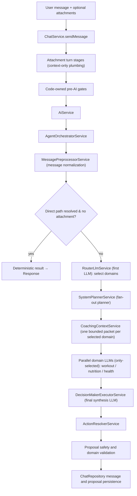

# Unified LLM Pipeline

This document is the **canonical, locked architecture** for the chat/LLM pipeline.
The pipeline is a **multi-domain fan-out + synthesis** design: one routing LLM
selects the relevant domains, the selected domain LLMs run in parallel, and a final
decision-maker LLM synthesizes their output into one reply plus typed proposals.

> **Status — locked architecture, now implemented.** This is the architecture the
> codebase locked and must not deviate from. The phased migration is complete: every
> component described below exists in code. The multi-domain fan-out path
> (RouterLlm → SystemPlanner `DomainFanoutPlan` → parallel `DomainLlmExecutorService`
> → `DecisionMakerExecutorService` → `ActionResolverService`) is the live path for
> eligible turns. The single bounded-loop `ResponseModeExecutorService` is retained
> deliberately for the non-fan-out turns (proposal-revision, proposal-explainer,
> low-confidence fallback, and deterministic gate-miss); see Stage 8 and "Retained
> Single-Executor Path".

Attachments are **context** for this same pipeline — there is no separate attachment
recognition/classification pipeline and no attachment proposal side channel. The old
intent router (`intent-router.ts`), `TurnDecisionService`, `MessageUnderstandingService`,
the attachment-family route bypass, and the attachment recognizers/classifiers have all
been removed (see "Removed Legacy Paths").

## End-To-End Flow



LLM call budget per eligible turn: **1 router + N selected domain LLMs (N ≤ 3, run in
parallel) + 1 decision-maker**. Direct-path, crisis, and proposal-explainer turns make
zero domain/decision LLM calls.

## Stage 0: Chat Entry

### `ChatService`

File: `apps/api/src/modules/chat/chat.service.ts`

`ChatService.sendMessage` owns the full chat turn at the API boundary.

Responsibilities:

- Resolve the authenticated user via `UsersService`.
- Load the thread and recent messages through `ChatRepository`.
- Validate attachment refs before send through
  `ChatTurnAttachmentStageService.validateRefsForSend`.
- Persist the user message.
- Run the **attachment plumbing stages** when `attachmentRefIds` are present
  (validate → link → apply upload disposition; no classify/recognize).
- Apply hard pre-AI gates: crisis support, proposal explainer no-proposal, and
  direct chat paths.
- Call `AiService.generateCoachResponse` for the unified LLM pipeline.
- Persist the assistant message with parse, safety, agent, and weekly-review
  metadata.
- Run the proposal validation stack and persist reviewable proposals.

`ChatService` does not create proposal cards from attachment recognition. Any
proposal shown to a user must come from a domain LLM / the decision-maker, then
pass validation.

### `ChatRepository`

File: `apps/api/src/modules/chat/chat.repository.ts`

Persists chat threads, chat messages, and proposal records. It does not make AI
or domain decisions.

### `chat.mapper`

File: `apps/api/src/modules/chat/chat.mapper.ts`

Maps database rows to API chat DTOs.

## Stage 1: Attachment Context (context-only)

Attachments are **bounded context** for the same pipeline used by text-only
messages. There is **no recognition or classification machinery** — the multimodal
router and domain LLMs read the attachment content directly. The chat-attachments
module keeps only the consent/ownership/storage perimeter.

### `ChatTurnAttachmentStageService`

File: `apps/api/src/modules/chat-attachments/chat-turn-attachment-stage.service.ts`

Runs the **plumbing stages only**:

- `validate_refs`: checks ownership and send eligibility.
- `link_to_message`: links attachments to the chat message and thread.
- `apply_upload_disposition`: applies category, retention, consent, and storage
  disposition. **Medical consent gate:** when the user-declared category /
  document-type + MIME indicate a medical document and consent is absent, the stage
  purges stored content and marks the attachment `needs_consent`.

The `classify`, `recognize`, and `prepare_attachment_context` stages and the removed
`prepare_proposal_candidates` stage **must not be reintroduced**.

### `ChatAttachmentsService`

File: `apps/api/src/modules/chat-attachments/chat-attachments.service.ts`

Owns chat attachment upload, ownership checks, consent grant, storage reads,
storage purge, linking, and status transitions. It keeps attachments as
chat/upload records, **not** durable health documents.

### Attachment Policy Helpers

File: `apps/api/src/modules/chat-attachments/attachment-behavior-policy.helpers.ts`

Resolves retention policy from `attachments.json` (`resolveAttachmentRetentionPolicyFromBehavior`).
The former recognition/meal-context/capability-hint helpers are removed.

### Medical Attachment Consent Helper

File: `apps/api/src/modules/chat-attachments/medical-document-attachment-recognizer.ts`

The recognition builder was removed; this file is retained **only** for the consent
metadata helpers `buildMedicalAttachmentConsent` and `parseMedicalUploadMetadata`,
which record the user-declared document type/title on the attachment consent record.
The medical consent gate itself (`isMedicalAttachmentByDeclarationOrMime`) lives in
`chat-turn-attachment-stage.service.ts` and keys off the **user-declared
category/document-type + MIME** — no LLM classifier.

### What the pipeline receives

`ChatService` passes the raw attachment refs + minimal metadata (category, MIME,
consent state, storage ref) into the orchestrator. The router LLM sees "an
attachment of type X is present"; the selected domain LLMs receive the bounded
attachment content as context and produce typed proposals (nutrition calories,
workout adjustments, a consent-gated medical-save proposal, etc.). No
`contextSummaries` / recognition envelope is produced.

## Stage 2: Code-Owned Pre-AI Gates

These gates intentionally bypass the LLM pipeline. They are safety or
deterministic product boundaries, not duplicate AI routers.

### Crisis Boundary

Functions:

- `evaluateWellbeingCrisisFromText`
- `formatWellbeingCrisisSupportReply`

Location: `@health/types`, used by `ChatService`.

When crisis support should be shown, the system creates a deterministic support
reply and no proposals — before any LLM runs.

### Proposal Explainer

Files:

- `apps/api/src/modules/chat/proposal-explainer.service.ts`
- `apps/api/src/modules/ai/proposal-explainer-matcher.service.ts`

Handles read-only questions about existing proposals. If no proposal is
available, it returns deterministic no-proposal copy without invoking any coach
LLM. Explainer turns with a proposal still remain read-only.

### Direct Chat Paths

Files:

- `apps/api/src/modules/chat/direct-chat-path.service.ts`
- `apps/api/src/modules/chat/direct-chat-path-formatters.ts`
- `apps/api/src/modules/ai/direct-chat-path-matcher.service.ts`

Handles explicit deterministic actions such as reading today's summary or
marking today's workout done. Direct paths resolve only when the message is
clearly understood **and there is no attachment**; otherwise the turn falls
through to the router. Plan changes remain proposal-only.

## Stage 3: AI Facade And Orchestrator

### `AiService`

File: `apps/api/src/modules/ai/ai.service.ts`

Thin facade over `AgentOrchestratorService`. It preserves the API boundary
between chat code and AI orchestration.

### `AgentOrchestratorService`

File: `apps/api/src/modules/ai/agent-orchestrator.service.ts`

Central orchestrator for the unified LLM pipeline.

Responsibilities (`orchestrateCoachTurn`):

- Run deterministic message normalization via `MessagePreprocessorService`.
- Run `RouterLlmService` for eligible turns to select relevant domains.
- Ask `SystemPlannerService` for the deterministic `DomainFanoutPlan`.
- Decide fan-out vs. single-executor via `isFanOutTurn` (router ran, returned a
  confident LLM result, and the plan is not a deterministic executor mode).
- **Fan-out turns** (`runFanOutTurn`): build one bounded coaching-context packet per
  selected domain through `CoachingContextService`, run the **selected domain LLMs in
  parallel** through `DomainLlmExecutorService`, synthesize via
  `DecisionMakerExecutorService`, and resolve through `ActionResolverService`.
- **Single-executor turns** (proposal-revision, explainer, low-confidence fallback,
  deterministic gate-miss): delegate to `ResponseModeExecutorService` (see "Retained
  Single-Executor Path").
- Return structured AI output, parse errors, reply safety errors, the
  `consentRequired` flag (fan-out only), and agent metadata.

`RouterLlmService` is the only first-LLM routing stage for eligible turns. Proposal
revision and proposal explainer turns are the explicit non-router exceptions and run
through the single-executor path.

## Stage 4: Message Normalization

### `MessagePreprocessorService`

File: `apps/api/src/modules/ai/message-preprocessor.service.ts`

Builds the deterministic **message-context** object from the raw user message:

- original text
- normalized text
- detected language and basic signals
- attachment presence
- direct-path candidate hints

Pure helpers and schemas live in `packages/types`
(`packages/types/src/message-preprocessor.ts`).

### `DirectChatPathMatcherService`

File: `apps/api/src/modules/ai/direct-chat-path-matcher.service.ts`

Compiles direct-path patterns from `ai-behavior.json` and detects deterministic
read/write candidates.

## Stage 5: RouterLlm — First LLM

### `RouterLlmService` (replaces the removed `TurnDecisionService`)

File: `apps/api/src/modules/ai/router-llm.service.ts`

Builds the first-LLM routing request (`buildRequest`) and validates the response
(`route`). The router receives the message-context plus app context assembled from
the **merged domain YAML config + capability catalog** (`buildAvailableDomains`), and
selects which domain LLMs should run. It calls `provider.generateRouterDecision`.

Inputs:

- normalized message-context (incl. detected language)
- attachment presence + minimal metadata
- recent messages
- available domains/capabilities from the merged domain config and
  `CapabilityRegistryService`
- safety guardrails

Output: `RouterDecisionOutput` (`packages/types/src/router-decision.ts`):

- `selectedDomains[]` (max 3) — each with `domain`, `confidence`, and per-domain
  `intentHints[]` / `toolHints[]` / `signalHints[]`
- `contextNeeds[]`
- `directCommand` signal
- `safetyFlags[]`
- `confidence`

Safety behavior:

- validates provider output shape (`.strict()`)
- rejects forbidden user-facing fields such as direct replies or proposals
- clamps selected domains, intents, and tools to the capability catalog allowlist
- falls back to a safe general decision if provider output fails

## Stage 6: SystemPlanner — Fan-out Planner

### `SystemPlannerService`

File: `apps/api/src/modules/ai/system-planner.service.ts`

`SystemPlannerService` is the deterministic control layer after the router. The
LLM suggests; the planner clamps and finalizes.

Route resolution order:

1. Proposal revision route from the original proposal intent.
2. Confident router selection → `DomainFanoutPlan`.
3. Proposal explainer route.
4. Safe fallback route, usually `general`.

Planner output (`DomainFanoutPlan`):

- `selectedDomains[]` — each with `{ domain, capabilityId, allowedTools,
  allowedProposalIntents, contextBudget, executorMode }`, clamped to the capability
  catalog (the catalog is the floor; YAML/router can only narrow it).
- decision-maker plan (action-variant catalog + budget)
- per-domain context slice plans and compression requirements

Selected domains are capped at **3** (code constant). The planner never widens
tool/proposal allowlists beyond the catalog.

### `CapabilityRegistryService`

File: `apps/api/src/modules/ai/capability-registry.service.ts`

Loads the capability catalog from code defaults plus optional repo-backed config
overrides. It is the source of truth for capability ids, allowed tools, allowed
proposal intents, prompt instructions, presentation metadata, and the
**domain → capabilities** mapping. The per-domain YAML config can only narrow these
allowlists, never widen them.

### `CapabilityIntentDefinitionAdapter`

File: `apps/api/src/modules/ai/capability-intent-definition.adapter.ts`

Converts capability config into intent metadata used by domain prompts and
executor allowlists.

### `ResponseModePolicyService`

File: `apps/api/src/modules/ai/response-mode-policy.service.ts`

Resolves expected response mode from capability policy and route metadata.

### `ContextBudgetPolicyService`

File: `apps/api/src/modules/coaching-context/context-budget-policy.service.ts`

Builds context budget and slice policy **per selected domain**. Code floors deny
documents and sensitive health context by default, even if config tries to relax
them, and the floor is re-applied to each per-domain packet.

## Stage 7: Coaching Context

### `CoachingContextService`

File: `apps/api/src/modules/coaching-context/coaching-context.service.ts`

Builds one bounded `AgentContextPacket` and provider prompt context **per selected
domain** from structured user state. It is the gateway between domain state and the
domain prompts.

Responsibilities:

- load user snapshot
- assemble requested context slices for each selected domain
- apply safety constraints (per-packet budget floor re-applied)
- record source refs and missing context notes
- expose read-only context tools used by the domain agent loops

### `agent-prompt-context`

File: `apps/api/src/modules/coaching-context/agent-prompt-context.ts`

Maps `AgentContextPacket` into bounded prompt context and strips broad legacy
context keys.

### `ContextCompressionService`

File: `apps/api/src/modules/coaching-context/context-compression.service.ts`

Compresses large context packets when the planner requires compression.

### `ContextExpansionPolicyService`

File: `apps/api/src/modules/coaching-context/context-expansion-policy.service.ts`

Creates expansion-policy metadata for domain executor modes that may request
more context through tools.

## Stage 8: Parallel Domain LLMs

### `DomainLlmExecutorService`

File: `apps/api/src/modules/ai/domain-llm-executor.service.ts`

Runs **one** domain LLM bounded loop (`runDomainLoop`). The orchestrator invokes the
selected domain executors concurrently (`Promise.all`, in
`AgentOrchestratorService.runDomainsConcurrently`). The three initial domains are:

- **workout** (`workoutCoach`)
- **nutrition**
- **health** (fed by `medical.yml` + `health.yml`)

Per domain executor:

- resolve the domain's executor mode and bounded loop policy (max ~3 tool
  iterations)
- enforce the per-domain tool allowlist via `AgentToolRegistryService`
- run read-only context tools only
- validate reply safety
- emit a typed `domain_answer`

Failure behavior: a domain that errors, exhausts its loop, or times out degrades
to a **safe empty output** and never blocks the other domains or the turn. Per-domain
timeouts bound latency.

Output shape (`packages/types/src/domain-llm-step.ts`) — union of
`tool_request` or `domain_answer`, where
`domain_answer = { domain, summary, candidateProposals[], domainSignals[],
workoutCalorieEstimate? }`. Only the **workout** domain may populate
`workoutCalorieEstimate`.

### `AgentToolRegistryService`

File: `apps/api/src/modules/ai/agent-tool-registry.service.ts`

Executes tool requests from a domain loop after executor allowlist checks.

Tools (read-only context only):

- `getUserContextSlice`
- `getDocumentContext`
- `getWeeklyProgressContext`

A tool request not allowed by the active domain capability is rejected.

## Stage 9: Decision-Maker LLM

### `DecisionMakerExecutorService`

File: `apps/api/src/modules/ai/decision-maker-executor.service.ts`

Receives the selected domains' outputs plus the **action-variant catalog**
(built by `ActionVariantCatalogService`,
`apps/api/src/modules/ai/action-variant-catalog.service.ts`) and produces the final
decision in a single LLM call (`execute` → `provider.generateFinalDecision`). It
always resolves, degrading to a safe fallback on any provider error.

Request (`packages/types/src/final-decision.ts`):
`{ userMessage, domainOutputs[], actionVariantCatalog, safetyFlags[] }`.

Output: `{ reply, selectedAction, proposals[], consentRequired }`.

The decision-maker emits **typed proposals only**; it never writes domain state and
never fabricates a workout calorie estimate (that may only come from the workout
domain LLM).

## Stage 10: Action Resolver

### `ActionResolverService`

File: `apps/api/src/modules/ai/action-resolver.service.ts`

Resolves the decision-maker's selected action against the active capability
allowlist and the action-variant catalog, producing one of:

- a **consent-gated medical-save proposal** (never an auto-persisted
  `health_document`)
- a **workout proposal** with numeric prescription fields (the user sets their own
  completion time) plus a calorie-burn estimate copied from the workout domain LLM
  with provenance `workout_llm`
- a **nutrition proposal** with approximate calories/macros
- a **mental-health survey** (`capture_wellbeing_checkin`)
- a **plain reply**

It filters proposals to the active capability allowlist. It does **not** mutate
domain state and does **not** persist proposals.

## Stage 11: Proposal Validation And Persistence

### Reply And Proposal Safety

File: `packages/ai/src/safety.ts`

Functions:

- `validateReplySafety`
- `validateProposalSafety`

### `ProposalValidationService`

File: `apps/api/src/modules/proposals/proposal-validation.service.ts`

Validates proposal schema, ownership, provenance, attachment refs, recovery-aware
workout changes (incl. calorie-estimate bounds), habits, wellbeing check-ins,
recipe recommendations, nutrition incident image refs, and Today checklist
references.

### `ChatRepository.createProposal`

File: `apps/api/src/modules/chat/chat.repository.ts`

Persists raw proposals with validation status and validation errors. Nothing is
applied to structured state until the user accepts a valid proposal through the
proposal apply flow. Accepted workout/nutrition changes create new revisions.

## Coach AI Provider Surface

### `CoachProviderFactory`

File: `apps/api/src/modules/ai/coach-provider.factory.ts`

Selects provider mode from config/env.

### `OpenAiCoachProvider`

File: `apps/api/src/modules/ai/openai-coach-provider.ts`

OpenAI-backed provider implementation. The `CoachAiProvider` surface
(`packages/ai/src/stub-provider.ts` defines the interface). The three fan-out
methods drive the live multi-domain path:

- `generateRouterDecision` — the first-LLM domain selection
- `generateDomainStep` — one domain loop step (`domain: 'workout' | 'nutrition' |
  'health'`); resolves image attachments to multimodal content when present
- `generateFinalDecision` — the decision-maker synthesis

Two further methods are retained for the single-executor path (proposal-revision,
proposal-explainer, low-confidence fallback): `generateAgentLoopStep` (one bounded
agent-loop step) and `generateCoachResponse` (single-pass coercion of one loop step).
These are **not** the fan-out path and never run for confident multi-domain turns.

OpenAI prompt templates are keyed `router`, `domain_workout`, `domain_nutrition`,
`domain_health`, and `decision`, rendered through `CompiledPromptTemplates` and the
shared JSON-completion + shape-validation helpers.

### Stub Provider

File: `packages/ai/src/stub-provider.ts`

Deterministic provider used for local/test behavior. It defines the
`CoachAiProvider` interface and mirrors every provider method (the three fan-out
methods plus the retained `generateAgentLoopStep` / `generateCoachResponse`) without
external calls.

### Agent Loop Parsing

File: `packages/ai/src/agent-loop-output.ts`

Parses and coerces provider loop output into either `tool_request` or a
`domain_answer` / `final_answer`.

## Domain Config (per-domain YAML)

AI/chat behavior is files-first and repo-backed. The domain-specific routing,
intents, tools, signals, and prompts live in **per-domain YAML files**:

- `packages/ai-behavior/config/domains/workout.yml`
- `packages/ai-behavior/config/domains/nutrition.yml`
- `packages/ai-behavior/config/domains/medical.yml`
- `packages/ai-behavior/config/domains/health.yml`

### Domain config schema

File: `packages/types/src/domain-config.ts`

Each domain config (`.strict()`) holds:

```
{ domain, llmId,
  intents: [{ id, description, mapsToCapabilityId }],
  tools:   [toolName],
  signals: [{ id, patterns? }],
  prompts: [{ key, body, placeholders }],
  safetyNotes: [] }
```

### Domain config loader

File: `packages/ai-behavior/src/domain-config-loader.ts`

One loader reads every `domains/*.yml`, Zod-parses each, and merges them into a
`DomainConfigBundle`. Loading is **fail-closed per file**: any read/parse error
falls back to that domain's built-in defaults and records warnings; a broken file is
never partially merged. The YAML parser dependency is `yaml`
(`packages/ai-behavior/package.json`).

### Catalog intersection is the floor

Each `intents[].mapsToCapabilityId` must resolve to a real `CatalogIntentId`. A
domain LLM's usable tools/proposals are the **intersection** of the YAML-declared
set and the capability-catalog allowlist (`AGENT_CAPABILITY_CONFIGS`). YAML can only
**narrow**; the loader drops and warns on anything outside the catalog. Domain YAML
carries prompts/signals/intents only — never context-budget, consent, crisis, or
validation rules.

## Config Sources

### `AiBehaviorConfigService`

File: `apps/api/src/modules/ai/ai-behavior-config.service.ts`

Loads repo-backed behavior config and exposes typed accessors, including
`getDomainConfigs()` backed by the domain YAML loader.

Config files:

- `packages/ai-behavior/config/ai-behavior.json` — chat/LLM behavior (direct-path
  patterns, prompts, proposal-revision routing, context budgets).
- `packages/ai-behavior/config/attachments.json` — attachment consent, categories,
  retention, and plumbing stage order. (Recognition/classification config removed.)
- `packages/ai-behavior/config/domains/*.yml` — per-domain intents/tools/signals/prompts.

Loaders:

- `packages/ai-behavior/src/loader.ts`
- `packages/ai-behavior/src/attachment-loader.ts`
- `packages/ai-behavior/src/domain-config-loader.ts`

Schemas and defaults:

- `packages/types/src/ai-behavior-config.ts`
- `packages/types/src/attachment-behavior-config.ts`
- `packages/types/src/domain-config.ts`

## Safety Boundaries

- Crisis support is code-owned and bypasses all LLMs.
- Medical attachments are consent-gated at upload by the **user-declared
  category/document-type + MIME** (no LLM classifier); content is context-only and a
  save is a **consent-gated proposal** — never an auto-persisted `health_document`.
- Context budgets deny document and sensitive health context by default, re-applied
  to every per-domain packet; config cannot relax these floors.
- The router output is clamped to known domains, capabilities, and tools, and may
  not emit replies or proposals.
- SystemPlanner owns final route, budget, executor modes, and allowlists, and caps
  selected domains at 3. YAML/router can only narrow catalog allowlists.
- Domain LLMs run only-selected and in parallel; each enforces its own tool
  allowlist and reply safety, and a failed domain degrades to a safe empty output.
- The decision-maker emits typed proposals only; only the workout domain LLM may set
  a workout calorie estimate.
- `ActionResolver` filters proposal intents to the active capability allowlist.
- `ChatService` validates every proposal before persistence.
- The AI layer never writes directly to domain tables; accepted workout/nutrition
  changes create new revisions.

## Removed Legacy Paths

The following files/exports were deleted and are no longer active runtime paths:

- `UNIFIED_TURN_DECISION_ENABLED` feature flag.
- `intent-router.ts`, `provider.generateIntentRoute`, the `llm_router` route fallback.
- `TurnDecisionService` (+ spec), `provider.generateTurnDecision`, the
  message-understanding-as-turn-decision shim
  (`mapTurnDecisionOutputFromMessageUnderstanding`), and `MessageUnderstandingService`
  (+ spec). The router-decision pipeline (`RouterLlmService` +
  `provider.generateRouterDecision`) is the only first-LLM routing stage.
- The "no LLM fan-out / no verdict LLM" model — replaced by the parallel domain LLMs
  + decision-maker described here.
- `attachment_family` planner bypass.
- The attachment recognition/classification machinery: `ChatAttachmentClassifierService`
  and the classification providers/factory, `ChatAttachmentRecognitionService`, the
  `food-photo` and `workout` attachment recognizers, the medical context-only
  recognition builder (`buildMedicalDocumentContextOnlyRecognition`), the
  `attachment-recognition-context` helpers, and the
  `classify`/`recognize`/`prepare_attachment_context` turn stages (the stage enum is now
  `validate_refs`/`link_to_message`/`apply_upload_disposition` only).
- Nutrition food-photo analysis providers (`food-photo-analysis.service.ts`,
  `food-photo-analysis.factory.ts`, `openai-food-photo-analysis.provider.ts`) — the
  nutrition domain LLM analyzes food photos directly via `generateDomainStep`.
- `prepare_proposal_candidates`, attachment `proposalCandidates`, `preparedProposals`,
  `buildProposalCandidates`, `mergeAttachmentProposals`.
- automatic `health_documents` creation from chat attachment recognition.

Some historical enum values and parse compatibility remain only so old stored
metadata can still be read safely:

- `agentRoutingMethodSchema` keeps the deprecated `llm_router`, `message_understanding`,
  and `attachment_family` values alongside the production `unified_turn_decision` value.
- The `unified_turn_decision` agent metadata block and the `recognition` column on
  `chat_attachment` rows remain for reading historically persisted data.

These compatibility shims are removable only behind a stated DB migration that backfills
or drops the historical rows; do not delete them otherwise.

## Retained Single-Executor Path (not legacy)

The single bounded-loop `ResponseModeExecutorService`
(`apps/api/src/modules/ai/response-mode-executor.service.ts`) is **deliberately
retained** — it is not legacy and was not removed. The orchestrator (`isFanOutTurn`
check) routes to it for every turn that is **not** a confident fan-out turn:

- proposal-revision turns (router skipped),
- proposal-explainer turns (router skipped),
- low-confidence / fallback turns (router ran but did not clear the confidence gate),
- deterministic gate-miss turns (a deterministic executor mode).

This path runs one bounded agent loop via `provider.generateAgentLoopStep` /
`provider.generateCoachResponse`, enforces the single capability's tool allowlist and
reply safety, and resolves proposals through `ActionResolverService.resolveProposalOnlyOutput`.
It never runs for confident multi-domain turns and shares the same proposal-only and
safety floors as the fan-out path.
