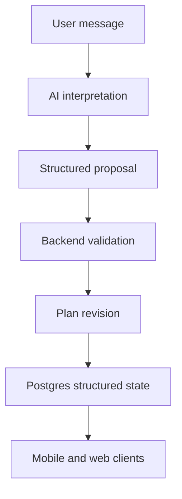

# Architecture Overview

## System Shape

Use a TypeScript monorepo with a modular monolith backend:

```text
apps/api     NestJS REST API
apps/mobile  Expo React Native app
apps/web     Next.js App Router app

packages/db      Drizzle schema and migrations
packages/types   Zod schemas and shared contracts
packages/ui      Shared design primitives
packages/ai      Prompts, tool schemas, and AI orchestration helpers
packages/config  Shared TypeScript, lint, and env validation
```

## Core Principle

Structured state is authoritative. Chat is only an interface for collecting input, explaining decisions, and proposing changes.



## Product Surface Architecture

The web product is the primary product surface for the current planning direction. It uses a small, user-facing information architecture:

- `Chat` — dominant coaching conversation and proposal approval surface.
- `Today` — daily execution surface for today's workout, nutrition, stress/recovery check-in, mental wellbeing checkpoints, habits, and feedback.
- `Longevity` — weekly overview for consistency, cross-domain trends, goals, recovery/wellbeing context, and safe coach prompts.
- `Profile` — account, onboarding, personal context, goal hierarchy, documents, consent, and settings.

Training and Nutrition remain routeable secondary views, but they are read-only weekly plan views rather than primary tabs. Users change workout and nutrition plans through Chat proposals, user approval, backend validation, and revision-safe state updates.

See `docs/architecture/product-surface-architecture.md` for the complete surface model.

## Backend

- NestJS modular monolith.
- REST API first; OpenAPI can be added after the first stable slices.
- Controllers stay thin.
- Services own application logic.
- Repositories own database access.
- Domain modules should be independently testable.

## Data

- PostgreSQL is the primary database.
- Drizzle owns schema and migrations.
- Plan entities are revision-safe: updates create revisions instead of overwriting the current plan in place.
- Zod validates user inputs, API contracts, and AI structured outputs.

## AI

- AI starts inside `apps/api/src/modules/ai`.
- Use structured outputs and tool calling.
- AI tools return proposals with reasons and typed changes.
- Backend services validate and apply proposals.
- The AI layer must not write directly to domain tables.

## Clients

- Web is the primary product experience for the current build direction.
- Mobile remains in the monorepo and should follow the same product surface hierarchy when brought to parity.
- TanStack Query should be used for API state on both web and mobile.
