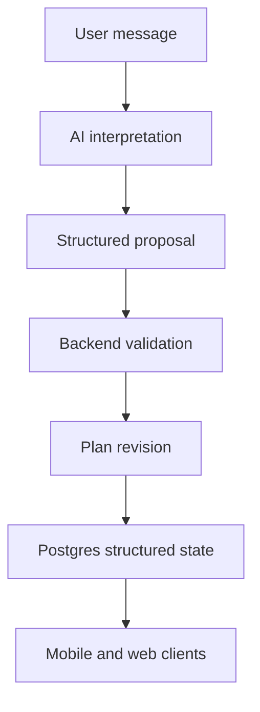

# Architecture Overview

## System Shape

Use a TypeScript monorepo with a modular monolith backend:

```text
apps/api     NestJS REST API
apps/mobile  Expo React Native app
apps/web     Next.js App Router app

packages/db      Drizzle schema and migrations
packages/types   Zod schemas and shared contracts
packages/ui      Shared design primitives
packages/ai      Prompts, tool schemas, and AI orchestration helpers
packages/config  Shared TypeScript, lint, and env validation
```

## Core Principle

Structured state is authoritative. Chat is only an interface for collecting input, explaining decisions, and proposing changes.



## Backend

- NestJS modular monolith.
- REST API first; OpenAPI can be added after the first stable slices.
- Controllers stay thin.
- Services own application logic.
- Repositories own database access.
- Domain modules should be independently testable.

## Data

- PostgreSQL is the primary database.
- Drizzle owns schema and migrations.
- Plan entities are revision-safe: updates create revisions instead of overwriting the current plan in place.
- Zod validates user inputs, API contracts, and AI structured outputs.

## AI

- AI starts inside `apps/api/src/modules/ai`.
- Use structured outputs and tool calling.
- AI tools return proposals with reasons and typed changes.
- Backend services validate and apply proposals.
- The AI layer must not write directly to domain tables.

## Clients

- Mobile is the primary user experience.
- Web starts as a lightweight surface for debugging, admin, or future desktop flows.
- TanStack Query should be used for API state on both web and mobile.
