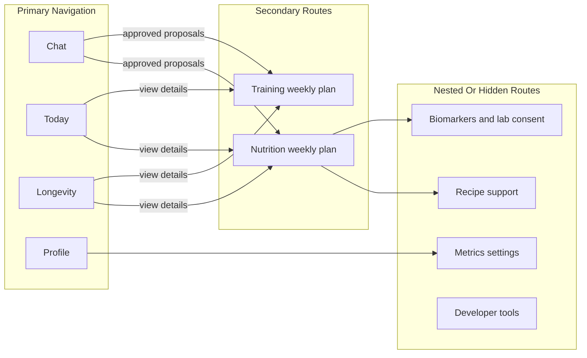
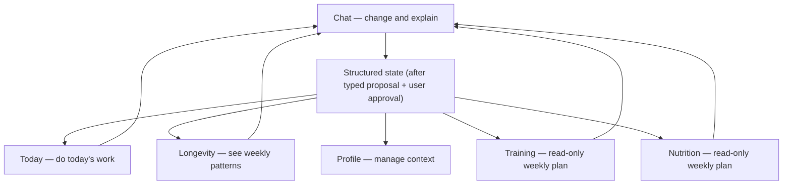

# Product Surface Architecture

## Purpose

This document defines the user-facing information architecture for AI Health Coach. It is the product-surface counterpart to the backend domain model: structured state remains authoritative (the canonical statement of that principle lives in [`overview.md`](./overview.md)), while the UI decides how much of that state the user should see directly.

## Surface Model

The web product uses four primary surfaces:

## User Flow

The user mostly sees these surfaces; the system keeps detailed structured state behind
them. Change requests flow through Chat as typed proposals (the full proposal lifecycle is
documented once in [`llm-pipeline.md`](./llm-pipeline.md)), and every surface can link back
into Chat to discuss or request a change:

Navigation rules: Chat is the dominant header action and the preferred default landing
route after authentication. Today, Longevity, and Profile are the other primary tabs.
Training and Nutrition are not primary tabs but must stay easy to open from Today,
Longevity, and proposal cards. Metrics, Biomarkers, Goals, Recipes, Progress, and developer
tools are never primary tabs. Mobile may keep placeholders but should follow the same
hierarchy when brought to parity.

## Primary Surfaces

- **Chat** is the dominant coaching surface. It is the default place to ask questions, attach food/document/workout context, receive explanations, review typed proposals, and approve or reject changes.
- **Today** is the daily execution surface. It shows what the user should do today: current workout, today's nutrition plan, stress or recovery check-in, mental wellbeing checkpoints, habits, and checklist completion.
- **Longevity** is the weekly overview. It summarizes consistency, trends, recovery, wellbeing, training, nutrition, goals, and safe biomarker-context status without clinical scores.
- **Profile** is the account and context surface. It owns onboarding status, identity, preferences, constraints, goal hierarchy, biomarker/lab consent, device/data consent, and settings.

## Secondary Surfaces

Training and Nutrition remain visible, but they are not primary navigation tabs. They are read-only plan views opened from Today, Longevity, Chat proposal links, or Profile context.

- **Training** shows the active weekly workout plan, scheduled sessions, completion history, and plan revisions in a visual way.
- **Nutrition** shows the active weekly nutrition plan, meal structure, hydration target, restrictions, and adherence in a visual way.

Users do not manually edit active workout or nutrition plans on these screens. Plan changes flow through Chat as typed AI proposals, user approval, backend validation, and revision-safe state updates.

## Hidden Or Nested Surfaces

- **Biomarkers** (`/biomarkers`, wayfinding parent Nutrition) is a consent-gated, wellness-only lab-report surface: an upload panel, manual reading entry, and a dashboard-by-area with range bars and per-marker history — under two-level consent (upload-time store-and-parse + an optional per-report coach-chat toggle), no clinical/diagnostic scores. See [`domain-model.md`](./domain-model.md) and [`database.md`](./database.md).
- **Metrics** are not a primary consumer tab. User-facing trends appear in Today or Longevity; raw metric management and consent live under Profile/settings.
- **Recipes** are not a standalone primary route. Recipe recommendations are nested under Nutrition and can also appear through Chat proposals.
- **Developer tools, proposal audit pages, inspectors, and admin views** must stay out of primary navigation.

## State And Mutation Rules

- Chat history is never the source of truth for plans, goals, metrics, wellbeing, or progress (structured state is authoritative — see [`overview.md`](./overview.md)).
- Chat attachments are context-only interaction input; there is no separate attachment classification/extraction proposal path (see [`llm-pipeline.md`](./llm-pipeline.md) Stage 1).
- Structured state drives every primary and secondary surface.
- AI can explain, summarize, and propose changes, but cannot silently mutate domain tables.
- Workout and nutrition plan changes create new revisions; they are not edited in place from read-only plan screens (revision pattern in [`database.md`](./database.md)).
- Today completion actions are user execution events, not plan edits.
- Longevity is read-only for structured state. It can link the user to Chat to discuss or change a plan.
- Profile edits can directly update user-owned account/context fields when the user is filling forms; AI-driven profile or goal changes still require typed proposals.

## Today Composition

Today should prioritize the smallest useful daily loop:

1. Current workout or movement task for today.
2. Today's nutrition plan and hydration focus.
3. Stress, recovery, or wellbeing check-in.
4. Mental wellbeing checkpoints and habits.
5. Completion state and short end-of-day feedback.

Today can link to full Training or Nutrition plan views, but it should not become a full weekly planning dashboard.

## Longevity Composition

Longevity answers "how am I doing overall?" It should aggregate:

- weekly consistency,
- Today adherence,
- workout and nutrition consistency,
- recovery and wellbeing trends,
- active goals,
- consent-aware biomarker context,
- static prompts or deep links into Chat.

Longevity must not expose diagnosis, treatment guidance, biological age, clinical risk scores, or vendor readiness scores as product truth.

## Feature Placement

- **Mental wellbeing check-ins:** capture on Today; trends on Longevity; privacy and
  settings on Profile.
- **Recovery / readiness:** daily focus on Today; weekly trends on Longevity; no exposed
  clinical score.
- **Habit system:** materialize daily habits into Today; consistency appears on Longevity.
- **Weekly review:** initiated from Chat or Longevity; proposals reviewed in Chat.
- **Biomarkers / lab reports:** uploads and two-level consent on the Biomarkers surface
  (wayfinding parent Nutrition); safe, bounded insights in Chat and Longevity only when
  consented — no diagnostic or clinical scores.
- **Recipes:** backend support for Nutrition, not a standalone user-facing tab.

## Implementation Implications

- Primary web navigation should be `Chat`, `Today`, `Longevity`, `Profile`.
- `/training` and `/nutrition` should remain routeable secondary pages, but not top-level nav items.
- `/biomarkers`, `/metrics`, `/goals`, `/recipes`, `/progress`, proposal inspector, and dev routes should not be advertised in primary navigation.
- App shell and design system components should make Chat visually dominant even when the user is on another surface.
- Feature briefs in `docs/product/features` should include a `UX Placement` section that maps their UI to this surface model.
