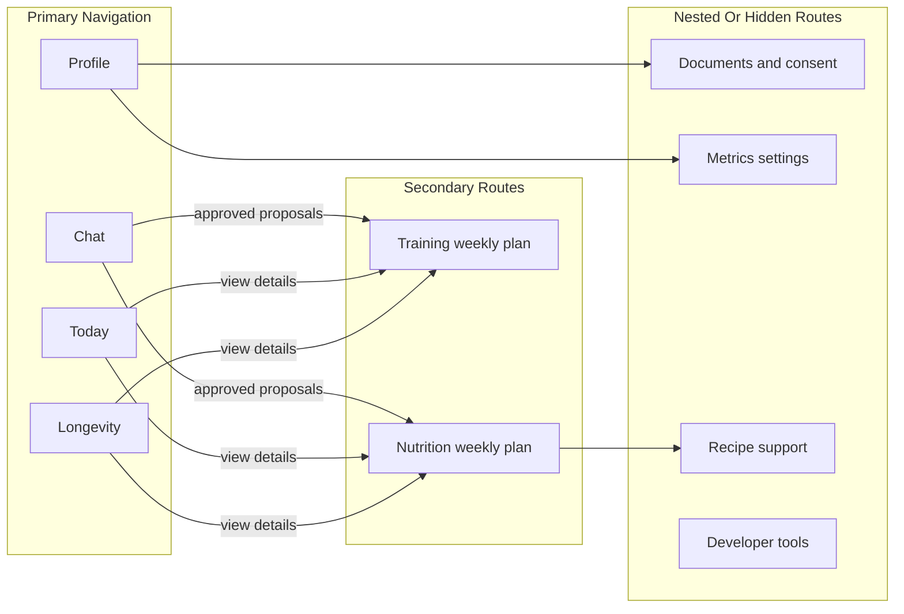

# Product Surface Architecture

## Purpose

This document defines the user-facing information architecture for AI Health Coach. It is the product-surface counterpart to the backend domain model: structured state remains authoritative, while the UI decides how much of that state the user should see directly.

## Surface Model

The web product uses four primary surfaces:

## Primary Surfaces

- **Chat** is the dominant coaching surface. It is the default place to ask questions, receive explanations, review typed proposals, and approve or reject changes.
- **Today** is the daily execution surface. It shows what the user should do today: current workout, today's nutrition plan, stress or recovery check-in, mental wellbeing checkpoints, habits, and checklist completion.
- **Longevity** is the weekly overview. It summarizes consistency, trends, recovery, wellbeing, training, nutrition, goals, and safe document-context status without clinical scores.
- **Profile** is the account and context surface. It owns onboarding status, identity, preferences, constraints, goal hierarchy, document consent, device/data consent, and settings.

## Secondary Surfaces

Training and Nutrition remain visible, but they are not primary navigation tabs. They are read-only plan views opened from Today, Longevity, Chat proposal links, or Profile context.

- **Training** shows the active weekly workout plan, scheduled sessions, completion history, and plan revisions in a visual way.
- **Nutrition** shows the active weekly nutrition plan, meal structure, hydration target, restrictions, and adherence in a visual way.

Users do not manually edit active workout or nutrition plans on these screens. Plan changes flow through Chat as typed AI proposals, user approval, backend validation, and revision-safe state updates.

## Hidden Or Nested Surfaces

- **Documents** live under Profile with explicit consent and wellness-only copy.
- **Metrics** are not a primary consumer tab. User-facing trends appear in Today or Longevity; raw metric management and consent live under Profile/settings.
- **Recipes** are not a standalone user-facing route. Recipes may support nutrition planning behind the scenes and may appear only as approved recommendations or nutrition plan details.
- **Developer tools, proposal audit pages, inspectors, and admin views** must stay out of primary navigation.

## State And Mutation Rules

- Chat history is never the source of truth for plans, goals, metrics, wellbeing, or progress.
- Structured state drives every primary and secondary surface.
- AI can explain, summarize, and propose changes, but cannot silently mutate domain tables.
- Workout and nutrition plan changes create revisions; they are not edited in place from read-only plan screens.
- Today completion actions are user execution events, not plan edits.
- Longevity is read-only for structured state. It can link the user to Chat to discuss or change a plan.
- Profile edits can directly update user-owned account/context fields when the user is filling forms; AI-driven profile or goal changes still require typed proposals.

## Today Composition

Today should prioritize the smallest useful daily loop:

1. Current workout or movement task for today.
2. Today's nutrition plan and hydration focus.
3. Stress, recovery, or wellbeing check-in.
4. Mental wellbeing checkpoints and habits.
5. Completion state and short end-of-day feedback.

Today can link to full Training or Nutrition plan views, but it should not become a full weekly planning dashboard.

## Longevity Composition

Longevity answers "how am I doing overall?" It should aggregate:

- weekly consistency,
- Today adherence,
- workout and nutrition consistency,
- recovery and wellbeing trends,
- active goals,
- consent-aware document context,
- static prompts or deep links into Chat.

Longevity must not expose diagnosis, treatment guidance, biological age, clinical risk scores, or vendor readiness scores as product truth.

## Implementation Implications

- Primary web navigation should be `Chat`, `Today`, `Longevity`, `Profile`.
- `/training` and `/nutrition` should remain routeable secondary pages, but not top-level nav items.
- `/metrics`, `/documents`, `/goals`, `/recipes`, `/progress`, proposal inspector, and dev routes should not be advertised in primary navigation.
- App shell and design system components should make Chat visually dominant even when the user is on another surface.
- Feature briefs in `docs/product/features` should include a `UX Placement` section that maps their UI to this surface model.
