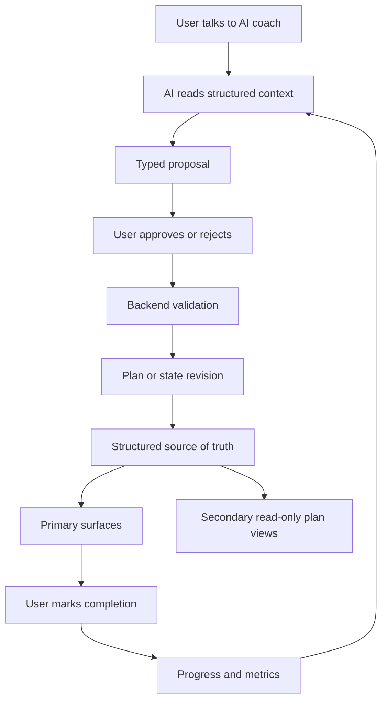

# AI Health Coach Feature Roadmap

## Product Idea

AI Health Coach is a stateful wellness and fitness coaching product. The user talks to an AI coach through chat, but chat is only the interaction layer. The source of truth is structured state: profile, goals, workout plans, nutrition plans, recipes, device metrics, documents, adherence, and progress.

The AI can explain, summarize, and propose changes. It does not silently rewrite the user's plans. When the AI recommends a new workout, nutrition adjustment, recipe set, or daily checklist change, it creates a typed proposal. The user approves or rejects that proposal. Approved proposals are validated by backend services and applied as auditable revisions.

## Product Surfaces

The user-facing web IA is intentionally small. The primary navigation has four surfaces:

- Chat: the dominant coaching conversation for planning, feedback, explanations, typed proposals, and approval decisions.
- Today: the daily execution loop for the current workout, today's nutrition plan, stress/recovery check-in, mental wellbeing checkpoints, habits, adherence, and quick feedback.
- Longevity: the weekly overview for consistency, cross-domain trends, goals, recovery/wellbeing context, and safe coach prompts.
- Profile: account identity, onboarding, personal context, goal hierarchy, documents, consent, device/data settings, and preferences.

Secondary read-only plan views remain routeable but are not primary tabs:

- Training: active weekly workout plan, scheduled sessions, execution history, and revision context.
- Nutrition: active weekly nutrition plan, meal structure, hydration, restrictions, adherence, and revision context.

Backend or nested surfaces should not become primary navigation:

- Recipes support nutrition planning and recommendations behind the scenes.
- Metrics feed Today, Longevity, and AI context; raw metric management belongs under Profile/settings.
- Documents live under Profile with explicit consent and wellness-only copy.
- Goals are structured state shown through Profile, Today linkage, Longevity, and Chat proposals.

## Roadmap Phases

### Phase 1: Foundation

Create the TypeScript monorepo, NestJS API, Expo mobile app, Next.js web product surface, Drizzle/Postgres database package, shared Zod contracts, AI package, and shared configuration.

### Phase 2: User, Auth, Profile, Goals

Create the first user-owned structured state. This includes authentication, user profile, goals, preferences, constraints, and onboarding.

### Phase 3: Chat and Proposal Approval

Implement chat threads and messages, AI structured output, proposal persistence, and the user approval flow. The AI returns both a conversational response and optional typed proposals.

### Phase 4: Workout Plans

Implement workout plans, immutable workout plan revisions, active plan reads, scheduled sessions, completion tracking, Today workout execution, and a secondary read-only Training plan view.

### Phase 5: Daily Execution Loop

Implement Today checklists, task completion, adherence scoring, daily progress history, and short feedback capture.

### Phase 6: Nutrition Plans

Implement nutrition plans, immutable nutrition plan revisions, calories, macros, hydration, restrictions, daily nutrition adherence, Today nutrition view, and a secondary read-only Nutrition plan view.

### Phase 7: Recipe Database

Add recipes as a structured knowledge base with ingredients, macro estimates, tags, restrictions, and meal types. Let AI propose recipes that fit the current nutrition plan, but keep nutrition targets in structured plan revisions.

### Phase 8: Device Sync and Health Metrics

Add Apple HealthKit, Android Health Connect, and wearable sync after explicit consent. Store normalized metric snapshots and aggregates rather than exposing raw private logs to the AI by default.

### Phase 9: Documents

Add health document upload, parsing/OCR, summaries, semantic search, and document-aware coaching context. Keep diagnosis and treatment guidance out of scope.

### Phase 10: Progress and Adaptation

Add weekly summaries, trend detection, adherence insights, and richer AI adaptation proposals across workouts, nutrition, recipes, and recovery.

## Current Implementation Snapshot

As of the longevity expansion planning pass, the core coaching loop is partially implemented on web and backend:

| Surface | Status | Notes |
|---------|--------|-------|
| Chat / Proposals | Partial | Full proposal pipeline; AI is stub-based |
| Workouts / Today / Nutrition | Partial | Strong web + backend; mobile mostly placeholder except nutrition |
| Metrics / Device Sync | Partial | API and consent exist; native HealthKit/Health Connect not live |
| Documents / Labs | Partial | Dev text upload, summaries, keyword search; no lab extraction or correlations |
| Progress / Adaptation | Partial | Workout-centric weekly summaries; cross-domain review deferred |

The backend already supports `Chat -> AIProposal -> approval -> structured state` for core domains. Longevity-specific layers below are planned but not yet implemented.

## Longevity Expansion

These features extend the product toward AI-first coaching for a longer and healthier life. Each has a dedicated feature brief in `docs/product/features/`.

### Recommended Sequence

1. [Personal Context, Onboarding, and Goal Hierarchy](features/personal-context-onboarding-goal-hierarchy.md) — foundation for coherent coaching context before other longevity features.
2. [Mental Wellbeing Check-ins](features/mental-wellbeing-check-ins.md) — structured mood/stress signals for daily and weekly coaching.
3. [Recovery and Readiness](features/recovery-readiness.md) — recovery context and recovery-aware proposals.
4. [Habit System and Daily Coaching](features/habit-system-daily-coaching.md) — durable habits materialized into Today.
5. [Today Daily Execution](features/today-daily-execution.md) — unifies current workout, nutrition today, stress, wellbeing checkpoints, and habits.
6. [Weekly Review and Cross-Domain Adaptation](features/weekly-review-cross-domain-adaptation.md) — extends Phase 10 beyond workout-only summaries and surfaces through Longevity + Chat.
7. [Longevity Dashboard](features/longevity-dashboard.md) — consumer overview once enough structured signals exist.
8. [Medical and Lab Data Wellness Correlations](features/medical-lab-data-wellness-correlations.md) — consent-first lab/document context and wellness correlations; depends on documents, metrics, and safety gates.

### Feature Index

| Feature | Brief | Depends on |
|---------|-------|------------|
| Onboarding and goal hierarchy | [personal-context-onboarding-goal-hierarchy.md](features/personal-context-onboarding-goal-hierarchy.md) | Phase 2 profile/goals |
| Mental wellbeing check-ins | [mental-wellbeing-check-ins.md](features/mental-wellbeing-check-ins.md) | Today, coaching context |
| Recovery and readiness | [recovery-readiness.md](features/recovery-readiness.md) | Metrics, Today, workouts |
| Habit system | [habit-system-daily-coaching.md](features/habit-system-daily-coaching.md) | Today, proposals |
| Today daily execution | [today-daily-execution.md](features/today-daily-execution.md) | Today, workouts, nutrition, wellbeing, habits |
| Weekly cross-domain review | [weekly-review-cross-domain-adaptation.md](features/weekly-review-cross-domain-adaptation.md) | Progress, wellbeing, recovery, habits |
| Longevity dashboard | [longevity-dashboard.md](features/longevity-dashboard.md) | Weekly review, metrics, goals |
| Medical/lab correlations | [medical-lab-data-wellness-correlations.md](features/medical-lab-data-wellness-correlations.md) | Documents, metrics, consent, proposals |

## AI Safety and State Rules

- Structured state is authoritative; chat history is not.
- AI creates typed proposals; backend services validate and apply them.
- User approval is required before an AI proposal changes a plan or user-facing tab state.
- Workout and nutrition changes create revisions instead of overwriting active plans.
- Device sync and document features require explicit consent and least-privilege data access.
- The product is for wellness, fitness, tracking, and coaching, not medical diagnosis or treatment.

## Medical and Lab Data Policy

The product does **not** provide diagnosis, treatment, medication guidance, medical certainty, or clinical triage. That boundary is fixed across every product phase.

Users **may** upload medical documents, laboratory studies, and other health data when they choose to. That data is allowed only as **user-consented coaching context**, not as a clinical decision engine.

With consent, the coach may:

- extract wellness-relevant structured signals from uploaded documents (for example biomarker name, value, unit, date, source section),
- look for **wellness-safe correlations** between physical, mental, behavioral, and plan signals,
- explain observed patterns in coaching language,
- propose changes to workout load, recovery focus, nutrition structure, habits, or Today checklist items.

All such changes must flow through typed proposals, user approval, backend validation, and revision-safe state updates. Chat remains the interaction layer; structured state remains authoritative.

