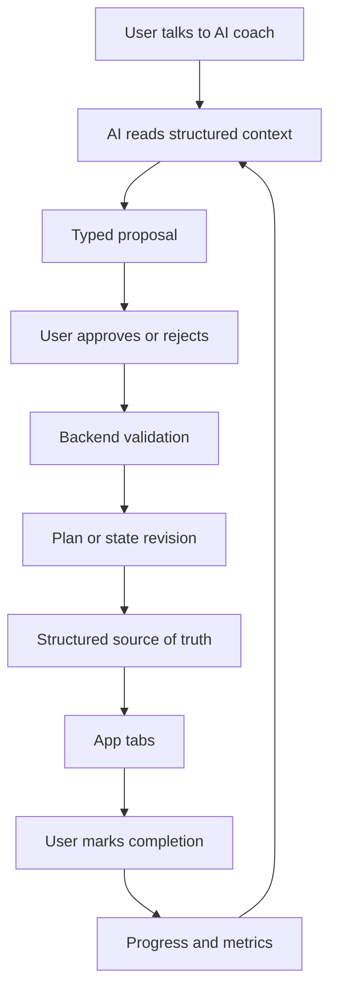

# AI Health Coach Feature Roadmap

## Product Idea

AI Health Coach is a stateful wellness and fitness coaching product. The user talks to an AI coach through chat, but chat is only the interaction layer. The source of truth is structured state: profile, goals, workout plans, nutrition plans, recipes, device metrics, documents, adherence, and progress.

The AI can explain, summarize, and propose changes. It does not silently rewrite the user's plans. When the AI recommends a new workout, nutrition adjustment, recipe set, or daily checklist change, it creates a typed proposal. The user approves or rejects that proposal. Approved proposals are validated by backend services and applied as auditable revisions.

## Product Surfaces

- Chat: the conversational interface for planning, feedback, explanations, and AI proposals.
- Today: the daily execution loop for checklists, plan tasks, adherence, and quick feedback.
- Training: the active workout plan, scheduled sessions, exercise details, completions, and training feedback.
- Nutrition: nutrition targets, meal plan structure, macros, hydration, restrictions, adherence, and AI-proposed adjustments.
- Recipes: curated recipes with ingredients, macros, tags, restrictions, meal type, and suitability for current goals.
- Metrics: user-entered and synced health metrics such as steps, sleep, weight, workouts, recovery, mood, and soreness.
- Documents: uploaded health documents, parsed summaries, and safe contextual use with explicit consent.
- Profile and Goals: the user's stable coaching context, preferences, constraints, activity level, and objective history.

## Roadmap Phases

### Phase 1: Foundation

Create the TypeScript monorepo, NestJS API, Expo mobile app, lightweight Next.js web/admin surface, Drizzle/Postgres database package, shared Zod contracts, AI package, and shared configuration.

### Phase 2: User, Auth, Profile, Goals

Create the first user-owned structured state. This includes authentication, user profile, goals, preferences, constraints, and onboarding.

### Phase 3: Chat and Proposal Approval

Implement chat threads and messages, AI structured output, proposal persistence, and the user approval flow. The AI returns both a conversational response and optional typed proposals.

### Phase 4: Workout Plans

Implement workout plans, immutable workout plan revisions, active plan reads, scheduled sessions, completion tracking, and Training tab UI.

### Phase 5: Daily Execution Loop

Implement Today checklists, task completion, adherence scoring, daily progress history, and short feedback capture.

### Phase 6: Nutrition Plans

Implement nutrition plans, immutable nutrition plan revisions, calories, macros, hydration, restrictions, daily nutrition adherence, and Nutrition tab UI.

### Phase 7: Recipe Database

Add recipes as a structured knowledge base with ingredients, macro estimates, tags, restrictions, and meal types. Let AI propose recipes that fit the current nutrition plan, but keep nutrition targets in structured plan revisions.

### Phase 8: Device Sync and Health Metrics

Add Apple HealthKit, Android Health Connect, and wearable sync after explicit consent. Store normalized metric snapshots and aggregates rather than exposing raw private logs to the AI by default.

### Phase 9: Documents

Add health document upload, parsing/OCR, summaries, semantic search, and document-aware coaching context. Keep diagnosis and treatment guidance out of scope.

### Phase 10: Progress and Adaptation

Add weekly summaries, trend detection, adherence insights, and richer AI adaptation proposals across workouts, nutrition, recipes, and recovery.

## AI Safety and State Rules

- Structured state is authoritative; chat history is not.
- AI creates typed proposals; backend services validate and apply them.
- User approval is required before an AI proposal changes a plan or user-facing tab state.
- Workout and nutrition changes create revisions instead of overwriting active plans.
- Device sync and document features require explicit consent and least-privilege data access.
- The product is for wellness, fitness, tracking, and coaching, not medical diagnosis or treatment.

