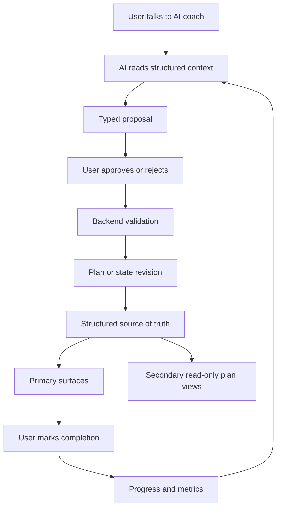

# AI Health Coach Feature Roadmap

## Product Idea

AI Health Coach is a stateful wellness and fitness coaching product. The user talks to an AI coach through chat, but chat is only the interaction layer. The source of truth is structured state: profile, goals, workout plans, nutrition plans, recipes, device metrics, documents, adherence, and progress.

The AI can explain, summarize, and propose changes. It does not silently rewrite the user's plans. When the AI recommends a new workout, nutrition adjustment, recipe set, or daily checklist change, it creates a typed proposal. The user approves or rejects that proposal. Approved proposals are validated by backend services and applied as auditable revisions.

## Current Direction: Editable Proposals + Performed Log

The active product direction is the **editable-proposals + performed-log** model. It
adds two things to the coaching loop:

- **A universal editable display contract.** Any proposal can carry an optional,
  non-authoritative `displayContract` render hint (`packages/types/src/display-contract.ts`)
  so the frontend renders an interactive card with live-recomputed derived values (e.g. a
  duration slider that updates an estimated-calories total). The contract carries no
  formulas — derived values use a closed `op` enum. On accept the backend **always
  recomputes** the total from the **stored** contract structure and a **stored, trusted
  rate** sourced only from the workout domain LLM, clamping each editable field to its
  stored bounds and discarding the client total
  (`recomputeWorkoutProposalCaloriesFromDisplayContract`; accept seam in
  `ProposalsService.decideProposal`). The contract and rate never persist on a revision.
- **Plan vs performed separation.** What was *planned* (authoritative recurring plans) is
  kept distinct from what was actually *performed*:
  - **Ad-hoc workout logging** via the `log_workout_activity` LOG intent creates an
    `ad_hoc` `workout_sessions` row (nullable plan/revision FKs, `activityType`,
    `estimatedCalories`) and **never** a plan revision.
  - **Nutrition incidents** feed `Today.eaten` (per-date aggregate) and a weekly
    `performed` aggregate (`aggregateNutritionIncidentsWeek`), separate from plan
    adherence, and still never mutate nutrition plan targets.

Brief: [editable-proposals-performed-log.md](features/editable-proposals-performed-log.md).

## Product Surfaces

The user-facing web IA is intentionally small. The primary navigation has four surfaces:

- Chat: the dominant coaching conversation for planning, feedback, explanations, image attachment context, typed (now editable) proposals, and approval decisions.
- Today: the daily execution loop for the current workout, today's nutrition plan and eaten/performed totals, stress/recovery check-in, mental wellbeing checkpoints, habits, adherence, and quick feedback.
- Longevity: the weekly overview for consistency, cross-domain trends (incl. nutrition performed and ad-hoc activity), goals, recovery/wellbeing context, and safe coach prompts.
- Profile: account identity, onboarding, personal context, goal hierarchy, documents, consent, device/data settings, and preferences.

Secondary read-only plan views remain routeable but are not primary tabs:

- Training: active weekly workout plan, scheduled sessions, execution history, and revision context.
- Nutrition: active weekly nutrition plan, meal structure, hydration, restrictions, adherence, and revision context.

Backend or nested surfaces should not become primary navigation:

- Recipes support nutrition planning and recommendations behind the scenes.
- Metrics feed Today, Longevity, and AI context; raw metric management belongs under Profile/settings.
- Documents live under Profile with explicit consent and wellness-only copy.
- Goals are structured state shown through Profile, Today linkage, Longevity, and Chat proposals.

## Roadmap Phases

### Phase 1: Foundation

Create the TypeScript monorepo, NestJS API, Expo mobile app, Next.js web product surface, Drizzle/Postgres database package, shared Zod contracts, AI package, and shared configuration.

### Phase 2: User, Auth, Profile, Goals

Create the first user-owned structured state. This includes authentication, user profile, goals, preferences, constraints, and onboarding.

### Phase 3: Chat and Proposal Approval

Implement chat threads and messages, AI structured output, proposal persistence, and the user approval flow. The AI returns both a conversational response and optional typed proposals.

### Phase 4: Workout Plans

Implement workout plans, immutable workout plan revisions, active plan reads, scheduled sessions, completion tracking, Today workout execution, and a secondary read-only Training plan view.

### Phase 5: Daily Execution Loop

Implement Today checklists, task completion, adherence scoring, daily progress history, and short feedback capture.

### Phase 6: Nutrition Plans

Implement nutrition plans, immutable nutrition plan revisions, calories, macros, hydration, restrictions, daily nutrition adherence, Today nutrition view, and a secondary read-only Nutrition plan view.

### Phase 7: Recipe Database

Add recipes as a structured knowledge base with ingredients, macro estimates, tags, restrictions, and meal types. Let AI propose recipes that fit the current nutrition plan, but keep nutrition targets in structured plan revisions.

### Phase 8: Device Sync and Health Metrics

Add Apple HealthKit, Android Health Connect, and wearable sync after explicit consent. Store normalized metric snapshots and aggregates rather than exposing raw private logs to the AI by default.

### Phase 9: Documents

Add health document upload, parsing/OCR, summaries, semantic search, and document-aware coaching context. Keep diagnosis and treatment guidance out of scope.

### Phase 10: Progress and Adaptation

Add weekly summaries, trend detection, adherence insights, and richer AI adaptation proposals across workouts, nutrition, recipes, and recovery.

## Current Implementation Snapshot

As of the completed longevity foundation pass, the core coaching loop is implemented on web and backend for the daily execution and structured-context paths:

| Surface | Status | Notes |
|---------|--------|-------|
| Chat / Proposals | Implemented foundation | Multi-domain fan-out LLM pipeline, typed **editable** proposals (universal display contract with accept-time backend recompute), evidence refs, wellbeing/recovery context, image attachment context, nutrition incident cards, recipe proposals, and safety gates |
| Today / Workouts / Nutrition | Implemented web MVP | Current workout with catalog metadata and bounded feedback, ad-hoc activity sessions on the checklist (non-required), nutrition `eaten` totals, checklist, wellbeing, recovery, adherence, reflection, and secondary Training/Nutrition links |
| Profile / Onboarding / Goals | Implemented web MVP | First-run onboarding, structured personal context, goal hierarchy, document consent, and profile hierarchy summary |
| Metrics / Device Sync | Partial | API, consent, and aggregate support exist; native HealthKit/Health Connect ingestion is not live |
| Documents / Labs | Implemented MVP | Text/PDF upload, structured signal extraction, signal approval/revocation, document-backed correlation preview, proposal evidence refs, and Chat attachment consent/review routing |
| Recipes / Nutrition incidents | Implemented MVP | Recipe intake/recommendations, recommendation lifecycle, recipe-backed nutrition incident proposals, and food/photo nutrition incident proposal flow |
| Progress / Adaptation | Partial | Weekly progress includes workout (incl. ad-hoc activity), recovery, and nutrition `performed` (eaten) aggregates; broader cross-domain review is still expanding |

The backend supports `Chat -> AIProposal -> approval -> structured state` for core domains. Completed feature briefs are removed once their MVP behavior is captured in this roadmap and architecture docs.

## Longevity Expansion

These capabilities extend the product toward AI-first coaching for a longer and healthier life. Completed briefs are folded back into the canonical docs; remaining open feature briefs stay in `docs/product/features/`.

### Implemented Capabilities

| Capability | Status | Notes |
|------------|--------|-------|
| Onboarding and goal hierarchy | Implemented MVP | Web onboarding direct-writes visible structured context, creates an active quarterly goal, gates incomplete users, enriches coaching context, and validates weekly/quarterly hierarchy rules |
| Mental wellbeing check-ins | Implemented MVP | Today mood/stress check-in, Longevity 7-day history, coaching `wellbeingSummary` without raw notes, static crisis support, and Chat crisis boundary |
| Recovery and readiness | Implemented MVP | Manual recovery check-in, qualitative recovery band, Today recovery focus card, consent-filtered recovery context, weekly recovery aggregate, and recovery-aware workout proposal guards |
| Today daily execution | Implemented MVP | Selected-date Today nutrition card, date-scoped adherence writes, no plan editing, and clear read-only links to Training, Nutrition, and Chat |
| Medical/lab correlations | Implemented MVP | Consent-gated text/PDF document upload, structured signal extraction/review/revocation, document-backed correlation preview, and proposal evidence validation |
| Adaptive workout execution | Implemented MVP | Exercise catalog taxonomy, catalog-enriched Training/Today views, execution feedback, and revision-safe workout proposal validation |
| Recipe recommendations | Implemented MVP | Provider-backed recipe normalization, confidence/provenance, Nutrition recipe panel, chat recipe proposals, and recipe-to-nutrition-incident proposal flow |
| Chat action proposals | Implemented MVP | Wellbeing check-in, nutrition incident, and `log_workout_activity` (ad-hoc) proposals with edit-before-apply, the universal editable display contract + accept-time backend recompute, crisis-safe behavior, and no-write-before-confirm guards |
| Image chat attachments (context-only) | Implemented MVP | Chat uploads images as bounded context for the multimodal domain LLMs; no upfront classification/recognition machinery and no attachment proposal side channel (see `docs/architecture/llm-pipeline.md`) |

### Remaining Recommended Sequence

1. **Editable proposals + performed log follow-ups** — mobile UI for the editable contract
   cards and performed log, and migrating the nutrition-incident card onto the universal
   display contract once it supports repeatable item groups (see brief below).
2. **Weekly cross-domain review expansion** — extend Phase 10 beyond workout-only summaries
   (nutrition `performed`, ad-hoc activity, habits, recovery) surfaced through Longevity + Chat.
3. **Longevity dashboard** — consumer overview once enough structured signals exist.

(2) and (3) do not yet have written briefs in `docs/product/features/`.

### Open Feature Brief Index

| Feature | Brief | Depends on |
|---------|-------|------------|
| Editable proposals + performed log | [editable-proposals-performed-log.md](features/editable-proposals-performed-log.md) | Proposals, workouts, nutrition, Today, progress |

## AI Safety and State Rules

- Structured state is authoritative; chat history is not.
- AI creates typed proposals; backend services validate and apply them.
- User approval is required before an AI proposal changes a plan or user-facing tab state.
- Workout and nutrition changes create revisions instead of overwriting active plans.
- Device sync and document features require explicit consent and least-privilege data access.
- The product is for wellness, fitness, tracking, and coaching, not medical diagnosis or treatment.

## Medical and Lab Data Policy

The product does **not** provide diagnosis, treatment, medication guidance, medical certainty, or clinical triage. That boundary is fixed across every product phase.

Users **may** upload medical documents, laboratory studies, and other health data when they choose to. That data is allowed only as **user-consented coaching context**, not as a clinical decision engine.

With consent, the coach may:

- extract wellness-relevant structured signals from uploaded documents (for example biomarker name, value, unit, date, source section),
- look for **wellness-safe correlations** between physical, mental, behavioral, and plan signals,
- explain observed patterns in coaching language,
- propose changes to workout load, recovery focus, nutrition structure, habits, or Today checklist items.

All such changes must flow through typed proposals, user approval, backend validation, and revision-safe state updates. Chat remains the interaction layer; structured state remains authoritative.

