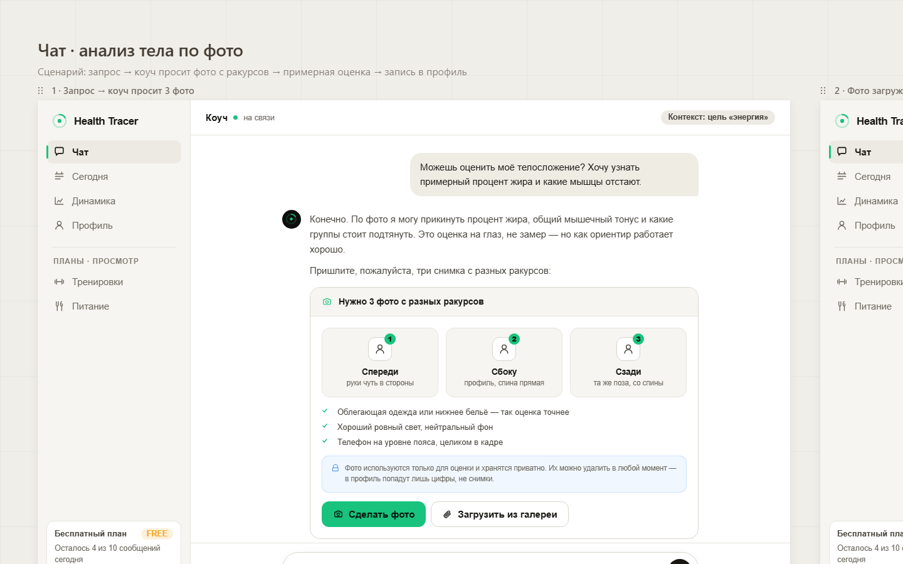

# Body analysis by photo — chat flow (Block A)

> Gap-analysis brief. Scope: the **chat-side** "body analysis by photo" flow. The resulting
> Profile section is a sibling brief — see [`./body-analysis-profile-section.md`](./body-analysis-profile-section.md).

## 1. Intent

Let a user ask the coach in chat to assess their physique, have the coach request three photos
(front / side / back) with an inline how-to card (`PhotoGuide`), accept the multi-photo upload,
run a multimodal "analysis", and return an inline result card (`BodyAnalysisCard`) with an
approximate fat %, muscle tone, and strong/weak muscle zones. The user can then **save** that
result to their profile (numbers only, never the photos). This is a wellness estimate, never a
medical measurement or diagnosis, and the save is a typed proposal the user explicitly accepts —
the coach proposes, the user decides.

## 2. Design spec

Source of truth (design reference): the handoff board screenshots in this folder —
`./screenshots/design/handoff-seg1.png` (the "Чат · анализ тела по фото" flow, board row 1)
and `./screenshots/design/handoff-canvas.png` (full board). The original `design_handoff_*`
JSX sources have been removed from the repo; the screenshots are the surviving design of record.
The screen «Чат · анализ тела по фото» (subtitle «Сценарий: запрос → коуч просит фото с ракурсов
→ примерная оценка → запись в профиль») renders inside the standard chat shell — the left nav
(Чат / Сегодня / Динамика / Профиль), a top «Коуч · на связи» header with a top-right
«Контекст: цель «энергия»» chip, the transcript column, and the composer.

### Flow steps (`chatBodyFlow.step` enum: `ask | uploading | analyzing | result | saved`)

The design defines the step enum as `step: ask | uploading | analyzing | result | saved`.

**A1 · `ChatBodyAsk` — user asks → coach requests photos** (`step: ask`)
- `UserMsg`: verbatim — «Можешь оценить моё телосложение? Хочу узнать примерный процент жира и какие
  мышцы отстают.»
- `CoachMsg` with two `Para` blocks, verbatim:
  - «Конечно. По фото я могу прикинуть процент жира, общий мышечный тонус и какие группы стоит
    подтянуть. Это оценка на глаз, не замер — но как ориентир работает хорошо.»
  - «Пришлите, пожалуйста, три снимка с разных ракурсов:»
- Then the `PhotoGuide` card (see below).

**A2 · `ChatBodyUpload` — photos uploaded, coach analysing** (`step: uploading → analyzing`)
- `PhotoStripMsg` — a user message carrying three `PhotoThumb` tiles (132×168), labelled
  `спереди.jpg` / `сбоку.jpg` / `сзади.jpg`, with caption «Вот, со всех сторон».
- `ThinkingBlock` with label verbatim: «Коуч анализирует фото · оцениваю состав и мышцы…».

**A3 · `ChatBodyResult` — result + save** (`step: result`, `saved` boolean → `step: saved`)
- `PhotoStripMsg` (no caption) + `CoachMsg`.
- Coach `Para`, verbatim: «Готово. Вот что я вижу по снимкам — телосложение спортивное, ноги и кор
  заметно сильнее верха. Жир в норме и, судя по динамике, снижается.»
- `BodyAnalysisCard` (see below).
- When `saved=false`, a trailing muted `Para`, verbatim: «Если сохраню — добавлю это в профиль и
  учту при планировании тренировок: чуть больше работы на грудь, руки и спину.»

### `PhotoGuide` component (the photo-request card)
Header (camera icon): «Нужно 3 фото с разных ракурсов».
Three angle tiles, each with a green numbered badge (1/2/3):
| # | Title (`t`) | Hint (`d`) |
|---|-------------|------------|
| 1 | Спереди | руки чуть в стороны |
| 2 | Сбоку | профиль, спина прямая |
| 3 | Сзади | та же поза, со спины |

Three requirement checklist rows (green `checkSm`), verbatim:
- «Облегающая одежда или нижнее бельё — так оценка точнее»
- «Хороший ровный свет, нейтральный фон»
- «Телефон на уровне пояса, целиком в кадре»

Privacy block (blue-tinted, `lock` icon), **verbatim**:
> «Фото используются только для оценки и хранятся приватно. Их можно удалить в любой момент — в
> профиль попадут лишь цифры, не снимки.»

Buttons:
- `accept` «Сделать фото» — opens camera capture (mobile `capture="environment"`).
- `ghost` «Загрузить из галереи» — opens the gallery/file picker.



### `BodyAnalysisCard` component (the result card; shared with the Profile section)
Header (`profile` icon): «Примерный анализ тела» + neutral chip «по 3 фото».
Three headline metrics in a row:
| Value | Unit | Label | Color |
|-------|------|-------|-------|
| ≈ 24–27 | % | Жир | amber |
| Средний | — | Мыш. тонус | green |
| 64–65 | кг | Вес* | ink |

Two zone blocks:
- «Сильные зоны» (green): «Ноги, ягодицы, пресс — развиты хорошо»
- «Зоны роста» (red): «Грудь, руки, верх спины — стоит подтянуть»

Disclaimer (panel bg), **verbatim**:
> «Это визуальная оценка по фото с погрешностью ±3–4%, а не замер состава тела. **\***Вес — со слов,
> не измеряется по фото. Не медицинская диагностика.»

Actions:
- `saved=false`: `accept` «Сохранить в профиль» + `ghost` «Сравнить с прошлым» + `quiet` «Не сохранять».
- `saved=true`: green confirmation strip «Сохранено в профиль · «Анализ тела»» with `CheckCircle`
  and a «Открыть →» link.

### `bodyAnalysis` shape (design state model)
```
bodyAnalysis: {
  date, source: 'chat',
  photos: [front, side, back],
  fatPct: { min, max },
  muscleTone,
  weight?,                       // "со слов" — self-reported, not from photo
  strongGroups[], weakGroups[],
  muscleMap: { [group]: 'strong' | 'mid' | 'weak' },
  history[]
}                               // + savedToProfile flag
```
```
chatBodyFlow: { step: 'ask'|'uploading'|'analyzing'|'result'|'saved', photos[], recognitionErrors }
```

### Error / loading states (design)
- `analyzing` → `ThinkingBlock` (inference shimmer).
- Recognition failure → soft inline error: the design specifies «не удалось распознать —
  переснимите фото» and "фото плохого качества" as a soft hint. The existing chat-error pattern
  («Не получилось ответить» + «Повторить»/«Изменить запрос») is the analog to reuse.

## 3. Current state (live-verified)

Verified live via Chrome MCP (2026-06-08, `/chat`, light theme, authenticated PRO account). No
current-app screenshots were saved this run, so the evidence below is the observed runtime state,
not a stored image. The code paths that back each observation are cited.

What exists today (observed in the running app):
- `ChatWorkspace` renders a `ChatTranscript` of `ChatBubble`s — user messages as grey bubbles on
  the right, coach messages as green-accent text on the left with a dot avatar, each with a
  timestamp. (`apps/web/src/components/chat/chat-workspace.tsx`,
  `apps/web/src/components/ui/chat-bubble.tsx`.)
- Composer: a rounded "Message your coach…" input with a clip (attach) icon **and** a camera icon,
  plus a send arrow; footer disclaimer "Your coach suggests — the decision is always yours. This
  is lifestyle support, not medical advice."
- Image attachments render inline as chips/previews on the message (observed e.g. a
  "_DSC0417_resized.jpg · Food photo" chip on a user message). The picker already supports
  `multiple` + camera capture, capped at `MAX_CHAT_COMPOSER_ATTACHMENTS = 5`
  (`apps/web/src/lib/chat-attachment-ui-state.ts`) — so **flat multi-image attach already works at
  the picker level**, but the camera button is a generic file capture (`capture="environment"`),
  not a guided 3-photo flow.
- Typed inline proposal cards exist and render in-thread: observed a "Log meal from photo" card
  with a green "APPLIED" badge, a "NUTRITION" tag, "Nutrition incident log" body, an outcome bar
  ("Nutrition incident logged. Your nutrition plan targets are unchanged. View nutrition →"), and a
  left green accent border. This is the reuse target for the body-analysis save UI.

Code paths behind the chat surface:
- Chat shell + message render: `apps/web/src/components/chat/chat-workspace.tsx` (covered by
  `chat-workspace-proposal-render.spec.ts`). Inline proposal cards are routed by
  `apps/web/src/components/proposals/inline-proposal-card.tsx`, which dispatches to
  `wellbeing-checkin-proposal-card.tsx`, `nutrition-incident-proposal-card.tsx`,
  `recommend-recipes-proposal-card.tsx`, `contract-proposal-card.tsx`, and
  `inline-proposal-card-generic.tsx`, all sharing `proposal-card-shell.tsx`.
- UI primitives in `apps/web/src/components/ui/*`: `ChatBubble` (`chat-bubble.tsx`),
  `MedicalNote`/`CoachNotes` (`dark-primitives.tsx`), `MediaCard` (`media-card.tsx`). **No
  `BodyAnalysisCard` and no body-figure / muscle-map SVG exist.**
- Attachment carrier (api): `apps/api/src/modules/chat-attachments/*` — **image-only,
  context-only**. Validates MIME + size, stores bytes on `LocalChatAttachmentStorageAdapter`, and
  carries images into the turn as context (`chat-turn-attachment-stage.service.ts`). No
  recognition/classification, and **no `health_documents` creation/parse** (a hard floor).
- Multimodal read path (api): `apps/api/src/modules/ai/domain-llm-executor.service.ts` —
  the domain LLMs read image content directly; `ai/action-resolver.service.ts` resolves a typed
  proposal filtered to the active capability allowlist.
- Proposal apply/validate (api): `apps/api/src/modules/proposals/proposal-apply.service.ts` +
  `proposal-validation.service.ts`.

What is **absent** today (confirmed live + in code):
- Live: no photo-guide card, no 3-angle (Спереди / Сбоку / Сзади) capture structure, no
  `BodyAnalysisCard`, no multi-photo angle strip, no front/back muscle map.
- No `BodyAnalysisCard` / `PhotoGuide` / `PhotoStripMsg` / `PhotoThumb` web components, and no
  front/side/back angle structure on attachments.
- No `save_body_analysis` proposal intent. `PROPOSAL_INTENT_VALUES` in
  `packages/types/src/intent-catalog.ts` is `update_profile`, `create_goal`, `update_goal`,
  workout intents, nutrition intents (`adjust_nutrition_plan`, `recommend_recipes`,
  `log_nutrition_incident`, …), `capture_wellbeing_checkin`, etc. — **nothing for persisting a body
  analysis.**
- No body-composition table anywhere in `packages/db/src/schema/*` and no `bodyAnalysis` contract.
- No `chatBodyFlow` orchestration (ask → 3-photo gate → analyze → result → save).
- No dedicated "body" domain: `domainConfigDomainSchema` (`packages/types/src/domain-config.ts`)
  is `["workout", "nutrition", "medical", "health"]`.

## 4. Gap

### Design diff (visual / component gap against `handoff-seg1.png`)
| Have today (live) | Need (design) |
|---|---|
| Generic attachment chips/previews on the message | `PhotoGuide` card: camera-icon header «Нужно 3 фото с разных ракурсов», 3 numbered angle tiles (Спереди / Сбоку / Сзади + pose hints), green checklist (tight clothing / even light / phone at waist / full body in frame), blue-tinted privacy block, «Сделать фото» + «Загрузить из галереи» buttons |
| Inline image previews (`chat-message-attachment-previews.tsx`) | `PhotoStripMsg` — strip of 3 labelled `PhotoThumb` tiles (132×168, `спереди/сбоку/сзади.jpg`) with caption «Вот, со всех сторон» |
| Generic coach "typing" indicator | `ThinkingBlock` with label «Коуч анализирует фото · оцениваю состав и мышцы…» |
| Typed inline proposal cards (wellbeing / nutrition incident / recipes / contract / generic) | `BodyAnalysisCard`: header «Примерный анализ тела» + «по 3 фото» chip, 3-metric row (fat % range / muscle tone / weight*), strong/weak zone blocks + front/back muscle map, verbatim ±3–4% disclaimer, save / «Сравнить с прошлым» / «Не сохранять» actions, and a `saved` confirmation strip |
| No top-right context chip on the chat header | «Контекст: цель «энергия»» chip top-right (design) |
| No body-analysis disclaimer copy anywhere | Verbatim «…погрешностью ±3–4%… Не медицинская диагностика.» on the result card; PhotoGuide privacy note «в профиль попадут лишь цифры, не снимки» |

### Feature diff (capability / data / backend gap)
| Have today (live) | Need |
|---|---|
| Flat multi-image picker (cap 5), `capture="environment"`, no angle semantics, no gating | Structured **3-photo** intake (front/side/back), gated until the coach has requested it via `PhotoGuide` |
| Multimodal domain LLMs read image content as context | A coach turn that synthesizes a body-analysis result (fat % range, muscle tone, strong/weak groups, muscle map) from the 3 images |
| Domains: workout / nutrition / medical / health | A route for a body estimate — new dedicated `body` domain **or** reuse `health`/`workout` + a new proposal (open question §8) |
| Proposal intents: workout, nutrition, today, habit, progress, profile/goal | New `save_body_analysis` typed proposal intent in `packages/types/src/intent-catalog.ts`, validated in `proposal-validation.service.ts`, applied in `proposal-apply.service.ts` |
| Attachments image-only/context-only, no persistence beyond retention | On accept, persist `bodyAnalysis` **numbers only** to profile state — **never the photos** |
| Inline proposal accept/decline (one primary action) | Save / «Сравнить с прошлым» / «Не сохранять» actions wired through the same proposal accept/decline path |
| No body-composition contract or table | New `bodyAnalysis` Zod contract (`packages/types`) + new Drizzle table & migration (`packages/db`) — numbers only |

## 5. Work needed

### Frontend (`apps/web/src/components/*`)
- Add `PhotoGuide`, `PhotoStripMsg`, `PhotoThumb`, `BodyAnalysisCard` components, built on the
  existing design-system primitives in `apps/web/src/components/ui/*`. `BodyAnalysisCard` is
  **shared** with the Profile section — place it where both surfaces can import it.
- **Reuse**, don't rebuild: the composer image picker already supports `multiple` + camera capture
  (cap 5); extend/wrap it to capture a structured front/side/back set rather than a flat list, and
  reuse the inline image-preview render as the basis for `PhotoStripMsg`.
- Reuse the inline proposal render path: route the new card through
  `apps/web/src/components/proposals/inline-proposal-card.tsx` (alongside
  `wellbeing-checkin-proposal-card.tsx` / `nutrition-incident-proposal-card.tsx` /
  `recommend-recipes-proposal-card.tsx`, sharing `proposal-card-shell.tsx`) so the
  `BodyAnalysisCard` save action goes through the **same accept/decline proposal mechanism** as the
  workout/nutrition cards (covered by `chat-workspace-proposal-render.spec.ts`).
- Add `chatBodyFlow` UI state for the `ask|uploading|analyzing|result|saved` steps and the
  recognition-error soft hint state.

### Backend (`apps/api/src/modules/*`)
- Decide the routing target: either add a `body` domain or extend the `health`/`workout` domain to
  emit a body-analysis result. Add the corresponding capability config so the new save proposal is
  allowed for that capability (tools stay read-only).
- Add a `save_body_analysis` proposal intent to `PROPOSAL_INTENT_VALUES` in
  `packages/types/src/intent-catalog.ts` (+ a Zod payload contract), validate it in
  `apps/api/src/modules/proposals/proposal-validation.service.ts`, and apply it in
  `apps/api/src/modules/proposals/proposal-apply.service.ts`. On accept, persist `bodyAnalysis`
  **numbers only**.
- Persist via a new repository/service (e.g. under `apps/api/src/modules/profiles/*` or a new
  `body-analysis` module). On save, **never store** the photo bytes beyond chat-attachment
  retention; only the derived numbers cross into the profile store.
- Keep using `chat-attachments` as the image carrier (validate → link → apply disposition); do not
  add any `health_documents` write.

### AI-pipeline (`apps/api/src/modules/ai/*`, `packages/ai-behavior/config/*`)
- **Reuse the multimodal domain LLM path** (`domain-llm-executor.service.ts`): the 3 images already
  reach the domain LLM as context. Add a prompt path that turns the images into the
  `BodyAnalysisCard` data shape (fat % range, muscle tone, strong/weak groups, muscle map).
- Add the new domain/intent + signals in `packages/ai-behavior/config/domains/*.yml` and the
  capability catalog; YAML can only **narrow** the catalog, never widen it.
- The body-analysis output must be a **typed `save_body_analysis` proposal**, never a direct write —
  the `decision-maker` synthesizes and emits the proposal; the user accepts it.
- Keep RouterLlm read-only and clamped; the 3-photo request copy is a coach reply, not a router emit.

### Data (`packages/types`, `packages/db`)
- New `bodyAnalysis` contract in `packages/types` matching the `bodyAnalysis` shape in §2 (`fatPct {min,max}`,
  `muscleTone`, `strongGroups[]`, `weakGroups[]`, `muscleMap`, `weight?`, `source:'chat'`,
  `date`, `history[]`).
- New Drizzle table + migration in `packages/db` for the saved analysis (numbers only — **no photo
  bytes, no storage keys, no extracted text**). History rows enable «Сравнить с прошлым».

## 6. Acceptance criteria

- Asking the coach to assess physique (RU intent like the verbatim A1 message) yields a coach reply
  containing the `PhotoGuide` card with the three angle tiles, checklist, privacy block, and both
  buttons.
- The user can attach exactly the front/side/back set; «Сделать фото» opens camera capture,
  «Загрузить из галереи» opens the gallery picker.
- After upload, the thread shows the `PhotoStripMsg` (3 labelled tiles) and a `ThinkingBlock` with
  the verbatim analysing label.
- The coach returns a `BodyAnalysisCard` with a fat-% range, muscle tone, strong/weak zones, and the
  verbatim ±3–4% disclaimer.
- «Сохранить в профиль» creates a `save_body_analysis` proposal; on accept the card flips to the
  `saved` confirmation strip and the profile gains a `bodyAnalysis` record — **with numbers only,
  no photos**.
- «Не сохранять» discards without persistence; «Сравнить с прошлым» shows a diff when history exists.
- No `health_documents` row is created or parsed by any path in this flow (regression-tested).
- Validation: valid analysis payload accepted; invalid payload rejected; medical/diagnostic wording
  rejected; accepted save persists exactly once and is ownership-scoped.

## 7. Invariants & safety

- **Wellness, not medical.** No diagnosis / treatment / dosing language anywhere in the flow.
- The analysis is always framed as **«примерная визуальная оценка по фото, не замер состава тела и
  не диагноз»** (design key principle); the result card carries the verbatim ±3–4% disclaimer and
  «Не медицинская диагностика.».
- **Image privacy:** **«в профиль попадут лишь цифры, не снимки»** — only the numbers persist to the
  profile, never the photos. The `PhotoGuide` privacy block states this verbatim and it must hold in
  code.
- **Profile/plan changes are PROPOSAL-ONLY** — the coach proposes a save, the user decides; no direct
  domain write from the AI layer (`.claude/rules/ai-orchestrator.md`).
- Attachments stay **image-only and context-only**: **no attachment path may persist or parse
  `health_documents`** (existing floor, regression-tested in `chat-attachments`). This body-analysis
  flow does not change that floor.
- Context budgets keep `allowDocuments=false` (DB document slices); config cannot relax code-level
  safety floors. Do not reintroduce removed recognizers/classifiers, the pre-upload
  classification/consent gate, `prepare_proposal_candidates`, `medical_document_save`, or any
  attachment proposal side-channel.

## 8. Open questions

- **Domain placement:** new dedicated `body` domain vs. extending `health`/`workout`? New domain is
  cleaner but adds a 5th entry to `domainConfigDomainSchema` and the ≤3 fan-out cap budget.
- **Photo lifecycle after save:** delete the 3 chat-attachment images immediately on save, or let
  them age out under normal attachment retention? The design privacy note says photos «можно удалить в любой момент».
- **3-photo gating strictness:** hard-require all three angles before analysis, or allow a degraded
  estimate from fewer (with a lower-confidence note)?
- **Weight field (`Вес*`):** the design marks it "со слов" (self-reported). Source it from an
  existing profile field or prompt inline?
- **«Сравнить с прошлым»:** is history diffing in-scope for v1, or deferred until ≥2 saved analyses
  exist?
- **Crisis/medical-document photo:** a physique photo could be a medical document photo — does the
  existing crisis/medical pre-AI gate need any body-flow-specific handling?

---

### Related
- [`./00-overview.md`](./00-overview.md) — body-and-nutrition feature overview.
- [`./body-analysis-profile-section.md`](./body-analysis-profile-section.md) — sibling: the saved
  Profile «Анализ тела» section (composition rings, muscle map).
- [`./design-system-and-backend-foundations.md`](./design-system-and-backend-foundations.md) —
  shared tokens, atoms, and backend foundations these screens build on.
