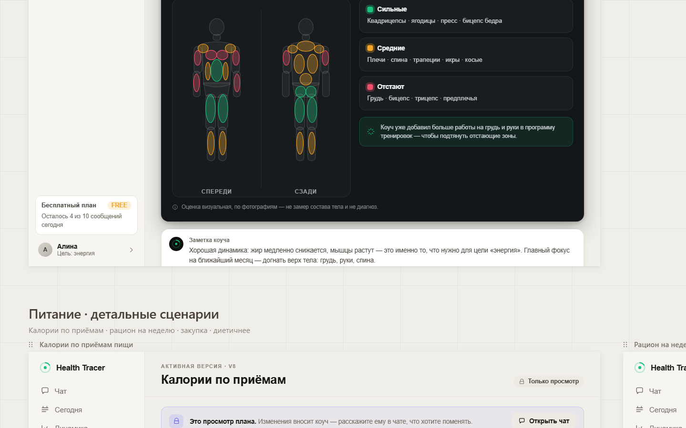

# Body Analysis — Profile "Анализ тела" Section (Gap Analysis)

> Block B of the body-and-nutrition design handoff. This brief covers the **Profile section**
> that appears once a chat body-analysis is accepted and saved. The **chat side** (request →
> photo guide → upload → estimate → save proposal) is the sibling brief
> [`./body-analysis-chat-flow.md`](./body-analysis-chat-flow.md).
>
> **Design source of truth:** `docs/design_handoff_body_and_nutrition/design/app/body.jsx`
> (`BodyAnalysisScreen`, `BodyComposition`, `MuscleMap`, `BodyFigure`, the `MUSCLES` map,
> `ST`/`ST_DIM` tokens, `Mz`), `kit.jsx` (`Ring`, `MiniBars`, `Stat`, `Card`, `CardHead`,
> `Eyebrow`, tokens `L`/`D`/`M`), `states.jsx` (`CoachNotes`, `MedicalNote`, `LoadingScreen`,
> `ErrorScreen`), and `docs/design_handoff_body_and_nutrition/README.md` (Section B +
> "State Management"). Design screenshots: `./screenshots/design/handoff-seg2.png` (the dark
> muscle-map card), `./screenshots/design/handoff-seg3.png` (Profile layout — "Анализ тела
> добавляется сюда отдельным разделом"), `./screenshots/design/handoff-canvas.png` (full canvas).
>
> **Current-app state verified live via Chrome MCP (2026-06-08)**: `/profile` (light theme,
> authenticated PRO) and `/longevity` (dark theme) — see §3.

---

## 1. Intent

After the coach returns an approximate visual body analysis in chat and the user accepts the
**"Сохранить в профиль"** proposal, the Profile gains a persistent **"Анализ тела"** section.
It shows the saved estimate as a durable, structured record: body composition (fat / muscle /
water %), weight & BMI, an 8-week fat% trend, and a per-muscle-group strength map rendered on
front/back silhouettes. The section is read-only — it is a *view* of what was accepted; updates
come only by running a new analysis in chat ("Обновить по фото"). Every card is framed as an
**approximate visual estimate, not a body-composition measurement and not a diagnosis**.

This is the durable counterpart of the chat flow: chat produces the estimate and the typed save
proposal; this section renders the persisted result.

---

## 2. Design spec

### 2.1 Screen frame
`BodyAnalysisScreen` = `AppShell(active='profile', contentBg=L.paper)` + `TopBar`:

- Title **"Анализ тела"**, sub **"Профиль · из анализа по фото"**.
- TopBar right: `Btn kind="soft" size="sm" icon="camera"` → **"Обновить по фото"** (re-runs the
  chat analysis flow).
- Body: padding `20px 34px`, vertical flex, `gap 16`.

The page lives in the **light "ChatGPT" world** (`L.paper = #f1efe9` warm page) with **dark
"instrument" cards** (`D` tokens) floating on it — the project's two-world rule: *numbers/data →
dark instrument; control/text/banners → light interface.*

### 2.2 Provenance banner (light)
Green banner at the top of the body (`background rgba(25,195,125,0.08)`, border
`rgba(25,195,125,0.26)`, radius 13):

- 30×30 icon badge (`M.greenDim` background, `camera` icon stroked `M.green`).
- Copy (verbatim): **"Сохранено из чата · 5 июня."** (bold, `L.ink`) +
  **"Анализ сделан по 3 фото (спереди, сбоку, сзади)."** (`L.mut`).
- Right link **"История →"** (`M.green`, pointer) → opens history/diff of prior analyses.

The date is dynamic (`bodyAnalysis.date`); "5 июня" is mock data.

### 2.3 `BodyComposition` — DARK instrument card
`Card dark pad={22}`, `CardHead dark icon="heart" color={M.amber}` title **"Состав тела"**,
right = small muted **"оценка · 5 июн"**.

**Three rings** (`Ring size={96} sw={9} dark track="rgba(255,255,255,0.07)"`), each in an inner
panel (`rgba(255,255,255,0.03)`, border `D.line`, radius 14, centered):

| Ring | value | color | sub-delta |
|------|-------|-------|-----------|
| Жир | 26% | `M.amber` | "−1.7% за 30 дней" (green, `good`) |
| Мышцы | 38% | `M.green` | "+0.9% за 30 дней" (green, `good`) |
| Вода | 54% | `M.blue` | "в норме" (muted) |

Below each ring: uppercase label (`D.mut`) + delta line (green when `good`, else `D.mut2`).

**Weight / BMI + trend row** (`marginTop 16`, two inner panels):

- Left panel (`flex 1`): `Stat dark value="64.2" unit="кг" label="Вес" sub="−1.2 кг за 30 дней"`
  · vertical divider · `Stat dark value="22.4" label="ИМТ" sub="норма"`.
- Right panel (`flex 1.2`): `Eyebrow dark` **"% жира · 8 недель"** + right **"↓ снижается"**
  (`M.green`), then `MiniBars dark h={42}` over an **8-point** trend
  `[27.8, 27.5, 27.6, 27.1, 26.8, 26.4, 26.1, 25.8]` (each bar `v - 22`, color `M.amber`).

### 2.4 `MuscleMap` — DARK instrument card
`Card dark pad={22}`, `CardHead dark icon="dumbbell" color={M.green}`
title **"Карта мышц · сила по группам"**, right = `Chip dark` **"оценка по фото"**.

Two columns:

**Left — `BodyFigure side="front"` + `side="back"`** in a shared inner panel
(`rgba(255,255,255,0.025)`, border `D.line`, radius 16) with a thin vertical divider between
them; labels **"СПЕРЕДИ"** / **"СЗАДИ"** (uppercase, `D.mut`).

`BodyFigure` is an **inline SVG** (`width 170 height 380`, `viewBox "0 0 220 440"`):

- **Base silhouette** (shared, symmetric): head `ellipse`, neck `rect`, torso `path`, arms/legs
  `rect rx`, pelvis `path`. Fill `rgba(255,255,255,0.05)`, stroke `rgba(255,255,255,0.16)`,
  `stroke-width 1.5`.
- **Muscle overlay**: per-group `<ellipse>` (`Mz` component) positioned over the silhouette,
  `stroke-width 1.4`, colored by strength tone (below). Front groups: `delts, chest, biceps,
  forearms, abs, obliques, quads, shins`. Back groups: `traps, reardelts, lats, triceps,
  lowerback, glutes, hams, calves`. Exact `cx/cy/rx/ry` per ellipse are in `body.jsx`.

**Strength tone tokens** (`ST` / `ST_DIM` in `body.jsx`):

```
strong → green  fill rgba(25,195,125,0.30)  stroke #19c37d
mid    → amber  fill rgba(245,165,36,0.30)  stroke #f5a524
weak   → red    fill rgba(240,80,106,0.30)  stroke #f0506a
```

**`MUSCLES` group→tone map (mock — Алина: legs/core strong, upper body lagging):**

```js
delts:'mid', chest:'weak', biceps:'weak', forearms:'weak', abs:'strong', obliques:'mid',
quads:'strong', shins:'mid',
traps:'mid', reardelts:'mid', lats:'mid', triceps:'weak', lowerback:'mid', glutes:'strong',
hams:'strong', calves:'mid'
```

In production the figure renders from `bodyAnalysis.muscleMap` (`{ [group]: 'strong'|'mid'|'weak' }`).

**Right — 3-block legend** (each inner panel `rgba(255,255,255,0.03)`, border `D.line`):

| dot (tone) | label | list (verbatim) |
|-----------|-------|-----------------|
| green | **Сильные** | "Квадрицепсы · ягодицы · пресс · бицепс бедра" |
| amber | **Средние** | "Плечи · спина · трапеции · икры · косые" |
| red | **Отстают** | "Грудь · бицепс · трицепс · предплечья" |

Below the legend, a green coach hint (`rgba(25,195,125,0.10)`, border `rgba(25,195,125,0.26)`,
`spark` icon): **"Коуч уже добавил больше работы на грудь и руки в программу тренировок — чтобы
подтянуть отстающие зоны."**

**Card-foot disclaimer** — `MedicalNote dark` with VERBATIM copy:

> **Оценка визуальная, по фотографиям — не замер состава тела и не диагноз.**

### 2.5 `CoachNotes` (light)
A `CoachNotes` card (coach avatar + "Заметка коуча") with the dynamics summary:

> Хорошая динамика: жир медленно снижается, мышцы растут — это именно то, что нужно для цели
> «энергия». Главный фокус на ближайший месяц — догнать верх тела: грудь, руки, спина.

### 2.6 Async states
Reuse `LoadingScreen layout="plan"` (skeleton) and `ErrorScreen` (e.g. "Анализ тела недоступен")
from `states.jsx`. Empty state (no analysis saved yet): the section is hidden or shows a
"запустите анализ в чате" prompt that deep-links to the chat flow.

### 2.7 Design screenshot
The MuscleMap (front/back colored figures + Сильные/Средние/Отстают legend + coach hint) and the
BodyComposition disclaimer:



### 2.8 `bodyAnalysis` data shape (from README "State Management")

```ts
bodyAnalysis: {
  date: string;                 // save date — drives the provenance banner
  source: 'chat';               // provenance: accepted chat proposal
  photos: [front, side, back];  // NOT persisted as images — see §7
  fatPct: { min: number; max: number };
  muscleTone: string;           // e.g. "Средний"
  weight?: number;              // self-reported ("со слов")
  strongGroups: string[];
  weakGroups: string[];
  muscleMap: { [group]: 'strong' | 'mid' | 'weak' };  // drives BodyFigure
  history: BodyAnalysisSnapshot[];                     // prior analyses for trend/diff
}
savedToProfile: boolean;
```

---

## 3. Current state (live-verified)

> Verified **live via Chrome MCP (2026-06-08)**: `/profile` (light theme, authenticated PRO) and
> `/longevity` (dark theme). No `screenshots/current/*` were saved this run; observed state is
> transcribed below and cross-checked against code paths. The earlier "Clerk-gated, can't capture"
> caveat is superseded — the Profile was reached and inspected directly.

**There is no Body Analysis section today — Profile has no place for it.** `/profile` renders
`ProfileWorkspace` (`apps/web/app/profile/page.tsx` → `apps/web/src/components/profile/profile-workspace.tsx`)
as a **two-column light layout**:

- **Left column:** `AccountHeaderCard` (PRO), `GoalHierarchyCard` (`#goals` — DIRECTION "want to be
  healthy and strong", QUARTERLY GOAL "one"/Maintenance, with the label "changes through your
  coach"), `PersonalContextCard` (Activity level: Very active; Training experience: Advanced).
- **Right column:** `DocumentsCard` (`#documents` — consent banner "…lifestyle context only — not
  for diagnosis or treatment. Visible only to you.", a "Document privacy boundary" explainer, an
  "Upload health document" form, and a "Your documents / Status and review" list with
  REVOKED / SIGNALS REVOKED chips and per-document consent-scope detail), then `DevicesCard`
  (`#data-consent`), `SubscriptionSummaryCard`, `LanguageCard` further down (per code).

**Observed ABSENT (live):** any body-composition section, fat/muscle/water rings, weight/BMI
display, 8-week fat% trend, muscle map, or saved body-analysis data. No provenance banner.

**Reuse evidence — `/longevity` (live, dark theme).** The exact dark primitives this section needs
are already shipped and rendering on Longevity:

- A **CONSISTENCY donut ring** (`DsRing` — big center number + uppercase label) → backs the three
  composition rings (fat / muscle / water).
- A **"Plan completion by day" MON–SUN 7-bar strip** (`DsTrendStrip`) → the closest existing atom
  to the 8-week fat% `MiniBars` trend (see the coloring caveat in §4.2).
- Week-nav chips (`‹ This week ›`) → pattern for "История →" period navigation.
- A **"wellness context only, not a clinical assessment" disclaimer** → the `MedicalNote` pattern
  for the mandatory visual-estimate banner.

**Frontend atoms (verified in code):**

- `DsRing` and `DsTrendStrip` live in `apps/web/src/components/ui/dark-charts.tsx`. `DsRing`
  (`value/size/sw/color/track/label/sub`) maps directly to each composition ring.
- `CoachNotes`, `MedicalNote`, `RevisionFacts` live in
  `apps/web/src/components/ui/dark-primitives.tsx`. `MedicalNote` is the disclaimer atom; `CoachNotes`
  is the §2.5 dynamics-summary card.
- `ProgressBar` (`progress-bar.tsx`) and `SegmentRow` (`segment-row.tsx`) exist for label/value rows.
- **ABSENT:** any **body-figure / muscle-map SVG** component anywhere — `BodyFigure` is net-new.
- `packages/ui/src/*` holds tokens only (`tokens.ts`, `colors.ts`) — no Ring/MiniBars/Stat/BodyFigure.
- **No** `MiniBars` or `Stat` web component exists anywhere.

**Backend / data (verified — nothing exists):**

- `grep` across `packages/db/src/schema`, `packages/types/src`, and `apps/api/src` for
  body-composition / `muscleMap` / `fatPct` / `body_analysis` returns **zero hits**. No table, no
  Zod contract, no module.
- `packages/db/src/schema/user-profiles.ts` stores `birthDate`, `heightCm`, `baselineWeightKg`,
  `activityLevel`, `trainingExperience`, `preferences`, `constraints`, `longevityDirection`,
  `coachingNotes`, `onboardingDraft`. **No** fat/muscle/water %, muscle-map, or analysis history.
- `packages/db/src/schema/device-metrics.ts` (`healthMetricSnapshots` / aggregates) has a `weight`
  metric type but **no** body-composition / muscle-map / fat% storage, and is consent-gated /
  out of MVP (HealthKit/Health Connect excluded — see `frontend-style.md`).
- `apps/api/src/modules/profiles/*` exposes the current profile only — **no** body-analysis
  read/write endpoint. A read API + Zod contract is fully net-new (see §5).

---

## 4. Gap

### 4.1 Design diff (design handoff vs live current app)

| Aspect | Design (handoff) | Current app (live 2026-06-08) |
|--------|------------------|-------------------------------|
| Section presence | Dedicated "Анализ тела" Profile section (seg3: "добавляется сюда отдельным разделом") | **Absent** — Profile has no slot for it |
| Provenance banner | Green "Сохранено из чата · <date>" + "История →" | None |
| Composition card | DARK instrument: 3 rings (fat/muscle/water) + weight/BMI + 8-wk MiniBars | None — no rings/stats anywhere on Profile |
| Muscle map | DARK card: front/back silhouettes with per-group colored ellipses + Сильные/Средние/Отстают legend + coach hint | None — no body-figure SVG exists in the codebase |
| Disclaimer | `MedicalNote` "не замер состава тела и не диагноз" on the cards | Profile has the analogous "lifestyle context only — not for diagnosis or treatment" line on `DocumentsCard`; Longevity has "wellness context only, not a clinical assessment" — but none for body analysis |
| Coach notes | `CoachNotes` dynamics summary | `CoachNotes` atom exists (dark-primitives) but not used on Profile body analysis |
| Update affordance | "Обновить по фото" → re-run chat flow | None |
| World/theme | Light page (`L.paper`) with floating DARK instrument cards | Profile is fully **light** today; the dark instrument cards live on `/longevity` — this section introduces dark cards into the light Profile (two-world rule) |

### 4.2 Feature diff (Have / Need)

| Capability | Have (live-verified) | Need |
|-----------|------|------|
| Persist fat/muscle/water % | ✗ (zero grep hits in db/types/api) | New body-composition persistence (numbers only) |
| Persist weight + BMI source | partial — `user_profiles.baselineWeightKg`, device `weight` metric (out of MVP) | Body-analysis self-reported weight + source marker + derived BMI snapshot |
| Persist per-group muscle map | ✗ | `muscleMap: {[group]:'strong'|'mid'|'weak'}` storage |
| Persist 8-week fat% trend | ✗ | fat% time series derived from analysis history |
| Persist analysis history[] | ✗ | History rows for diff / "История →" |
| Read API for section | ✗ | `GET` body-analysis endpoint (ownership-scoped, Zod-validated) |
| Write path | ✗ | Apply the accepted `save_body_analysis` proposal from the chat flow |
| Dark ring atom | `DsRing` (`dark-charts.tsx`, shipped on `/longevity`) | **Reuse** for all 3 composition rings |
| Trend bars atom | `DsTrendStrip` (`dark-charts.tsx`) | **Reuse but re-color**: `DsTrendStrip` colors bars by an absolute level threshold (green ≥70 / amber ≥30 / red <30) for *completion* — wrong semantics for a single-amber fat% series. Either add a `color`/`barColor` override prop to `DsTrendStrip` or build a thin `MiniBars` (foundations brief). Bar height also maps `v−22` in the design. |
| Disclaimer atom | `MedicalNote` (`dark-primitives.tsx`) | **Reuse** on both instrument cards |
| `CoachNotes` atom | `CoachNotes` (`dark-primitives.tsx`) | **Reuse** for §2.5 |
| `Stat` atom | ✗ | New `Stat` atom (foundations brief) — or compose from existing primitives |
| `BodyFigure` SVG atom | ✗ (no muscle-map / body-figure SVG anywhere) | **New `BodyFigure` SVG atom** (foundations brief) |

---

## 5. Work needed

### Frontend (`apps/web`)
- New `BodyAnalysisSection` in `apps/web/src/components/profile/` rendered inside
  `profile-workspace.tsx` (the page is `apps/web/app/profile/page.tsx` → `ProfileWorkspace`), as a
  new "Анализ тела" section (full-width or its own column block). Provenance banner →
  `BodyComposition` → `MuscleMap` → `CoachNotes`, with the dark instrument cards floating on the
  light Profile page (two-world rule).
- Reuse **`DsRing`** (`apps/web/src/components/ui/dark-charts.tsx`) for the three composition rings;
  for the 8-week fat% trend reuse **`DsTrendStrip`** with a color override (or a thin `MiniBars`) —
  its default coloring is completion-threshold based and must not be applied to fat% (see §4.2).
- Reuse **`MedicalNote`** and **`CoachNotes`** from `apps/web/src/components/ui/dark-primitives.tsx`.
- Wire TanStack Query to the new read endpoint; provide loading / error / empty / success states
  (per `frontend-style.md`). Empty state deep-links to the chat analysis flow.
- The on-card `MedicalNote` disclaimer is **non-negotiable** and must render on both instrument
  cards.

### New atoms (belong to the foundations brief)
`MiniBars`, `Stat`, and `BodyFigure` are shared primitives and should be specced/built in
[`./design-system-and-backend-foundations.md`](./design-system-and-backend-foundations.md), then
consumed here. `BodyFigure` carries the `MUSCLES` ellipse geometry + `ST`/`ST_DIM` tones from
`body.jsx`; it must accept a `muscleMap` prop so positions are static but colors are data-driven.

### Backend (significant net-new — `apps/api`, `packages/db`, `packages/types`)
- **New persistence (net-new — nothing exists today).** A body-analysis store keyed by user
  (Drizzle migration under `packages/db/src/schema`, generated via
  `pnpm --filter @health/db db:generate`, then applied with `pnpm db:migrate` — and manually on
  Railway per `git-flow.md`). Must hold: fat%, muscle%, water% (and 30-day deltas / sub-labels),
  weight + weight source + derived BMI, the per-group `muscleMap` tone map, strong/weak group
  lists, the muscle-tone label, the date/provenance (`source:'chat'`, photo count), and a
  **history** of prior snapshots so the 8-week trend and "История →" diff can be derived.
  **Candidate homes** (decide in Open Questions): (a) a **new standalone `body_composition_analyses`
  table** with a JSONB `muscleMap`/snapshot column, one row per analysis (history = rows) — mirrors
  how food-photo analyses are stored and keeps `user_profiles` lean (preferred); (b) extend
  `packages/db/src/schema/user-profiles.ts` with a latest-snapshot JSONB column (no history);
  (c) `device-metrics` `healthMetricSnapshots` — rejected (consent-gated, out of MVP, and it has no
  composition/muscle-map shape).
- **Read API (net-new).** A `GET` endpoint — a new `body-analysis` module (or extend the profiles
  module) — returning the latest snapshot + trend + history, ownership-scoped, Zod-validated via
  `packages/types`. There is no existing endpoint to extend.
- **Write path.** Writing happens by **applying the accepted `save_body_analysis` proposal**
  produced in the chat flow ([`./body-analysis-chat-flow.md`](./body-analysis-chat-flow.md)) — *not*
  a silent write and *not* an attachment side-channel. The proposal is validated (schema, ownership,
  provenance, safety) before persistence, consistent with
  `apps/api/src/modules/proposals/proposal-validation.service.ts`. No diagnosis/treatment/dosing
  language may pass.

### AI-pipeline
- The estimate and the typed save proposal originate in the chat flow (sibling brief). This
  section consumes the *accepted* result only. Per `ai-orchestrator.md`/`security.md`: the AI
  emits a typed proposal; the backend decides accept/reject; **numbers, not photos**, are
  persisted; uploaded photos reach the multimodal LLM for the estimate but are **not** persisted
  to a `health_document` and must **not** create/parse `health_documents` rows.

### Data
- Define the shared Zod contract for `bodyAnalysis` (§2.8) in `packages/types`, used by the read
  API, the save proposal payload, and the web client.
- BMI = weight / (height m)². Height comes from `user_profiles.heightCm`; weight is
  self-reported via the analysis (mark its source). Trend is computed from history, not stored
  per-week redundantly unless a derived cache is justified.

---

## 6. Acceptance criteria

1. After a user accepts "Сохранить в профиль" in the chat flow, the Profile shows an "Анализ
   тела" section with the provenance banner ("Сохранено из чата · <date>") reflecting the real
   save date and photo count.
2. `BodyComposition` renders three rings (fat/muscle/water %) with correct colors and 30-day
   deltas, the weight/BMI stats, and the 8-week fat% MiniBars trend, sourced from persisted data.
3. `MuscleMap` renders front/back silhouettes with per-group ellipses colored by the persisted
   `muscleMap` tones, the 3-block legend, and the coach hint.
4. The disclaimer **"Оценка визуальная, по фотографиям — не замер состава тела и не диагноз."**
   is visible on the analysis cards.
5. The section is read-only; the only update path is "Обновить по фото" → chat flow. No inline
   editing of composition/muscle data.
6. Loading, error, and empty states render; empty deep-links to the chat analysis flow.
7. The read endpoint is ownership-scoped, Zod-validated, and returns only the requesting user's
   analysis.
8. Persistence happens only via an accepted, validated proposal — never a silent write; no
   `health_documents` row is created by this path.

---

## 7. Invariants & safety

- **Wellness, not medical.** No diagnosis, treatment, or medical-certainty language — anywhere in
  the section or its persisted strings. (`CLAUDE.md` product invariants, `security.md`.)
- **On-screen disclaimer is mandatory.** Every body-analysis card carries the visual-estimate
  `MedicalNote` ("…не замер состава тела и не диагноз."). It is a content floor, not optional.
- **Numbers, not photos.** Only numeric/structured estimates persist. The 3 photos are used by
  the multimodal LLM to produce the estimate but are **not** stored; the Profile shows figures
  only. No attachment path may create or parse `health_documents` rows (chat-attachments stays
  image-only/context-only).
- **Data originates from an accepted proposal.** The save is a typed proposal validated by backend
  services (schema, ownership, provenance, safety) before any write — never a direct AI mutation
  and never a silent write. (`ai-orchestrator.md`.)
- **Ownership-scoped.** All reads/writes are scoped to the authenticated user; no cross-user leak
  of body data (health-sensitive).
- **Read-only view.** Structured state is authoritative; this section displays it and changes come
  only through the chat coach flow, consistent with the "коуч предлагает — человек решает" rule.

---

## 8. Open questions

1. **Weight / BMI source** — self-reported via the analysis ("со слов") vs. the existing
   `device-metrics` `weight` snapshot vs. `user_profiles.baselineWeightKg`? The chat card marks
   weight with a `*` ("со слов, не по фото"); persistence must record the source so the UI keeps
   that caveat. Height for BMI comes from `user_profiles.heightCm` — what if it's unset?
2. **Muscle-map storage shape** — single JSONB `muscleMap` column on a body-analysis snapshot row
   vs. a normalized per-group table. JSONB matches the `{[group]:tone}` contract and the static
   ellipse geometry; normalization buys queryability we likely don't need yet.
3. **History / diff** — how many snapshots to retain, and what does "История →" / "Сравнить с
   прошлым" show (full snapshot diff vs. fat%/muscle% deltas only)? The 8-week trend needs at
   least a fat% time series — derived from history rows or a separate cached series?
4. **Trend granularity** — the design shows 8 weekly fat% points, but analyses are event-driven
   (per photo session), not weekly. How are weekly buckets derived when sessions are irregular?
5. **30-day deltas** — "−1.7% за 30 дней" etc. require a comparison anchor ~30 days back; define
   behavior when there is no prior snapshot in range (hide delta vs. show "—").

---

## Cross-links

- Overview: [`./00-overview.md`](./00-overview.md)
- Sibling (chat side): [`./body-analysis-chat-flow.md`](./body-analysis-chat-flow.md)
- Foundations (atoms + backend): [`./design-system-and-backend-foundations.md`](./design-system-and-backend-foundations.md)
