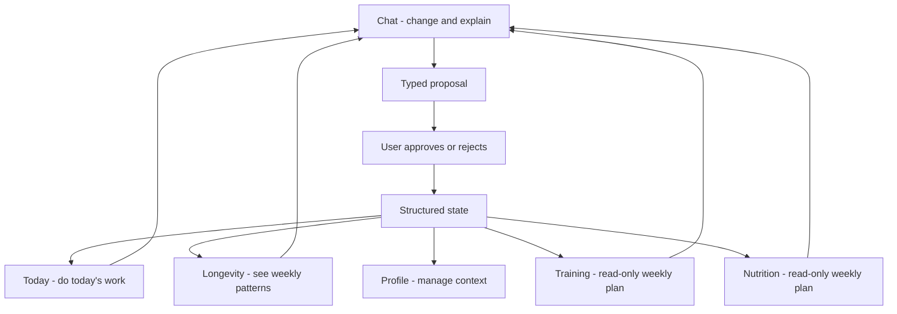

# UX Information Architecture

## Canonical Model

AI Health Coach is chat-primary, but not chat-as-database. The user should mostly see four clear surfaces while the system keeps detailed structured state behind them.

Primary web navigation:

- **Chat** — central coaching conversation and proposal approval.
- **Today** — what to do today.
- **Longevity** — weekly overview and cross-domain trends.
- **Profile** — account, onboarding, goals, documents, consent, settings.

Secondary routes:

- **Training** — read-only weekly workout plan and execution history.
- **Nutrition** — read-only weekly nutrition plan and adherence.

Hidden or nested routes:

- Documents, metrics, goals, recipes, progress, proposal audit, and developer inspectors.

## User-Facing Roles

## Navigation Rules

- Chat is the dominant header action and the preferred default landing route after authentication.
- Today, Longevity, and Profile are the other primary tabs.
- Training and Nutrition are not primary tabs, but must remain easy to open from Today, Longevity, and proposal cards.
- Metrics, Documents, Goals, Recipes, Progress, and developer tools are not primary tabs.
- Mobile can keep implementation placeholders, but product IA should follow the same hierarchy when mobile is brought to parity.

## Today Screen

Today answers: "What should I do today?"

Required blocks:

- Current workout or movement task.
- Today's nutrition plan and hydration focus.
- Current stress, recovery, or wellbeing check-in.
- Mental wellbeing checkpoints and habits for today.
- Completion state and optional daily reflection.

Today can show links to the full weekly Training and Nutrition views, but it should not become a planning editor.

## Training And Nutrition

Training and Nutrition are visual plan views:

- show the current week,
- show the active plan revision,
- show planned items and recent completion,
- explain what changed after accepted proposals,
- link back to Chat when the user wants a change.

Users should not manually edit active workout or nutrition plans on these screens. AI can propose changes in Chat, the user approves or rejects them, and backend services apply accepted changes as new revisions.

## Longevity Screen

Longevity answers: "How am I doing over time?"

It aggregates structured state from Today, Training, Nutrition, wellbeing, recovery, goals, metrics, and consented document context. It can show static prompts to discuss patterns in Chat, but it does not apply plan changes.

Longevity copy must stay in wellness, fitness, tracking, and coaching language. It must not present medical diagnosis, treatment advice, biological age, clinical scoring, or vendor readiness scores as product truth.

## Profile Screen

Profile answers: "Who am I, what context can the coach use, and what have I consented to?"

It includes account identity, onboarding, preferences, constraints, goal hierarchy, document upload/consent, device/data consent, and settings. It is not the main weekly wellness dashboard; that belongs to Longevity.

## Feature Placement

- Mental wellbeing check-ins: capture on Today; trends on Longevity; privacy and settings on Profile.
- Recovery/readiness: daily focus on Today; weekly trends on Longevity; no exposed clinical score.
- Habit system: materialize daily habits into Today; consistency appears on Longevity.
- Weekly review: initiated from Chat or Longevity; proposals reviewed in Chat.
- Medical/lab correlations: consent and uploads in Profile; safe insights in Chat and Longevity only when bounded and consented.
- Recipes: backend support for Nutrition, not a standalone user-facing tab.
